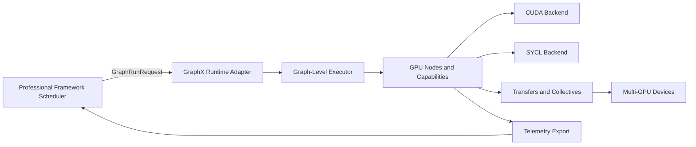

# CUDA, SYCL, and Metal Graph Nodes and Thin Data Movement Implementation Plan

## Objective

Add high-performance GPU computation and data movement to GraphX using thin abstractions that preserve existing libgraph node and capability patterns and avoid heavyweight framework layers.

Primary backend language in this document is CUDA, with SYCL and Metal variants that mirror the same core structure for non-NVIDIA and macOS hardware.

## Scope

In scope:

1. CUDA capability interfaces and default implementations
2. SYCL capability interfaces and default implementations
3. Metal capability interfaces and default implementations for macOS
4. Thin buffer and token payload model for host and device movement
5. A minimal, high-throughput CUDA node set (ingress, transfer, compute, egress, sync)
6. A matching SYCL node set with equivalent contracts and lifecycle behavior
7. A matching Metal node set with equivalent contracts and lifecycle behavior on macOS
8. Metrics and diagnostics integration with existing node metrics model
9. Single-process multi-GPU execution support (sharding, peer movement, collectives)
10. Unit, integration, and performance test coverage and CI entry points

Out of scope (initial phase):

1. Full deep-learning runtime integration (TensorRT and ONNX runtime wrappers)
2. Multi-node distributed orchestration (cross-host scheduling and transport)
3. Automatic graph-level kernel fusion planner

## Design Principles

1. Thin layers only: keep runtime calls visible and explicit in capability backends and nodes
2. Tokenized movement: pass small metadata views on edges, never copy large buffers in messages
3. Explicit synchronization: execution state in payloads, no implicit device-wide sync
4. Pool-first memory strategy: pinned host pools, device pools, and reuse contracts
5. Backend parity: CUDA, SYCL, and Metal keep equivalent graph-facing contracts
6. Incremental adoption: no breakage to existing CPU-only nodes and pipelines

## Architecture Contract (Normative)

1. Edges carry tokens, context, metadata, leases, and tickets.
2. Edges do not imply byte movement.
3. Nodes transform messages and declare intent.
4. Nodes do not secretly own the data plane.
5. Capabilities perform backend work.
6. GPU behavior belongs behind CUDA/SYCL/Metal/simulated capability boundaries.
7. SAR is an example package, not a new framework layer.
8. SAR-specific types stay under `examples/SAR` unless promoted deliberately.
9. PR1 must demonstrate the architecture, not perfect SAR math.

## Existing GraphX Hooks Used

1. Capability registration and lookup: libgraph/include/graph/CapabilityBus.hpp
2. Node lifecycle and typed ports: libgraph/include/graph/Nodes.hpp
3. Optional capability defaults and discovery:
   - libgraph/include/graph/DefaultCapabilityBus.hpp
   - libgraph/include/graph/CapabilityDiscovery.hpp
4. Message envelope tuned for small payloads: libgraph/include/graph/Message.hpp

## Current Implementation Notes and Corrections

The current repository state represents a stub-backed graph-validation slice, not full CUDA/SYCL runtime validation.

1. The current default CUDA and SYCL capability implementations are CPU-safe simulation backends used to validate graph contracts, token flow, lifecycle, and plugin wiring in CPU-only CI.
2. Metal support should follow the same capability-bus and stub-validation pattern, but remain gated until the macOS backend surfaces are added.
3. Stub plugins may be built independently of backend enable flags so G0 topology validation remains available when ENABLE_CUDA_GRAPH_NODES and ENABLE_SYCL_GRAPH_NODES are OFF.
4. Real backend plugins and backend-validation tests must be gated separately from stub plugins and stub tests.
5. Current stub GPU nodes resolve capabilities through the shared libgpu capability bus and bootstrap path rather than constructor injection or private per-plugin instances. Real backend plugins must continue this pattern, but swap in backend-aware bootstrap wiring instead of stub defaults.
6. Current topology coverage is limited to G0. G1-G8 remain planned work and must not be described as implemented.
7. Metrics and diagnostics remain planned work beyond the current queue/thread metrics already provided by libgraph.

Implementation guidance before additional topology expansion:

1. Keep the stub nature of the current default backends explicit in naming, comments, build layout, and test categorization.
2. Separate stub validation from backend validation in both CMake and CI reporting.
3. Route real plugin node construction through CapabilityBus/bootstrap before claiming backend parity.
4. Implement LeaseReleaseNode next to close the ownership gap in the lease model before adding more compute complexity.
5. Implement DeviceTransformNode after LeaseReleaseNode using a stub kernel capability first, then add backend-gated real CUDA/SYCL/Metal execution.
6. Maintain explicit test categories: libgpu_stub_unit, libgpu_backend_unit, libgpu_integration, and libgpu_perf.

Implementation rule for the next iteration:

1. Every GPU node must be implemented and validated in three lanes before the node is considered complete:
   - CPU stub lane: contract validation using CPU-safe default capabilities.
   - SYCL HAL lane: real queue, event, allocation, and copy or kernel path validation through SYCL capability implementations.
   - Metal macOS lane: real command-queue, allocation, copy, and kernel path validation through Metal capability implementations.
2. "Node complete" means all lanes pass required unit plus integration checks for that node.
3. Topology expansion (G1+) is gated on tri-lane completion of all prerequisite nodes in the topology.

## Implementation Dashboard

This dashboard is the working view for tracking the implementation sequence and the next gate per phase.

| Phase | Status | What is Done | Next Gate |
|---|---|---|---|
| Phase 0a: Graph framework validation | Complete | Builder, executor, and topology validation gate is established with existing libgraph test assets. | Keep as regression gate before widening GPU topology work. |
| Phase 0/1: Capability baseline and backend scaffolding | In progress | CUDA, SYCL, and Metal capability bootstrap paths exist in the plan; default SYCL smoke coverage now validates context, memory, transfer, kernel, telemetry, and collective contracts. | Add backend-specific runtime validation and keep capability bootstrap parity across CUDA, SYCL, and Metal. |
| Phase 2: Payload and token model | In progress | Core payload types exist and validation now covers views, leases, transfer tickets, kernel tickets, collective tickets, and shard descriptors. | Finish node-level propagation of validated payloads across transfer and shard-adjacent paths. |
| Phase 3: Data movement nodes | In progress | Host ingress, H2D, D2H, and lease-release nodes now enforce the payload contract in CUDA and SYCL stub lanes; Metal parity is planned on the same contracts. | Implement PeerCopyNode and its validation path. |
| Phase 4: Compute nodes | Planned | Compute node contracts are defined in the plan. | Implement DeviceTransformNode and DeviceReduceNode with CPU stub, SYCL HAL, and Metal macOS lanes. |
| Phase 5: Integration and metrics | Planned | End-to-end topology and metrics goals are defined. | Wire the full sample pipeline and surface backend telemetry. |
| Phase 5b: Multi-GPU collectives | Planned | Collective contract shape is defined. | Implement CollectiveReduceNode and multi-GPU parity coverage. |
| Phase 6: Hardening and CI | Planned | CI and regression goals are defined. | Split stub, backend, integration, and perf lanes in CI. |

## Proposed Artifacts

### 1. CUDA Capability Interfaces

Create interfaces under libgpu/include/gpu/cuda/capabilities/:

1. ICudaContextCapability
   - device selection
   - stream and event create and destroy
2. ICudaMemoryPoolCapability
   - device allocate and release (async-capable)
   - pinned host allocate and release
3. ICudaTransferCapability
   - H2D, D2H, D2D async copy
4. ICudaKernelCapability
   - kernel registration and launch API
5. ICudaTelemetryCapability
   - timing and event measurements and counters
6. ICudaCollectiveCapability
   - all-reduce, all-gather, reduce-scatter for single-process multi-GPU

### 1b. SYCL Capability Interfaces

Create interfaces under libgpu/include/gpu/sycl/capabilities/:

1. ISyclContextCapability
   - platform and device selection
   - queue and event lifecycle
2. ISyclMemoryPoolCapability
   - USM device, shared, and host allocation and release
3. ISyclTransferCapability
   - host-device, device-host, and device-device async copy
4. ISyclKernelCapability
   - kernel registration and launch API
5. ISyclTelemetryCapability
   - event timing and queue-level counters
6. ISyclCollectiveCapability
   - backend-appropriate collectives for single-process multi-GPU

### 1c. Metal Capability Interfaces

Create interfaces under libgpu/include/gpu/metal/capabilities/:

1. IMetalContextCapability
   - device selection, command-queue lifecycle, and event lifecycle
2. IMetalMemoryPoolCapability
   - device, shared, and host allocation and release
3. IMetalTransferCapability
   - host-device, device-host, and device-device copy
4. IMetalKernelCapability
   - kernel registration and dispatch API
5. IMetalTelemetryCapability
   - queue timing and event counters
6. IMetalCollectiveCapability
   - macOS-appropriate collectives for single-process multi-GPU

### 2. Thin Payload Types (Shared Contract)

Create backend-neutral types under libgpu/include/gpu/accel/types/ (or mirrored per backend with identical fields):

1. DeviceBufferView
   - device_ptr, bytes, dtype, shape and stride, device_id, execution_queue_id, ready_event
2. HostPinnedBufferView
   - host_ptr, bytes, dtype, shape and stride, allocator_id
3. BufferLease
   - pool_id, allocation_id, view, release policy
4. TransferTicket
   - src and dst view metadata, execution_queue_id, completion_event
5. KernelTicket
   - kernel_id, launch config, args metadata, execution_queue_id
6. DeviceShardDescriptor
   - global tensor metadata, shard index/count, owning device_id, offset and length
7. CollectiveTicket
   - collective kind, group_id, rank, world_size, completion_event

### 3. Initial CUDA Node Set

Create nodes under libgpu/include/gpu/cuda/nodes/ and libgpu/src/gpu/cuda/nodes/:

1. HostIngressPinnedSourceNode
   - Source node that emits HostPinnedBufferView
2. H2DAsyncNode
   - Interior node: HostPinnedBufferView -> DeviceBufferView
3. DeviceTransformNode
   - Interior node: DeviceBufferView -> DeviceBufferView (single kernel launch)
4. DeviceReduceNode
   - Interior node: DeviceBufferView -> DeviceBufferView (aggregation)
5. D2HAsyncNode
   - Interior node: DeviceBufferView -> HostPinnedBufferView
6. HostEgressSinkNode
   - Sink node for host consumption
7. StreamSyncNode
   - Control node for explicit event dependency edges
8. LeaseReleaseNode
   - Sink or control node for deterministic pool release and backpressure control
9. DeviceShardNode
   - Interior node: DeviceBufferView -> DeviceBufferView shards across GPUs
10. PeerCopyNode
   - Interior node: DeviceBufferView -> DeviceBufferView on peer GPU (P2P when available)
11. CollectiveReduceNode
   - Interior node: multi-GPU collective reduction with CollectiveTicket emission

### 3b. Initial SYCL Node Set (Structural Match)

Create nodes under libgpu/include/gpu/sycl/nodes/ and libgpu/src/gpu/sycl/nodes/ with equivalent semantics:

1. HostIngressPinnedSourceNodeSycl
2. H2DAsyncNodeSycl
3. DeviceTransformNodeSycl
4. DeviceReduceNodeSycl
5. D2HAsyncNodeSycl
6. HostEgressSinkNodeSycl
7. QueueSyncNodeSycl
8. LeaseReleaseNodeSycl
9. DeviceShardNodeSycl
10. PeerCopyNodeSycl
11. CollectiveReduceNodeSycl

Naming can be unified later by selecting backend via capability injection to avoid duplicated node names.

### 3c. Initial Metal Node Set (Structural Match for macOS)

Create nodes under libgpu/include/gpu/metal/nodes/ and libgpu/src/gpu/metal/nodes/ with equivalent semantics:

1. HostIngressPinnedSourceNodeMetal
2. H2DAsyncNodeMetal
3. DeviceTransformNodeMetal
4. DeviceReduceNodeMetal
5. D2HAsyncNodeMetal
6. HostEgressSinkNodeMetal
7. QueueSyncNodeMetal
8. LeaseReleaseNodeMetal
9. DeviceShardNodeMetal
10. PeerCopyNodeMetal
11. CollectiveReduceNodeMetal

Metal nodes should preserve the same graph-facing payload contracts as CUDA and SYCL, but use Metal command-queue and shared-memory semantics on macOS.

## libgpu Placement and Repository Layout

GPU node code should live in libgpu and follow the same packaging pattern used by libdsp.

Recommended structure:

1. Public headers
   - libgpu/include/gpu/accel/types/
   - libgpu/include/gpu/cuda/capabilities/
   - libgpu/include/gpu/sycl/capabilities/
   - libgpu/include/gpu/cuda/nodes/
   - libgpu/include/gpu/sycl/nodes/
2. Implementations
   - libgpu/src/gpu/cuda/capabilities/
   - libgpu/src/gpu/sycl/capabilities/
   - libgpu/src/gpu/cuda/nodes/
   - libgpu/src/gpu/sycl/nodes/
3. Plugins (registration wrappers, similar to libdsp/plugins)
   - libgpu/plugins/
4. Tests
   - libgpu/test/unit/
   - libgpu/test/integration/
   - libgpu/test/perf/

Build integration notes:

1. Keep graph-facing abstractions in libgraph and backend implementations in libgpu.
2. Link libgpu against graph and sensor as already done in libgpu CMake.
3. Add backend-gated test targets in libgpu/test with ENABLE_CUDA_GRAPH_NODES and ENABLE_SYCL_GRAPH_NODES guards.

## Detailed Node Architecture and Test Plans

This section defines architecture, contracts, and validation for each node pair.

### 1. HostIngressPinnedSourceNode and HostIngressPinnedSourceNodeSycl

Architecture plan:

1. Node type: SourceNodeBase<HostPinnedBufferView>
2. Responsibility: acquire pinned host buffers from pool capability and publish tokens only.
3. Inputs: none (source-driven or external callback-driven ingestion).
4. Outputs: HostPinnedBufferView plus optional BufferLease metadata side-channel.
5. State:
   - pre-allocated lease ring,
   - sequence number,
   - backpressure counters.
6. Error handling:
   - allocation unavailable -> emit pressure metric and defer,
   - malformed producer input -> fail packet and increment validation counter.

Test plan:

1. Unit tests:
   - emits valid HostPinnedBufferView shape and byte fields,
   - lease lifecycle accounting under repeated acquire and release,
   - deterministic behavior when pool is exhausted.
2. Integration tests:
   - source -> H2D pipeline under bounded pool size,
   - soak test for monotonic sequence and zero leak growth.
3. Performance tests:
   - sustained ingress rate and lease reuse efficiency,
   - latency impact of varying prefetch depth.

### 2. H2DAsyncNode and H2DAsyncNodeSycl

Architecture plan:

1. Node type: InteriorNodeBase<HostPinnedBufferView, DeviceBufferView>
2. Responsibility: enqueue host-to-device copy and attach completion event token.
3. Inputs: HostPinnedBufferView with valid lease context.
4. Outputs: DeviceBufferView with execution_queue_id and ready_event populated.
5. State:
   - transfer queue or stream handle,
   - copy ticket allocator,
   - fallback path flags.
6. Error handling:
   - copy submission failure -> emit transfer failure code,
   - invalid source view -> reject token before runtime API call.

Test plan:

1. Unit tests:
   - validates input invariants and rejects invalid buffers,
   - correct mapping from source byte span to destination view.
2. Integration tests:
   - overlap copy with downstream compute node without global sync,
   - event dependency chaining across two queues or streams.
3. Performance tests:
   - effective H2D bandwidth for representative payload sizes,
   - overlap efficiency against non-overlapped baseline.

### 3. DeviceTransformNode and DeviceTransformNodeSycl

Architecture plan:

1. Node type: InteriorNodeBase<DeviceBufferView, DeviceBufferView>
2. Responsibility: launch one transform kernel on input device and emit output token.
3. Inputs: DeviceBufferView with ready_event and kernel configuration metadata.
4. Outputs: DeviceBufferView for transformed payload with updated ready_event.
5. State:
   - kernel handle cache,
   - launch configuration policy,
   - telemetry sampler.
6. Error handling:
   - kernel registration missing -> deterministic init failure,
   - launch failure -> propagate error ticket with node context.

Test plan:

1. Unit tests:
   - launch parameter validation,
   - deterministic kernel selection for configured kernel_id.
2. Integration tests:
   - transform correctness against CPU reference vectors,
   - chained transform stages preserve event order.
3. Performance tests:
   - kernel throughput by tensor size,
   - launch overhead distribution and occupancy trends.

### 4. DeviceReduceNode and DeviceReduceNodeSycl

Architecture plan:

1. Node type: InteriorNodeBase<DeviceBufferView, DeviceBufferView>
2. Responsibility: apply reduction kernel for aggregation workloads.
3. Inputs: DeviceBufferView and reduction mode metadata.
4. Outputs: reduced DeviceBufferView and reduction telemetry ticket.
5. State:
   - reduction kernel variants,
   - scratch allocation references,
   - numerical tolerance policy.
6. Error handling:
   - unsupported reduction mode -> validation error,
   - temporary allocation failure -> pressure/defer signal.

Test plan:

1. Unit tests:
   - mode validation and shape compatibility,
   - deterministic output for fixed seeds.
2. Integration tests:
   - end-to-end reduction parity against CPU reference,
   - repeated-run numerical stability checks.
3. Performance tests:
   - reduction throughput scaling with batch size,
   - memory pressure behavior under constrained pool sizes.

### 5. D2HAsyncNode and D2HAsyncNodeSycl

Architecture plan:

1. Node type: InteriorNodeBase<DeviceBufferView, HostPinnedBufferView>
2. Responsibility: enqueue device-to-host copy and return host-visible token.
3. Inputs: DeviceBufferView with completion event from compute stage.
4. Outputs: HostPinnedBufferView and transfer completion metadata.
5. State:
   - destination host pool reference,
   - transfer stream or queue,
   - copy fallback markers.
6. Error handling:
   - host lease unavailable -> defer with backpressure reason,
   - D2H copy failure -> transfer error with source context.

Test plan:

1. Unit tests:
   - destination buffer selection and size checks,
   - completion event propagation.
2. Integration tests:
   - compute -> D2H -> host sink correctness chain,
   - no global synchronization on steady-state path.
3. Performance tests:
   - effective D2H bandwidth and tail latency.

### 6. HostEgressSinkNode and HostEgressSinkNodeSycl

Architecture plan:

1. Node type: SinkNodeBase<HostPinnedBufferView>
2. Responsibility: consume host-visible output and emit completion/ack metrics.
3. Inputs: HostPinnedBufferView and optional run status metadata.
4. Outputs: none (sink semantics), optional completion callbacks.
5. State:
   - output serializer or callback adapter,
   - sink throughput counters,
   - error ledger.
6. Error handling:
   - sink callback failure -> captured as non-fatal or fatal by policy,
   - malformed payload -> drop with diagnostics.

Test plan:

1. Unit tests:
   - callback invocation contract and ordering,
   - malformed payload handling.
2. Integration tests:
   - full pipeline determinism and output checksum validation,
   - cancellation behavior during active sink processing.
3. Performance tests:
   - host egress throughput and callback overhead.

### 7. StreamSyncNode and QueueSyncNodeSycl

Architecture plan:

1. Node type: control interior node for explicit dependency barriers.
2. Responsibility: translate dependency edges into runtime wait semantics.
3. Inputs: one or more DeviceBufferView or ticket payloads with events.
4. Outputs: pass-through payload with synchronized ready_event semantics.
5. State:
   - dependency fan-in bookkeeping,
   - timeout policy,
   - sync diagnostics counters.
6. Error handling:
   - missing dependency event -> deterministic validation failure,
   - timeout -> configurable fail or defer behavior.

Test plan:

1. Unit tests:
   - fan-in barrier correctness and timeout policy behavior.
2. Integration tests:
   - multi-branch merge ordering,
   - deadlock resilience in cyclic-misconfiguration detection.
3. Performance tests:
   - synchronization overhead under fan-in depth sweep.

### 8. LeaseReleaseNode and LeaseReleaseNodeSycl

Architecture plan:

1. Node type: sink or control node for release semantics.
2. Responsibility: deterministic return of host/device leases to pools.
3. Inputs: BufferLease or buffer views carrying allocation_id.
4. Outputs: optional release acknowledgement token.
5. State:
   - release ledger,
   - duplicate-release detector,
   - pressure relief counters.
6. Error handling:
   - unknown allocation_id -> diagnostics and policy-driven halt,
   - double release -> explicit error counter and trace.

Test plan:

1. Unit tests:
   - single release, duplicate release, and unknown lease handling.
2. Integration tests:
   - long-run pipeline leak checks,
   - cancellation path lease cleanup verification.
3. Performance tests:
   - release throughput and contention impact.

### 9. DeviceShardNode and DeviceShardNodeSycl

Architecture plan:

1. Node type: InteriorNodeBase<DeviceBufferView, DeviceBufferView>
2. Responsibility: partition input into explicit shard descriptors across devices.
3. Inputs: DeviceBufferView with global shape metadata.
4. Outputs: per-device DeviceBufferView tokens with DeviceShardDescriptor.
5. State:
   - shard policy (range, block, cyclic),
   - device map,
   - skew metrics.
6. Error handling:
   - incompatible shard geometry -> validation failure,
   - unavailable target device -> fallback or reject by policy.

Test plan:

1. Unit tests:
   - shard boundary calculations for multiple shapes and counts,
   - descriptor correctness for each shard.
2. Integration tests:
   - 2-GPU and 4-GPU shard fan-out/fan-in correctness,
   - deterministic shard ownership across runs.
3. Performance tests:
   - load-balance efficiency and skew statistics.

### 10. PeerCopyNode and PeerCopyNodeSycl

Architecture plan:

1. Node type: InteriorNodeBase<DeviceBufferView, DeviceBufferView>
2. Responsibility: move shards across devices with P2P preferred path.
3. Inputs: DeviceBufferView source on device A with destination metadata for device B.
4. Outputs: DeviceBufferView resident on destination device.
5. State:
   - peer capability matrix,
   - staged-copy fallback resources,
   - transfer retry policy.
6. Error handling:
   - P2P unavailable -> staged fallback with explicit telemetry tag,
   - transfer timeout -> bounded retry then fail.

Test plan:

1. Unit tests:
   - path selection logic (P2P vs staged fallback),
   - metadata rewrite correctness after migration.
2. Integration tests:
   - peer copy correctness across device pairs,
   - fallback correctness when peer access is disabled.
3. Performance tests:
   - peer bandwidth vs staged bandwidth comparison.

### 11. CollectiveReduceNode and CollectiveReduceNodeSycl

Architecture plan:

1. Node type: multi-input interior node with collective contract.
2. Responsibility: perform all-reduce or related collective over shard outputs.
3. Inputs: per-device DeviceBufferView tokens and CollectiveTicket metadata.
4. Outputs: reduced DeviceBufferView plus collective completion event.
5. State:
   - communicator/group binding,
   - collective algorithm selection,
   - collective error counters.
6. Error handling:
   - backend collective unavailable -> fallback policy or explicit fail,
   - rank mismatch -> hard validation error.

Test plan:

1. Unit tests:
   - ticket validation and rank/world-size invariants,
   - algorithm selection determinism.
2. Integration tests:
   - all-reduce correctness against CPU reference,
   - timeout and cancellation handling under repeated runs.
3. Performance tests:
   - scaling efficiency over 1, 2, and 4 GPU topologies where available.

## Per-Node Validation Lanes (Mandatory)

Each node pair must satisfy both validation lanes:

1. CPU stub lane validates graph contract correctness, token semantics, lifecycle wiring, and deterministic error handling.
2. SYCL HAL lane validates actual HAL behavior (queue usage, event dependencies, memory operations, kernel dispatch, and backend error propagation).

### Node Completion Matrix

| Node Pair | CPU Stub Lane (required) | SYCL HAL Lane (required) |
|---|---|---|
| HostIngressPinnedSourceNode / HostIngressPinnedSourceNodeSycl | Token and lease emission correctness, pool-exhaustion behavior | USM host allocation path, allocator and lease release parity |
| H2DAsyncNode / H2DAsyncNodeSycl | Transfer token construction and event metadata propagation | queue.memcpy enqueue semantics, event chaining, async overlap behavior |
| D2HAsyncNode / D2HAsyncNodeSycl | Host view reconstruction and lease handling | queue.memcpy device-to-host correctness and completion-event usage |
| DeviceTransformNode / DeviceTransformNodeSycl | Kernel ticket validation and deterministic transform contract | Real SYCL kernel submit path, nd_range correctness, completion event propagation |
| DeviceReduceNode / DeviceReduceNodeSycl | Reduction mode and shape contract validation | Real SYCL reduction kernel semantics and numeric tolerance checks |
| StreamSyncNode / QueueSyncNodeSycl | Dependency fan-in and timeout policy logic | queue event wait semantics and barrier correctness |
| LeaseReleaseNode / LeaseReleaseNodeSycl | Release accounting, duplicate and unknown lease behavior | Actual SYCL memory release behavior and error propagation |
| DeviceShardNode / DeviceShardNodeSycl | Shard descriptor correctness and deterministic ownership | SYCL device mapping and per-device shard execution validity |
| PeerCopyNode / PeerCopyNodeSycl | Path-selection logic and fallback contract | Real device-to-device or staged copy path in SYCL backend |
| CollectiveReduceNode / CollectiveReduceNodeSycl | Ticket and rank-world-size contract checks | SYCL collective backend call behavior and completion signaling |

Completion gate for each row:

1. Unit tests pass in CPU stub lane and SYCL HAL lane.
2. At least one graph integration path including the node passes in both lanes.
3. Error-path assertions are present for malformed inputs and backend-call failures.

## SYCL Variant and Structural Parity

Yes, the SYCL variant should match the fundamental CUDA structure at the graph contract level.

Parity mapping:

1. cudaStream_t -> sycl::queue
2. cudaEvent_t -> sycl::event
3. cudaMemcpyAsync -> queue.memcpy with event dependency chaining
4. cudaMallocAsync or pool API -> USM allocators with pooling strategy
5. Kernel launch triple (grid, block, shared memory) -> nd_range and local range configuration

Expected differences (kept behind thin backend capability layers):

1. Queue ordering and dependency nuances between runtimes
2. USM capability variance across implementations and devices
3. Profiling and timing semantic differences across SYCL runtimes
4. Peer-to-peer capability and collective backend differences by vendor stack

## Multi-GPU Support Model (Single Process)

Execution model:

1. One process controls N devices
2. Each device has one or more execution queues or streams
3. Shards are explicit payloads via DeviceShardDescriptor
4. Cross-device movement uses PeerCopyNode (P2P preferred, staged fallback)
5. Cross-device aggregation uses CollectiveReduceNode

Scheduling and ownership rules:

1. Device ownership is explicit in payload tokens
2. Queue or stream affinity remains explicit at node boundaries
3. No implicit cross-device migration
4. Backpressure is enforced per-device pool and globally at shard fan-in points

## Implementation Phases

## Phase 0a: Graph Framework Validation Gate

This phase must complete before additional GPU node implementation proceeds.

Purpose:

1. Validate current GraphExecutorBuilder and GraphExecutor behavior using the existing libgraph test harness.
2. Prove that graph construction, lifecycle, edge wiring, and executor orchestration are correct before introducing more GPU-specific topology complexity.
3. Reuse repository-standard test assets as the example and consistency template for GPU-node topology and graph-execution testing rather than inventing a parallel GPU-only harness.

Required existing harness assets:

1. Advanced test nodes:
   - libgraph/test/include/test/AdvancedTestNodes.hpp
2. Predefined topology factory:
   - libgraph/test/include/test/TestGraphTopologies.hpp
   - libgraph/test/unit/TestGraphTopologies.cpp
3. Supporting plugin/factory infrastructure already used by these topologies.

Required validation topologies:

1. MinimalGraph
   - validates simplest Source -> Sink executor path.
2. LinearSequential
   - validates Source -> Interior -> Sink execution and transfer semantics.
3. MergeSimple
   - validates multi-input readiness and merge ordering.
4. SplitSimple
   - validates fan-out wiring and downstream sink activation.
5. DiamondComplex
   - validates split -> parallel interior -> merge execution path.
6. ComplexNetwork
   - validates larger mixed merge/split/interior routing through GraphExecutorBuilder.
7. MinimalIntProducer and LinearSequentialIntProducer
   - validates producer-oriented completion and callback-sensitive executor behavior.

Validation objectives:

1. Build graphs via the standard topology builder pattern so GPU-node graph tests follow the same test-construction model as other node families.
2. Run them through GraphExecutorBuilder using the current builder path.
3. Verify executor lifecycle:
   - build,
   - init,
   - start or run,
   - stop,
   - join,
   - completion/cancellation behavior where applicable.
4. Verify graph invariants:
   - expected node count,
   - expected edge count,
   - successful typed edge wiring,
   - no null extraction from plugin-backed node wrappers.
5. Verify harness-visible node behavior:
   - produce/consume/transfer/merge/split instrumentation,
   - completion signaling,
   - repeated-run stability.

Example validation path:

1. Build topology from TestGraphTopologies:
   - auto graph = test::TopologyBuilder::BuildTopology(test::TopologyType::DiamondComplex);
2. Construct executor with current production builder path:
   - auto executor = graph::GraphExecutorBuilder().WithGraphManager(graph).Build();
3. Execute lifecycle and assert:
   - graph shape metadata matches expected topology metadata,
   - executor initialization succeeds,
   - executor run path completes cleanly,
   - sink-side and completion-side test nodes observe expected events.

Representative graph patterns to review before GPU-specific graphs:

1. Source -> Sink
   - baseline builder/executor correctness.
2. Source -> Interior -> Sink
   - baseline sequential transformation path.
3. Source + Source -> Merge -> Sink
   - baseline multi-input readiness path.
4. Source -> Split -> Sink + Sink
   - baseline fan-out path.
5. Source -> Split -> Interior + Interior -> Merge -> Sink
   - baseline parallel branch and convergence path.

GPU graph generation should then mirror these proven shapes:

1. Minimal GPU slice:
   - HostIngressPinnedSourceNode -> H2DAsyncNode -> D2HAsyncNode -> HostEgressSinkNode
2. Sequential compute slice:
   - HostIngressPinnedSourceNode -> H2DAsyncNode -> DeviceTransformNode -> D2HAsyncNode -> HostEgressSinkNode
3. Parallel branch slice:
   - HostIngressPinnedSourceNode -> H2DAsyncNode -> StreamSync or split-equivalent branch -> DeviceTransformNode + DeviceTransformNode -> DeviceReduceNode or merge-equivalent -> D2HAsyncNode -> HostEgressSinkNode

### GPU Graph Topologies To Be Tested

The following topology set defines the required GPU graph-execution tests. These are the concrete GPU counterparts of the existing TestGraphTopologies patterns and should be exercised for both CUDA and SYCL where applicable.

| GPU Topology ID | Topology Name | Node Chain / Shape | Test Intent |
|---|---|---|---|
| G0 | GpuMinimalRoundTrip | HostIngressPinnedSourceNode -> H2DAsyncNode -> D2HAsyncNode -> HostEgressSinkNode | Baseline GPU movement path, executor lifecycle sanity, and host-visible completion validation |
| G1 | GpuLinearTransform | HostIngressPinnedSourceNode -> H2DAsyncNode -> DeviceTransformNode -> D2HAsyncNode -> HostEgressSinkNode | Sequential compute pipeline correctness and event propagation through one compute stage |
| G2 | GpuLinearReduce | HostIngressPinnedSourceNode -> H2DAsyncNode -> DeviceReduceNode -> D2HAsyncNode -> HostEgressSinkNode | Reduction stage correctness and deterministic reduction output behavior |
| G3 | GpuBranchMerge | HostIngressPinnedSourceNode -> H2DAsyncNode -> (DeviceTransformNode_A + DeviceTransformNode_B) -> DeviceReduceNode -> D2HAsyncNode -> HostEgressSinkNode | Split/parallel branch execution and merge-equivalent convergence under GraphExecutorBuilder |
| G4 | GpuSyncBarrierChain | HostIngressPinnedSourceNode -> H2DAsyncNode -> DeviceTransformNode -> StreamSyncNode/QueueSyncNodeSycl -> DeviceTransformNode -> D2HAsyncNode -> HostEgressSinkNode | Explicit synchronization node behavior and dependency ordering across staged compute |
| G5 | GpuLeaseLifecycle | HostIngressPinnedSourceNode -> H2DAsyncNode -> DeviceTransformNode -> D2HAsyncNode -> LeaseReleaseNode -> HostEgressSinkNode | Lease accounting correctness, no leaks, and deterministic release behavior under repeated runs |
| G6 | GpuPeerCopySingleShard | HostIngressPinnedSourceNode -> H2DAsyncNode -> PeerCopyNode -> D2HAsyncNode -> HostEgressSinkNode | Cross-device movement semantics and fallback path validation when direct peer access is unavailable |
| G7 | GpuTwoWayShardFanOutFanIn | HostIngressPinnedSourceNode -> H2DAsyncNode -> DeviceShardNode(2-way) -> DeviceTransformNode(per shard) -> CollectiveReduceNode -> D2HAsyncNode -> HostEgressSinkNode | Multi-GPU shard fan-out/fan-in correctness and collective integration behavior |
| G8 | GpuFourWayShardFanOutFanIn | HostIngressPinnedSourceNode -> H2DAsyncNode -> DeviceShardNode(4-way) -> DeviceTransformNode(per shard) -> CollectiveReduceNode -> D2HAsyncNode -> HostEgressSinkNode | Scaled shard topology behavior and stability under larger fan-out |

Required execution matrix:

1. CUDA backend: run G0-G8 where backend capability flags and hardware permit.
2. SYCL backend: run G0-G8 where backend capability flags and hardware permit.
3. Single-GPU mandatory set: G0-G5 must pass in backend-enabled CI lanes.
4. Multi-GPU optional set: G6-G8 run under MULTI_GPU_TESTS and capability-aware skip logic.

Required assertions per topology:

1. Graph shape assertions:
   - expected node count,
   - expected edge count,
   - successful typed edge wiring.
2. Executor lifecycle assertions:
   - build/init/start(or run)/stop/join all succeed,
   - cancellation path leaves graph and leases in consistent state where test applies.
3. Payload and synchronization assertions:
   - queue or stream and event IDs are propagated as expected,
   - host/device token invariants remain valid at each stage.
4. Result assertions:
   - output parity against CPU reference for transform/reduce stages,
   - deterministic behavior across repeated runs.

Testing consistency rule:

1. GPU node topology tests should use AdvancedTestNodes and TestGraphTopologies as the structural example for how graphs are assembled and executed in tests.
2. GPU graph-execution tests should follow the same GraphExecutorBuilder and GraphExecutor usage pattern already used for broader node-family validation.
3. New GPU-specific graphs may introduce GPU payloads and nodes, but their test organization should remain consistent with the existing topology-builder-driven approach.

Deliverables:

1. New executor-focused test step in the implementation sequence using AdvancedTestNodes and TestGraphTopologies.
2. Review-ready topology matrix mapping harness topologies to future GPU graph shapes.
3. At least one example test flow documenting how GraphExecutorBuilder consumes a generated topology and how that pattern should be reused for GPU node tests.

Acceptance criteria:

1. All selected topology-builder tests are green using the current GraphExecutorBuilder and GraphExecutor path.
2. Builder/executor lifecycle regressions are identified before additional GPU topology work continues.
3. The review package includes topology-to-GPU-shape mapping and an example builder/executor test flow.
4. This gate is treated as a prerequisite for remaining Phase 3+ GPU node work.

## Phase 0: Foundation and Build Gating

Deliverables:

1. CMake option ENABLE_CUDA_GRAPH_NODES (default OFF)
2. CMake option ENABLE_SYCL_GRAPH_NODES (default OFF)
3. CUDA toolkit detection and compile gating
4. SYCL compiler and runtime detection and compile gating
5. CPU-only build unaffected

Acceptance criteria:

1. Default build and test path unchanged
2. Enabling CUDA or SYCL option compiles interface headers and stubs

## Phase 1: Capability Contracts and Basic Backends

Deliverables:

1. Capability interfaces for context, memory, transfer, kernel, telemetry
2. Default CUDA backend implementations using CUDA runtime APIs
3. Default SYCL backend implementations using SYCL APIs
4. Registration in capability bus bootstrap path
5. HAL conformance checklist for each capability family (context, memory, transfer, kernel, telemetry, collective)

Acceptance criteria:

1. Capability lookup succeeds and fails predictably with clear diagnostics
2. Basic stream or queue, event, and allocation smoke tests pass for enabled backends
3. SYCL HAL conformance checklist passes for context, memory, and transfer capabilities

## Phase 2: Payload and Token Model

Deliverables:

1. DeviceBufferView, HostPinnedBufferView, BufferLease, TransferTicket, KernelTicket
2. Validation helpers (is valid, shape bytes sanity)
3. Backend tag and execution dependency handle support (stream or queue and event)
4. Lightweight serialization and log formatting for diagnostics

Acceptance criteria:

1. No dynamic payload copies in hot path message transport
2. Token structs remain trivially movable where possible

## Phase 3: Data Movement Nodes

Deliverables:

1. HostIngressPinnedSourceNode (CUDA and SYCL variants)
2. H2DAsyncNode (CUDA and SYCL variants)
3. D2HAsyncNode (CUDA and SYCL variants)
4. LeaseReleaseNode (shared behavior)
5. PeerCopyNode for cross-device movement (CUDA and SYCL variants)
6. Dual-lane node validation for each Phase 3 node:
   - CPU stub contract tests
   - SYCL HAL behavior tests

Recommended implementation order inside this phase:

1. LeaseReleaseNode
2. PeerCopyNode only after ownership and release semantics are proven locally

Acceptance criteria:

1. Sustained async copy without global device sync in steady-state path
2. Correct event sequencing across at least 2 queues or streams
3. No leaks in pool accounting under repeated runs
4. Correct peer transfer fallback behavior when direct P2P is unavailable
5. Each Phase 3 node marked complete only after both CPU stub and SYCL HAL lanes pass

## Phase 4: Compute Nodes

Deliverables:

1. DeviceTransformNode for unary kernel execution (CUDA and SYCL variants)
2. DeviceReduceNode for reduction path (CUDA and SYCL variants)
3. StreamSyncNode or QueueSyncNode for explicit event dependencies
4. DeviceShardNode for shard fan-out and shard metadata propagation
5. Dual-lane validation for each compute and sync node (CPU stub plus SYCL HAL)

Recommended implementation order inside this phase:

1. DeviceTransformNode with stub kernel capability
2. Backend-gated real CUDA and SYCL kernel capability hookup
3. DeviceReduceNode
4. StreamSyncNode or QueueSyncNode
5. DeviceShardNode

Acceptance criteria:

1. Correct compute output against CPU reference on representative workloads
2. Throughput scales with batch size and queue or stream count as expected
3. Shard fan-out and fan-in correctness validated across at least 2 GPUs
4. Each Phase 4 node has passing SYCL HAL kernel or sync path tests, not just stub contract tests

## Phase 5: Integration and Metrics

Deliverables:

1. End-to-end sample topology:
   - HostIngressPinnedSourceNode -> H2DAsyncNode -> DeviceTransformNode -> DeviceReduceNode -> D2HAsyncNode -> HostEgressSinkNode
2. Metrics integration with existing queue and thread metrics plus backend telemetry (CUDA or SYCL)
3. Diagnostic dumps for queue or stream, event, and pool usage
4. Multi-GPU sample topology with shard fan-out and collective fan-in

Acceptance criteria:

1. End-to-end topology deterministic and stable over long-run test
2. Metrics expose copy latency, kernel latency, queue depths, lease pressure
3. Metrics expose per-device utilization and cross-device transfer overhead

## Phase 5b: Multi-GPU Collectives

Deliverables:

1. CollectiveReduceNode (CUDA and SYCL variants)
2. Collective capability implementations and backend selection
3. Multi-GPU topology example:
   - DeviceShardNode -> DeviceTransformNode (per GPU) -> CollectiveReduceNode -> D2HAsyncNode

Acceptance criteria:

1. Collective results match CPU reference within tolerance
2. No deadlocks under repeated collective runs
3. End-to-end throughput improvement over single-GPU baseline for parallelizable workload

## Phase 6: Hardening and CI

Deliverables:

1. Unit tests for capabilities, payload validity, node behavior
2. Integration tests for graph topologies and failure handling
3. Optional performance baselines and regression thresholds
4. CI matrix extension for backend-specific runners when available
5. Optional multi-GPU test lane when suitable runners are available

Acceptance criteria:

1. New CUDA tests pass with ENABLE_CUDA_GRAPH_NODES=ON
2. New SYCL tests pass with ENABLE_SYCL_GRAPH_NODES=ON
3. Existing tests pass with both backend options OFF
4. Multi-GPU tests pass when MULTI_GPU_TESTS=ON and compatible hardware is available

## Test Strategy

### Unit tests

1. Capability contracts and error paths
2. Pool lease lifecycle correctness
3. Stream and queue event ordering and timeout behavior
4. Payload invariants and shape and byte checks
5. Per-node dual-lane tests:
   - CPU stub lane contract suite
   - SYCL HAL lane behavior suite

### Integration tests

1. H2D -> compute -> D2H correctness against CPU reference
2. Multi-stream or multi-queue overlap behavior
3. Backpressure behavior under constrained pool sizes
4. Recovery from kernel and copy errors without deadlock
5. Two-GPU shard and merge correctness
6. Collective correctness and timeout handling
7. Per-node SYCL HAL integration path for every node in the completion matrix

### Performance tests

1. H2D bandwidth with pinned memory
2. Kernel throughput for representative kernels
3. End-to-end latency distribution (p50, p95, p99)
4. Pool churn and reuse efficiency
5. Backend parity checks to compare CUDA and SYCL throughput and latency trends on equivalent workloads
6. Multi-GPU scaling efficiency (1 GPU vs 2 GPU vs 4 GPU where available)

## Data Movement Abstraction (Thin Contract)

Contract rules:

1. Graph edges carry only token structs (views, leases, tickets)
2. Ownership is explicit via BufferLease and release node or RAII policy
3. Synchronization state is explicit via queue or stream and event handles
4. No hidden memcpy, no hidden synchronization in helper wrappers
5. Backend-specific primitives are confined to capability backends, not graph-facing payload contracts
6. Multi-GPU routing decisions are explicit in shard and collective tickets, not hidden in node internals

## Comparison with Professional GPU Frameworks

This architecture intentionally differs from large production GPU stacks in scope and layering.

Where this plan is similar:

1. Explicit async execution model (queues or streams plus events)
2. Memory pool and tokenized buffer ownership model
3. Separation of graph-facing contracts from backend runtime APIs
4. Multi-GPU sharding and collective primitives as first-class building blocks

Where this plan is different:

1. Lighter orchestration layer
   - Professional frameworks often include full runtime schedulers, admission control, autoscaling, and placement engines.
   - This plan keeps orchestration inside GraphX nodes and capabilities with minimal policy.
2. Less automatic optimization
   - Professional frameworks commonly provide graph rewrites, kernel fusion planners, runtime autotuning, and operator libraries.
   - This plan keeps optimization explicit and node-driven, with fewer hidden transforms.
3. Narrower distributed scope
   - Professional frameworks support robust multi-node transport and fault domains by default.
   - This plan currently targets single-process multi-GPU and leaves multi-node orchestration out of scope.
4. Smaller operational surface
   - Professional platforms include deep observability stacks, deployment controls, and mature debugging ecosystems.
   - This plan integrates with existing GraphX metrics and adds backend telemetry without introducing a platform control plane.

Trade-off summary:

1. Advantage: lower integration cost, simpler debugging, better transparency of data movement and sync semantics
2. Cost: fewer built-in optimizations and less out-of-the-box distributed operations tooling

## Orchestration Glossary

1. Runtime scheduler
   - The policy component that decides when ready work runs, what runs first, and how work is overlapped across devices and execution queues.
2. Admission control
   - The gate that decides whether new work is accepted now, delayed, or rejected based on pressure signals (queue depth, memory, latency budget).
3. Autoscaling
   - Dynamic capacity adjustment based on load (for this plan, typically activating more local devices, streams, or replicas; multi-node scaling is out of scope).
4. Placement engine
   - The policy component that maps work to concrete devices and queues, including shard placement and movement strategy.

## Scheduling Model in GraphX

A GraphX graph can count as a schedulable work item, and this should be the default model for the initial phase.

Recommended scheduling hierarchy:

1. Outer scheduler unit: Graph run request
   - The runtime schedules graph instances based on admission and placement policies.
2. Inner execution unit: Node readiness within the graph
   - Existing graph executor semantics drive node-level dependency execution.
3. Device execution unit: Kernel launches inside GPU nodes
   - GPU nodes issue one or more backend kernel submissions on assigned queue or stream.

Do we need a dedicated kernel-manager node?

1. Not required for initial delivery.
2. Kernel launch orchestration should remain inside DeviceTransformNode and DeviceReduceNode implementations plus backend capabilities.
3. Introduce a dedicated kernel-manager node only if one of these appears:
   - multiple kernels must be jointly scheduled across many graph branches with shared admission policy,
   - dynamic kernel batching or fusion decisions are needed at runtime,
   - kernel-level fairness and prioritization must be managed independently of node-level scheduling.

Initial decision for this plan:

1. Schedule at graph level.
2. Keep kernel scheduling local to GPU nodes and capabilities.
3. Re-evaluate need for kernel-manager node after Phase 5 performance and contention data.

## Professional Framework Integration Architecture

This section defines how GraphX can operate as a GPU-aware execution substrate under a professional framework control plane.

### Integration intent

1. Professional framework controls lifecycle, policy, and multi-tenant scheduling.
2. GraphX executes graph runs as deterministic GPU-aware work units.
3. GraphX retains thin data movement and explicit synchronization semantics.

### Scheduling boundary

1. Schedulable unit exposed to the framework: GraphRunRequest.
2. GraphRunRequest encapsulates:
   - graph_id and version,
   - input descriptors and SLO hints,
   - resource hints (device count, memory budget, priority class),
   - backend preference (CUDA or SYCL),
   - optional placement constraints.
3. GraphX internal scheduler executes node-ready work and delegates device work to backend capabilities.

### Control-plane and data-plane split

Control plane (professional framework):

1. Global admission control and tenant policy.
2. Placement policy for which host or process receives GraphRunRequest.
3. Capacity management and autoscaling decisions.
4. SLO policy, retries, and failover orchestration.

Data plane (GraphX runtime):

1. Graph-level execution and dependency resolution.
2. Queue or stream-level dispatch in GPU nodes.
3. Explicit transfer, synchronization, sharding, and collectives.
4. Per-run and per-device telemetry export.

### Proposed integration interfaces

1. IGraphWorkSchedulerAdapter
   - Submit(GraphRunRequest) -> RunHandle
   - Cancel(RunHandle)
   - QueryStatus(RunHandle)
2. IGraphPlacementHintProvider
   - Resolve placement capabilities and constraints for a graph version.
3. IGraphTelemetryExporter
   - Emits run-level and stage-level metrics for framework observability.
4. IGraphAdmissionFeedback
   - Returns immediate accept, defer, or reject signals with reason codes.

### Execution flow

1. Framework submits GraphRunRequest to GraphX adapter.
2. GraphX validates backend capabilities and resource hints.
3. GraphX admits or defers request based on local pressure policies.
4. GraphX executes graph with explicit queue or stream and event semantics.
5. GraphX publishes progress and telemetry to framework.
6. Framework applies global policy based on telemetry and status updates.

### Policy ownership model

1. Framework-owned policies:
   - tenant fairness,
   - global autoscaling,
   - cross-workload prioritization,
   - cross-host placement.
2. GraphX-owned policies:
   - node and edge execution semantics,
   - local queue and stream overlap strategy,
   - local pool pressure handling,
   - deterministic payload and synchronization contracts.

### Required additions for this integration mode

1. Stable GraphRunRequest schema and status model.
2. Adapter layer exposing submit, cancel, and status primitives.
3. Local admission hooks with explicit pressure reason codes.
4. Telemetry export mapping to framework metric namespaces.
5. Optional run-level preemption and cooperative cancellation semantics.

### Non-goals for first integration pass

1. Embedding a full global scheduler inside GraphX.
2. Replacing framework autoscaling or placement engines.
3. Introducing hidden graph rewrites that change node-level determinism.

### Acceptance criteria for professional-framework mode

1. GraphRunRequest can be submitted and tracked end-to-end.
2. Admission and defer behavior is deterministic under configurable pressure thresholds.
3. Telemetry provides enough signal for external scheduler decisions.
4. Cancellation is safe and leaves pools, queues, and events in consistent state.
5. Backend parity maintained for CUDA and SYCL in control-plane contracts.

## Required Graph Framework Updates

A full GraphX rewrite is not required. Targeted framework updates are required to support GPU backends cleanly.

Required updates:

1. Capability bootstrap and selection
   - Add backend-aware capability registration and discovery paths for CUDA and SYCL.
2. Build and feature gating
   - Add and validate CMake feature flags and backend detection paths for CUDA and SYCL.
3. Backend-neutral payload placement
   - Introduce or adopt shared accel payload types with execution and event metadata.
4. Node and topology support for multi-GPU
   - Ensure graph execution path supports shard fan-out and fan-in nodes with deterministic ordering semantics.
5. Metrics surface extensions
   - Extend existing queue or thread metrics to include backend timing and per-device utilization signals.

Recommended (not strictly required for first delivery):

1. Backend-agnostic node naming and factory conventions
2. Standardized error taxonomy for copy, launch, and collective failures
3. Conformance test harness for CUDA versus SYCL semantic parity
4. Optional multi-GPU CI lanes with capability-aware skip and fallback behavior

Not required for this phase:

1. Replacing core node lifecycle APIs
2. Replacing message transport primitives
3. Introducing a heavyweight orchestration service or scheduler

## Risk Register and Mitigations

1. Risk: Hidden synchronizations degrade throughput
   - Mitigation: ban global synchronization calls in hot-path nodes, enforce event-based sync
2. Risk: Memory leaks under exceptions and failures
   - Mitigation: lease accounting plus scoped release utilities plus failure tests
3. Risk: Capability lookup overhead in hot path
   - Mitigation: resolve once at Init, store raw or shared refs in node state
4. Risk: Build portability issues
   - Mitigation: strict CMake option gating and CPU-only compatibility tests
5. Risk: Backend behavior drift between CUDA and SYCL implementations
   - Mitigation: parity conformance tests for node semantics and payload contracts
6. Risk: SYCL runtime variability across vendors
   - Mitigation: define minimum required SYCL features and provide capability checks at Init
7. Risk: Multi-GPU load imbalance reduces scaling
   - Mitigation: shard policy hooks and per-device telemetry-driven tuning
8. Risk: Collective backend mismatch or unavailability
   - Mitigation: capability probing with explicit fallback and clear diagnostics

## Review Checklist

1. Are abstractions thin and explicit enough for performance work?
2. Do payload contracts avoid hidden copies and ownership ambiguity?
3. Are lifecycle and error semantics aligned with existing node patterns?
4. Are required metrics sufficient for tuning and debugging?
5. Is phased rollout safe for existing pipelines and CI?
6. Are CUDA and SYCL graph-level semantics equivalent where required?
7. Is multi-GPU behavior explicit, deterministic, and measurable?

## Proposed Milestone Breakdown

1. M0 (review gate): Phase 0a graph-framework validation using AdvancedTestNodes, TestGraphTopologies, GraphExecutorBuilder, and GraphExecutor.
   - Dual-lane node completion target: 0/10 (planning and harness validation gate only).
2. M1 (1 week): Phase 0 and Phase 1 (capability baseline and SYCL scaffolding).
   - Dual-lane node completion target: 0/10.
   - Gate: capability bootstrap and HAL conformance checklist are green for context, memory, and transfer capability families.
3. M2 (1 week): Phase 2 and Phase 3 (payload model plus data movement nodes).
   - Dual-lane node completion target: 5/10 complete rows in the node matrix.
   - Required node rows complete: HostIngressPinnedSourceNode, H2DAsyncNode, D2HAsyncNode, LeaseReleaseNode, PeerCopyNode.
   - Gate: required rows pass in libgpu_stub_unit, libgpu_backend_unit (SYCL lane), and at least one libgpu_integration topology covering each required row.
4. M3 (1 week): Phase 4 and Phase 5 baseline (compute parity plus multi-GPU sharding).
   - Dual-lane node completion target: 9/10 complete rows in the node matrix.
   - Required additional rows complete: DeviceTransformNode, DeviceReduceNode, StreamSyncNode/QueueSyncNode, DeviceShardNode.
   - Gate: compute and sync rows have CPU reference parity and SYCL HAL behavior validation; end-to-end topology is green in both lanes.
5. M4 (1 week): Phase 5b and Phase 6 hardening plus docs and parity review.
   - Dual-lane node completion target: 10/10 complete rows in the node matrix.
   - Required final row complete: CollectiveReduceNode.
   - Gate: collective and hardening suites are green, CI lane separation is in place (stub vs backend), and libgpu_perf parity trends are published for review.

## Deliverables for Architecture Review

1. This implementation plan
2. Interface header draft set for capabilities and payload types
3. One pilot topology and benchmark plan
4. CUDA and SYCL parity matrix and updated acceptance criteria after review decisions
5. Multi-GPU conformance matrix (sharding, peer copy, collectives)

## Framework Comparison Matrix

Legend:

1. High = near-production parity for the category
2. Medium = meaningful support but incomplete production surface
3. Low = early-stage or largely planned

### Executive Summary Matrix

| Decision Dimension | GraphX Position | Relative Standing vs Professional Frameworks | Primary Gap to Close |
|---|---|---|---|
| Execution control and determinism | High explicit control (queues/events/tokens) | Stronger transparency, less automation | Add selective automation without losing explicit semantics |
| Backend portability | CUDA + SYCL planned | Competitive direction, lower maturity | Harden SYCL backend and vendor validation matrix |
| Single-process multi-GPU | Sharding/peer/collective architecture defined | Near competitive for scoped workloads | Collective parity and performance tuning across backends |
| Distributed multi-node operations | Out of scope in this phase | Behind production frameworks | Integrate with external distributed control plane |
| Kernel and operator ecosystem | Focused set for target paths | Behind broad framework libraries | Expand optimized operator coverage by workload priority |
| Graph optimization automation | Minimal by design | Behind frameworks with rewrite/fusion/autotune stacks | Add targeted fusion/overlap autotuning layers |
| Control-plane integration | Professional-framework adapter model defined | Good substrate pattern, early implementation maturity | Implement scheduler/admission/telemetry contracts end-to-end |
| Observability and operations | Existing metrics + planned telemetry export | Partial parity | Add runbook-grade diagnostics and policy-facing metrics |

Quick read:

1. GraphX is positioned as an execution substrate with strong explicit semantics.
2. Professional frameworks lead in automation depth and distributed operations breadth.
3. The most valuable next steps are backend hardening, collectives parity, and control-plane adapter completion.

### Architecture View (Control Plane vs Data Plane)

### Execution and Backend Comparison

| Category | GraphX (this plan) | PyTorch + Ecosystem | TensorFlow + XLA | JAX + XLA | ONNX Runtime + TensorRT | oneAPI SYCL Stack | Key GraphX Gap |
|---|---|---|---|---|---|---|---|
| GPU backend breadth | CUDA + SYCL planned | CUDA + ROCm + ecosystem backends | CUDA + ROCm + TPU paths | CUDA + TPU + ROCm (deployment dependent) | CUDA + TensorRT + ROCm providers | SYCL-focused across vendors | Backend maturity and production hardening |
| Graph execution model | Explicit node graph, thin runtime | Dynamic + compiled graph modes | Static + eager + compiled graph modes | Functional tracing + JIT | Provider-dispatched execution graph | Kernel/task DAG style execution | Advanced graph rewrite and optimization passes |
| Async execution and overlap | High (explicit queues/streams + events) | High | High | High | High | High | Runtime autotuning for overlap policies |
| Memory pooling and reuse | Medium-High (pool-first design) | High (caching allocators) | High | High | High | Medium-High | Cross-workload allocator policy and fragmentation control |
| Multi-GPU single-process | High (shard/peer/collective planned) | High | High | High | Medium-High | Medium | Backend-validated collective parity across CUDA/SYCL |
| Operator and kernel library depth | Low-Medium | Very High | Very High | High (XLA lowering ecosystem) | High | Medium | Broad optimized operator catalog |
| Automatic graph optimization | Low-Medium | High (Inductor/Triton ecosystem) | High (Grappler/XLA) | High (XLA) | High (provider-level optimizations) | Medium | Rewrite engine, fusion planner, autotuning loop |
| Portability across non-NVIDIA GPUs | Medium (SYCL variant planned) | Medium-High (ROCm path) | Medium-High | Medium | Medium | High | SYCL backend maturity and vendor validation matrix |
| Deterministic explicit data movement | High (core design goal) | Medium | Medium | Medium | Medium | Medium-High | Keep determinism while adding automation |

### Operations and Scale Comparison

| Category | GraphX (this plan) | PyTorch Platform Stacks | TensorFlow Platform Stacks | JAX Platform Stacks | ONNX Runtime Serving Stacks | DeepSpeed / Horovod | Key GraphX Gap |
|---|---|---|---|---|---|---|---|
| Admission control | Medium (adapter-based model) | High | High | High | High | Medium | Production policy adapter maturity |
| Autoscaling | Medium (external framework expected) | High | High | High | High | Medium | Tight integration with control-plane scale signals |
| Placement engine sophistication | Medium (hint-driven, explicit ownership) | High | High | High | High | Medium | Advanced placement heuristics and remapping |
| Multi-node distributed orchestration | Low (out of scope) | High | High | High | Medium | High (primary focus) | Distributed control plane and transport integration |
| Observability and runbook depth | Medium (metrics + telemetry plan) | High | High | Medium-High | High | High | End-to-end operational tooling and diagnostics depth |

### Summary Positioning

1. GraphX is strongest where explicit control, deterministic movement, and thin abstractions are required.
2. Professional frameworks are strongest in operator breadth, automated optimization, and full distributed operations.
3. The fastest path to parity is not to copy entire framework surfaces, but to keep GraphX as an execution substrate with strong control-plane integration and focused optimization layers.

### Priority Gap Closure Roadmap

1. Short term
   - Stabilize CUDA/SYCL backend parity and multi-GPU collectives.
   - Add production-grade scheduler adapter and telemetry exporter contracts.
2. Mid term
   - Introduce selective graph optimizations (fusion opportunities, overlap autotuning, placement hints).
   - Expand optimized kernel/operator coverage for target workloads.
3. Long term
   - Add optional distributed multi-node orchestration integration.
   - Build production operations surface (SLO policy hooks, richer diagnostics, fleet-level observability).

## Implementation Task Board

Status legend:

1. Not Started
2. In Progress
3. Blocked
4. Complete

### Milestone M1: Contracts and Scheduler Adapter

### Milestone M0: Graph Framework Validation Gate

| ID | Task | Status | Deliverables | Exit Criteria |
|---|---|---|---|---|
| M0-1 | Validate topology harness coverage | Not Started | Selected topology set from TestGraphTopologies mapped to builder/executor validation goals | Review confirms coverage for minimal, sequential, merge, split, diamond, and complex routing |
| M0-2 | Execute generated topologies through GraphExecutorBuilder | Not Started | Builder/executor validation run across MinimalGraph, LinearSequential, MergeSimple, SplitSimple, DiamondComplex, ComplexNetwork, and producer-based topologies | All selected topology executions pass lifecycle validation |
| M0-3 | Publish example executor validation flow | Not Started | Review-ready example using TopologyBuilder plus GraphExecutorBuilder | Example accepted as canonical pre-GPU executor validation pattern |
| M0-4 | Approve topology-to-GPU-shape mapping | Not Started | Mapping from harness topologies to GPU topology shapes for Phase 3+ work | Review sign-off recorded before further GPU topology expansion |

### Milestone M1: Contracts and Scheduler Adapter

| ID | Task | Status | Deliverables | Exit Criteria |
|---|---|---|---|---|
| M1-1 | Freeze shared payload contracts | Not Started | DeviceBufferView, HostPinnedBufferView, BufferLease, TransferTicket, KernelTicket, DeviceShardDescriptor, CollectiveTicket headers | Contract review approved and no breaking changes for one sprint |
| M1-2 | Freeze capability interfaces | Not Started | CUDA and SYCL capability interface headers under libgpu/include/gpu/cuda/capabilities and libgpu/include/gpu/sycl/capabilities | Interface review approved with parity checklist signed |
| M1-3 | Define GraphRunRequest and status schema | Not Started | Request, RunHandle, RunStatus, reason-code definitions | Submit/cancel/status API stable and documented |
| M1-4 | Implement scheduler adapter skeleton | Not Started | IGraphWorkSchedulerAdapter implementation with submit/cancel/query paths | End-to-end request lifecycle passes smoke tests |
| M1-5 | Telemetry exporter contract baseline | Not Started | IGraphTelemetryExporter and initial metric mapping | Framework-facing telemetry contract validated |

### Milestone M2: First Vertical Slice (SYCL-first, then CUDA parity)

| ID | Task | Status | Deliverables | Exit Criteria |
|---|---|---|---|---|
| M2-1 | SYCL backend baseline | Not Started | Context, queue/event, memory pool, transfer, kernel capability implementations | Single-device SYCL smoke tests green |
| M2-2 | First SYCL pipeline | Not Started | HostIngressPinnedSourceNodeSycl -> H2DAsyncNodeSycl -> DeviceTransformNodeSycl -> D2HAsyncNodeSycl -> HostEgressSinkNodeSycl | Correctness vs CPU reference with deterministic outputs |
| M2-3 | CUDA backend parity for baseline slice | Not Started | CUDA implementations for same capability and node subset | Same topology and tests pass on CUDA |
| M2-4 | Cross-backend conformance harness v1 | Not Started | Shared test suite validating output/lifecycle/error parity | CUDA and SYCL parity report generated |

### Milestone M3: Multi-GPU Core

| ID | Task | Status | Deliverables | Exit Criteria |
|---|---|---|---|---|
| M3-1 | Implement DeviceShardNode variants | Not Started | CUDA and SYCL shard fan-out nodes | 2-GPU shard correctness tests pass |
| M3-2 | Implement PeerCopyNode variants | Not Started | P2P copy path + staged fallback path | Peer transfer and fallback tests pass |
| M3-3 | Implement CollectiveReduceNode variants | Not Started | Collective capability wiring and node implementations | Collective result parity vs CPU reference |
| M3-4 | Multi-GPU topology integration test | Not Started | Shard -> per-device transform -> collective -> host egress topology | End-to-end multi-GPU test stable under repetition |

### Milestone M4: Hardening, Operations, and CI

| ID | Task | Status | Deliverables | Exit Criteria |
|---|---|---|---|---|
| M4-1 | Admission/defer policy hooks | Not Started | Configurable local pressure thresholds and reason codes | Deterministic admission tests pass |
| M4-2 | Cancellation safety | Not Started | Cooperative cancellation path across nodes/capabilities | No leaks and clean state after cancellation stress tests |
| M4-3 | CI backend lanes | Not Started | CUDA/SYCL feature-gated CI jobs and optional multi-GPU lane | Required lanes green with predictable skip semantics |
| M4-4 | Metrics and diagnostics hardening | Not Started | Per-device utilization, transfer overhead, queue/stream/event diagnostics | Operations checklist complete for pilot deployment |

### Milestone M5: Optimization and Expansion

| ID | Task | Status | Deliverables | Exit Criteria |
|---|---|---|---|---|
| M5-1 | Overlap autotuning hooks | Not Started | Queue/stream overlap policy hooks and benchmark scripts | Measurable p95 latency improvement on target workload |
| M5-2 | Selective fusion opportunities | Not Started | Candidate fused kernels and gating heuristics | Throughput uplift without regression in determinism |
| M5-3 | Targeted operator expansion | Not Started | Prioritized kernel/operator backlog implementation | Coverage target reached for pilot workload set |

### Backlog and Dependency Notes

1. M0 must complete before additional GPU topology expansion beyond the initial baseline node slice.
1. M1-1 and M1-2 must complete before M2 implementation starts.
2. M2 conformance harness is a prerequisite for M3 backend parity validation.
3. M3 collective delivery should not block M4 cancellation and telemetry hardening.
4. M5 work starts only after M4 CI stability criteria are met.

## Real-World Benchmark Workload Track (RF/EW)

Purpose:

1. Validate architecture decisions with production-like signal-processing pressure.
2. Compare CUDA and SYCL on a meaningful workload instead of synthetic microbenchmarks only.
3. Provide objective go or no-go data for optimization and multi-GPU strategy.

Primary candidate workload (initial):

1. Mini SAR range-Doppler processing chain
   - input I/Q burst ingest
   - windowing
   - range FFT
   - matched filtering
   - azimuth FFT
   - magnitude and log scaling

Secondary candidate workload (fallback):

1. EW pulse-processing chain
   - STFT
   - CFAR detection
   - pulse clustering and extraction

### GraphX Mapping (Mini SAR)

1. HostIngressPinnedSourceNode -> emits I/Q burst blocks
2. H2DAsyncNode -> staged host-to-device transfer
3. DeviceTransformNode (windowing kernel)
4. DeviceTransformNode or FFT node (range FFT)
5. DeviceTransformNode (matched filter)
6. DeviceTransformNode or FFT node (azimuth FFT)
7. DeviceTransformNode (magnitude and log scaling)
8. Optional DeviceShardNode and CollectiveReduceNode for multi-GPU decomposition
9. D2HAsyncNode -> host transfer
10. HostEgressSinkNode -> output persistence and validation

### KPI Set for Benchmark Decisions

1. End-to-end latency (p50, p95, p99)
2. Throughput (bursts or range-lines per second)
3. Effective H2D and D2H bandwidth
4. Per-stage GPU utilization and occupancy
5. Multi-GPU scaling efficiency (1 GPU vs 2 GPU vs 4 GPU where available)
6. Numerical error vs CPU reference pipeline

### Benchmark Task Board Additions

| ID | Task | Status | Deliverables | Exit Criteria |
|---|---|---|---|---|
| B1 | CPU reference pipeline | Not Started | Deterministic CPU mini-SAR (or EW fallback) reference implementation | Golden outputs generated for fixed datasets |
| B2 | Dataset and harness | Not Started | Reproducible benchmark dataset pack and run harness | Same inputs usable across CUDA and SYCL runs |
| B3 | Single-GPU CUDA benchmark path | Not Started | End-to-end CUDA benchmark topology integration | Meets baseline throughput and correctness thresholds |
| B4 | Single-GPU SYCL benchmark path | Not Started | End-to-end SYCL benchmark topology integration | Meets baseline throughput and correctness thresholds |
| B5 | Multi-GPU benchmark decomposition | Not Started | Shard strategy and collective integration for benchmark topology | Demonstrates positive scaling over single-GPU baseline |
| B6 | Cross-backend benchmark report | Not Started | CUDA vs SYCL comparison report with KPI tables and bottleneck analysis | Review sign-off on backend strategy and next optimizations |

### Milestone Alignment for Benchmark Track

1. M2: deliver B1 and B2, plus first single-GPU backend integration (B3 or B4).
2. M3: complete both single-GPU paths and multi-GPU decomposition (B3, B4, B5).
3. M4: publish cross-backend benchmark report and recommendations (B6).

### Acceptance Thresholds (Initial)

1. Correctness
   - relative error against CPU reference below agreed tolerance per stage and end-to-end output.
2. Stability
   - no deadlocks, leaks, or repeated-run instability across at least 100 consecutive benchmark runs.
3. Performance
   - measurable improvement from overlap and pooling strategy compared to non-overlapped baseline.
4. Portability
   - benchmark topology executes on both CUDA and SYCL paths with shared control-plane contracts.

## Detailed Implementation Plan

This section defines the concrete build order, deliverables, and review gates for implementation.

### Workstream A: Contracts and Build System

Objective:

1. Stabilize interfaces and compile-time feature control before backend implementation.

Steps:

1. Add and validate feature flags:
   - ENABLE_CUDA_GRAPH_NODES
   - ENABLE_SYCL_GRAPH_NODES
   - MULTI_GPU_TESTS
2. Add backend detection and capability macros in CMake.
3. Create shared payload headers under accel/types.
4. Create CUDA and SYCL capability interface headers.
5. Add static validation helpers for payload invariants.

Artifacts:

1. Build configuration updates and feature docs.
2. Payload contract headers.
3. Capability interface headers.

Exit criteria:

1. CPU-only build remains green when both backend flags are OFF.
2. Backend flags compile interface-only stubs without linking full implementations.
3. Contract review signed off and no breaking changes for one sprint.

### Workstream A0: Executor and Topology Harness Validation

Objective:

1. Establish GraphExecutorBuilder and GraphExecutor correctness and use the existing harness as the consistency model for future GPU topology and execution tests.

Steps:

1. Use AdvancedTestNodes and TestGraphTopologies as the canonical example for GPU-node topology and graph-execution testing.
2. Execute the selected topology set through GraphExecutorBuilder.
3. Record graph shape, lifecycle, and completion behavior for each topology.
4. Add one review example showing generated graph construction and executor usage.
5. Use results to confirm that future GPU graphs should follow already-proven topology patterns and the same overall test-harness organization.

Artifacts:

1. Executor validation matrix across the selected topology set.
2. Review example using TopologyBuilder plus GraphExecutorBuilder.
3. Topology-to-GPU-shape mapping notes for Phase 3 and Phase 4 node work.
4. Testing-consistency guidance tying GPU graph tests to the existing node-test harness pattern.

Exit criteria:

1. Selected topology set passes under current builder/executor behavior.
2. No unresolved lifecycle or typed-edge extraction defects remain in the graph framework path.
3. GPU implementation review explicitly signs off on this gate before more node-pair expansion.

### Workstream B: Scheduler Adapter and Control-Plane Contract

Objective:

1. Enable professional framework integration through stable GraphRunRequest semantics.

Steps:

1. Implement GraphRunRequest schema and run status model.
2. Implement IGraphWorkSchedulerAdapter submit/cancel/query status path.
3. Implement local admission feedback with explicit reason codes.
4. Implement telemetry export contract and baseline metric mapping.
5. Add cancellation propagation hooks to graph run lifecycle.

Artifacts:

1. Adapter implementation and tests.
2. Admission reason code catalog.
3. Telemetry contract and example exporter.

Exit criteria:

1. End-to-end GraphRunRequest lifecycle works in integration tests.
2. Deterministic accept/defer behavior under synthetic pressure tests.
3. Cancellation leaves queues, events, and pools in clean state.

### Workstream C: SYCL Baseline Vertical Slice

Objective:

1. Deliver first practical GPU execution path on available non-NVIDIA hardware.

Steps:

1. Implement SYCL context, queue/event, memory pool, transfer, and kernel capabilities.
2. Implement nodes:
   - HostIngressPinnedSourceNodeSycl
   - H2DAsyncNodeSycl
   - DeviceTransformNodeSycl
   - D2HAsyncNodeSycl
   - HostEgressSinkNodeSycl
3. Add CPU reference comparison harness for correctness.
4. Add first latency and throughput instrumentation.

Artifacts:

1. SYCL capability backends.
2. First end-to-end SYCL topology.
3. Correctness and baseline performance report.

Exit criteria:

1. Topology passes correctness checks against CPU reference.
2. No deadlocks or leaks over repeated run soak tests.
3. Telemetry fields populated and exported.

### Workstream D: CUDA Parity Slice

Objective:

1. Achieve feature and semantic parity with SYCL baseline.

Steps:

1. Implement CUDA capability backends for same vertical slice.
2. Implement corresponding CUDA nodes.
3. Run shared conformance harness across CUDA and SYCL.
4. Resolve differences in event ordering and transfer semantics.

Artifacts:

1. CUDA baseline topology.
2. Cross-backend conformance report.

Exit criteria:

1. Same topology and tests pass on CUDA and SYCL.
2. Output parity and lifecycle parity deviations documented and accepted.

### Workstream E: Multi-GPU Core

Objective:

1. Validate shard, peer movement, and collective functionality.

Steps:

1. Implement DeviceShardNode variants.
2. Implement PeerCopyNode with P2P and staged fallback.
3. Implement CollectiveReduceNode and collective capability backends.
4. Build 2-GPU reference topology and run scaling tests.

Artifacts:

1. Multi-GPU nodes and capability implementations.
2. 2-GPU topology integration tests.
3. Scaling and stability report.

Exit criteria:

1. 2-GPU correctness and stability tests pass.
2. Collective behavior deterministic under repeated runs.
3. Positive scaling trend over single-GPU baseline on target workload.

### Workstream F: RF/EW Benchmark Track

Objective:

1. Benchmark architecture with a realistic SAR/EW workload.

Steps:

1. Build deterministic CPU reference pipeline (Mini SAR primary, EW fallback).
2. Finalize dataset pack and reproducible benchmark harness.
3. Integrate benchmark topology for CUDA and SYCL.
4. Add multi-GPU decomposition and collective reduction path.
5. Generate cross-backend performance and correctness report.

Artifacts:

1. CPU golden outputs.
2. Benchmark harness and scripts.
3. CUDA/SYCL benchmark report with bottleneck analysis.

Exit criteria:

1. Benchmark runs on both backends with shared control-plane contract.
2. KPI deltas available for roadmap prioritization.
3. Multi-GPU benchmark path demonstrates measurable value where expected.

### Workstream G: Hardening and Release Readiness

Objective:

1. Move from prototype to production-ready integration quality.

Steps:

1. Extend CI lanes for backend-gated and optional multi-GPU tests.
2. Add failure-mode tests (allocation failure, collective unavailable, cancellation race).
3. Add diagnostics for queue/stream/event state and pool pressure.
4. Freeze error taxonomy for transfer, kernel, and collective failures.
5. Complete docs and operations notes.

Artifacts:

1. CI definitions and gating policies.
2. Hardening test suite.
3. Runbook-oriented diagnostics documentation.

Exit criteria:

1. Required CI lanes green and stable.
2. Operational diagnostics sufficient for first pilot deployment.
3. Release checklist fully complete.

## Implementation Checklist

### Repository and Layout Checklist

1. Public GPU headers added under libgpu/include/gpu.
2. CUDA node headers added under libgpu/include/gpu/cuda/nodes.
3. SYCL node headers added under libgpu/include/gpu/sycl/nodes.
4. CUDA node implementations added under libgpu/src/gpu/cuda/nodes.
5. SYCL node implementations added under libgpu/src/gpu/sycl/nodes.
6. Capability implementations added under libgpu/src/gpu/cuda/capabilities and libgpu/src/gpu/sycl/capabilities.
7. libgpu plugins updated for node factory registration symmetry with libdsp/plugins.
8. libgpu test targets added for unit, integration, and perf suites.

### Contract and Build Checklist

1. ENABLE_CUDA_GRAPH_NODES implemented and documented.
2. ENABLE_SYCL_GRAPH_NODES implemented and documented.
3. MULTI_GPU_TESTS implemented and documented.
4. Shared payload contracts reviewed and approved.
5. CUDA capability interfaces reviewed and approved.
6. SYCL capability interfaces reviewed and approved.

### Scheduler and Integration Checklist

1. GraphExecutorBuilder and GraphExecutor validation gate completed with AdvancedTestNodes and TestGraphTopologies.
2. Review example added for generated topology execution through GraphExecutorBuilder.
1. GraphRunRequest schema finalized.
2. Run status and reason codes finalized.
3. Scheduler adapter submit/cancel/query implemented.
4. Admission accept/defer/reject path implemented.
5. Telemetry exporter contract implemented.
6. Cancellation semantics validated under stress.

### Build and Test Classification Checklist

1. Stub/default capability backends explicitly documented as CPU-safe simulation backends.
2. Stub plugins built independently from real backend plugin gating.
3. Real backend plugins gated by ENABLE_CUDA_GRAPH_NODES and ENABLE_SYCL_GRAPH_NODES.
4. libgpu_stub_unit category used for CPU-safe topology and contract validation.
5. libgpu_backend_unit category reserved for enabled runtime backend validation.
6. libgpu_integration category used for multi-node/backend slices.
7. libgpu_perf category reserved for benchmark and throughput testing.

### Backend Parity Checklist

1. SYCL baseline pipeline passes correctness tests.
2. CUDA baseline pipeline passes correctness tests.
3. Metal baseline pipeline passes correctness tests on macOS.
4. Shared conformance harness passes for all enabled backends.
5. Event and synchronization semantics differences documented.
6. Backend parity report generated.

### Metal Port Checklist

1. Add Metal backend capability interfaces under libgpu/include/gpu/metal/capabilities.
2. Add Metal node contracts under libgpu/include/gpu/metal/nodes and mirror implementations under libgpu/src/gpu/metal/nodes.
3. Add Metal capability bootstrap registration in libgpu/src/gpu/GpuCapabilityBootstrap.cpp.
4. Add Metal build gating and macOS detection to the top-level CMake configuration.
5. Add Metal plugin registration wrappers under libgpu/plugins.
6. Add Metal stub or runtime validation tests under libgpu/test/unit and libgpu/test/integration.
7. Confirm Metal transfer paths use shared-memory or explicit copy semantics consistent with macOS constraints.
8. Confirm Metal compute nodes expose the same graph-facing payload contracts as CUDA and SYCL.
9. Confirm the Metal path is documented as the macOS backend lane in this plan.

### Node-by-Node Architecture and Test Checklist

1. HostIngressPinnedSourceNode and HostIngressPinnedSourceNodeSycl architecture review complete.
2. H2DAsyncNode and H2DAsyncNodeSycl architecture review complete.
3. DeviceTransformNode and DeviceTransformNodeSycl architecture review complete.
4. DeviceReduceNode and DeviceReduceNodeSycl architecture review complete.
5. D2HAsyncNode and D2HAsyncNodeSycl architecture review complete.
6. HostEgressSinkNode and HostEgressSinkNodeSycl architecture review complete.
7. StreamSyncNode and QueueSyncNodeSycl architecture review complete.
8. LeaseReleaseNode and LeaseReleaseNodeSycl architecture review complete.
9. DeviceShardNode and DeviceShardNodeSycl architecture review complete.
10. PeerCopyNode and PeerCopyNodeSycl architecture review complete.
11. CollectiveReduceNode and CollectiveReduceNodeSycl architecture review complete.
12. Unit test coverage implemented for all node pairs.
13. Integration test coverage implemented for all node pairs.
14. Performance test coverage implemented for all node pairs.

### Multi-GPU Checklist

1. DeviceShardNode implemented for CUDA and SYCL.
2. PeerCopyNode implemented for CUDA and SYCL.
3. CollectiveReduceNode implemented for CUDA and SYCL.
4. P2P fallback path validated.
5. 2-GPU integration topology passes correctness tests.
6. Multi-GPU stability soak test passes.

### Benchmark Checklist

1. CPU reference Mini SAR pipeline implemented.
2. EW fallback reference path available.
3. Reproducible dataset and harness finalized.
4. CUDA benchmark topology integrated.
5. SYCL benchmark topology integrated.
6. Cross-backend KPI comparison report produced.

### Quality and Release Checklist

1. Backend-gated CI lanes added and stable.
2. Optional multi-GPU CI lane configured with clear skip logic.
3. Failure-mode test suite passes.
4. Metrics and diagnostics coverage validated.
5. Error taxonomy documented.
6. Pilot readiness review completed and signed off.

### Pre-GPU Review Addendum

Before approving further GPU-node expansion, reviewers should confirm:

1. The existing topology harness is sufficient to expose GraphExecutorBuilder and GraphExecutor regressions.
2. The selected topology set covers minimal, sequential, merge, split, diamond, and complex routing behaviors.
3. The documented GPU topologies are derived from already-validated harness shapes rather than invented independently.
4. GPU graph tests are organized consistently with the existing node-test model built around AdvancedTestNodes, TestGraphTopologies, GraphExecutorBuilder, and GraphExecutor.
5. The builder/executor path is treated as a prerequisite dependency for all remaining GPU graph work.

### Weekly Review Cadence

1. Review open blockers and status transitions for all in-progress tasks.
2. Refresh parity matrix and conformance outcomes for CUDA and SYCL.
3. Record performance deltas for target topologies (single-GPU and multi-GPU).
4. Reprioritize backlog based on risk, hardware availability, and integration milestones.
