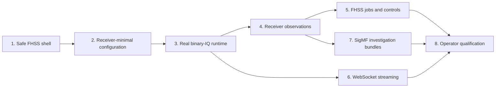

# FHSS-First Dashboard Remediation and Implementation Plan

> Archived historical dashboard-planning record. Not current authority.

Date: 2026-07-17

Status: Proposed implementation plan

Normative repository inputs:

- `docs/dsp/fhss_architecture.md` for FHSS message, IQ generation, receiver,
  metadata, and synthetic-only evidence rules.
- `docs/dsp/fhss_validation_plan.md` for validation terminology, evidence
  classification, and the explicit absence of HWIL.
- `docs/graphx_dashboard.md` for the current dashboard artifact inventory and
  implementation gap assessment.

Historical input, not a completion record:

- `GRAPHX_FHSS_WEB_DASHBOARD_PLAN.md` and the archived implementation prompts.

## 1. Objective

Deliver a trustworthy, externally testable, FHSS-specific embedded dashboard
before attempting to generalize dashboard infrastructure for other GraphX
applications.

The dashboard will let an operator:

1. load an architecture-conformant synthetic IQ recording;
2. inspect the receiver-only graph and its minimal configuration;
3. start, stop, rebuild, and observe real graph execution;
4. distinguish scheduled/generator truth from receiver observations;
5. examine channel, pulse, decoder, timing, and graph diagnostics;
6. export reproducible IQ, truth, receiver-result, and SigMF artifacts without
   mixing those products;
7. reconnect to a bounded event stream without silently losing state; and
8. reproduce each implementation phase from documented command lines.

The work is not authorized to create a generic dashboard product first. Shared
abstractions may be extracted only after the FHSS vertical slice has proven
their contracts through real use.

## 2. Evidence and deployment boundary

There is no hardware-in-the-loop, conducted RF, channel-emulator, over-the-air,
or independently recorded RF testing available. All dashboard examples and
qualification evidence use synthetic IQ or software-derived receiver data.

This has four mandatory consequences:

- UI and exported reports label the evidence `synthetic`.
- Generator truth is stored and transported separately from raw IQ and
  receiver observations.
- Receiver execution receives only IQ and receiver configuration; it never
  receives the scheduled messages, expected hop sequence, or other generator
  truth.
- Passing this plan qualifies the synthetic FHSS dashboard workflow, not RF or
  production receiver performance.

The default deployment profile is a trusted local workstation. “External
operator” means a person other than the developer can build or unpack the
example, execute documented commands, open the printed URL, complete a
checklist, and retain machine-readable results. It does not mean exposing an
unauthenticated service on a network.

## 3. Standards and research baseline

The following sources govern acceptance decisions. They are primary standards
or authoritative project documentation rather than secondary summaries.

| Source | Requirements adopted by this plan |
|---|---|
| [RFC 9110: HTTP Semantics](https://www.rfc-editor.org/rfc/rfc9110.html) | Correct method semantics, status codes, media types, conditional requests, and protocol-compliant parsing/response behavior. |
| [RFC 9112: HTTP/1.1](https://www.rfc-editor.org/rfc/rfc9112.html) | Unambiguous message framing and rejection of malformed or conflicting transfer-length input. |
| [RFC 9457: Problem Details for HTTP APIs](https://www.rfc-editor.org/rfc/rfc9457.html) | Consistent `application/problem+json` errors whose HTTP and body status agree. |
| [RFC 6585: Additional HTTP Status Codes](https://www.rfc-editor.org/rfc/rfc6585.html) | `428` for required preconditions and `429` plus `Retry-After` for rate limits where applicable. |
| [RFC 8259: JSON](https://www.rfc-editor.org/rfc/rfc8259.html) | Interoperable JSON plus explicit implementation limits for bytes, depth, members, arrays, and numbers. |
| [RFC 6455: WebSocket Protocol](https://www.rfc-editor.org/rfc/rfc6455.html) | Standards-compliant handshake, origin validation, client masking, fragmentation, ping/pong, close, and failure behavior. |
| [RFC 6901: JSON Pointer](https://www.rfc-editor.org/rfc/rfc6901.html) | Canonical addressing of configuration fields. |
| [RFC 6902: JSON Patch](https://www.rfc-editor.org/rfc/rfc6902.html) | Atomic patch evaluation and `application/json-patch+json`; failed operations leave the document unchanged. |
| [RFC 3339: Internet Timestamps](https://www.rfc-editor.org/rfc/rfc3339.html) | UTC event and operation timestamps with an unambiguous Internet profile. |
| [OpenAPI 3.1.2](https://spec.openapis.org/oas/v3.1.2.html) | Pinned, machine-readable HTTP interface contract. |
| [JSON Schema Draft 2020-12](https://json-schema.org/draft/2020-12) | Request, response, event, configuration, truth, and result schemas. |
| [WCAG 2.2](https://www.w3.org/TR/WCAG22/) and [WAI-ARIA tabs pattern](https://www.w3.org/WAI/ARIA/apg/patterns/tabs/) | WCAG 2.2 AA target, keyboard-operable tabs and controls, focus visibility, live status, labels, non-color status cues, reflow, and contrast. |
| [NIST SP 800-218 SSDF 1.1](https://csrc.nist.gov/pubs/sp/800/218/final) | Recorded security requirements, threat-oriented verification, dependency provenance, review evidence, and vulnerability-focused tests. |
| [OWASP ASVS 5.0](https://owasp.org/www-project-application-security-verification-standard/) and [OWASP API Security Top 10: 2023](https://owasp.org/API-Security/editions/2023/en/0x04-release-notes/) | Bind/authentication policy, access control, resource limits, input validation, safe file operations, security headers, API inventory, and negative testing. |
| [Content Security Policy Level 3](https://www.w3.org/TR/CSP/) | Restrictive browser resource policy, including script, connection, object, and framing sources. |
| [SigMF specification 1.2.6](https://sigmf.org/) | Portable IQ metadata, datatype/sample-rate/frequency description, capture/annotation structure, integrity hashes, and schema validation. |
| [OpenTelemetry semantic conventions](https://opentelemetry.io/docs/specs/semconv/) | Stable metric names, units, attribute meanings, and bounded cardinality where standard conventions apply. |
| [Boost.Beast HTTP/WebSocket documentation](https://www.boost.org/doc/libs/latest/libs/beast/doc/html/index.html) | Maintained asynchronous HTTP/WebSocket implementation, deadlines, rate limits, strand ownership, and graceful protocol shutdown. |
| [Clang AddressSanitizer](https://clang.llvm.org/docs/AddressSanitizer.html) | Memory-safety qualification lane for request parsing, streaming, and file/export code. |

The current hand-written POSIX HTTP parser is not an acceptable long-term
implementation of these protocol and resource-management requirements. Phase 1
must record an architecture decision and replace it with a maintained library.
Boost.Beast is the preferred choice because the repository's historical plan
already selected it and its official implementation covers both HTTP and
WebSocket. If dependency availability prevents its use, the implementer must
submit a documented alternative for verifier approval before changing the
plan; another ad hoc parser is not acceptable.

## 4. Current gaps to close

The plan treats the following as discovered facts, not hypothetical risks:

| Gap | Required outcome |
|---|---|
| `Options::host` is ignored and the server binds all interfaces | Bind the requested address; default and operator examples are loopback-only. |
| Start/stop/rebuild mutate session state without controlling an executor | One runtime owner performs real, transactional graph lifecycle actions. |
| Dashboard modes both enter a no-run function | CLI names and behavior agree; inspection and execution modes are explicit. |
| Generic configuration service embeds FHSS derivation rules | FHSS application policy owns scenario derivation; reusable services remain domain-neutral. |
| Assembler configuration still receives redundant truth/frequency fields | Minimal receiver config contains `preamble_pulses`; active frequencies are derived from it; no messages are required. |
| Step 5 test is excluded and its controller is missing | Controls are absent/disabled until a real source-owned job/controller exists, then implemented and tested. |
| Event transport is HTTP polling, not WebSocket, and the UI ignores it | Preserve a documented fallback but implement and consume bounded RFC 6455 streaming. |
| “Detected,” “confidence,” “Viterbi,” and spectrum values are placeholders | Expected/truth and observed/receiver schemas and panels are separate; no fabricated observations. |
| Artifact “capture” writes metadata but no IQ | Export valid, linked IQ and SigMF products or label metadata-only outputs precisely. |
| Static file containment uses string-prefix ancestry | Component-aware canonical containment with symlink and sibling-prefix negative tests. |
| No request/time/concurrency/security limits | Explicit limits, deadlines, backpressure, origin policy, security headers, and hostile-input tests. |
| Dashboard assets are not installed and feature gating is partial | Reproducible packaging; dashboard-only code and assets follow the build option. |
| Capability/policy and embedded dashboard command paths are disconnected | FHSS path has one runtime-control authority; legacy path is adapted or explicitly deprecated after proof. |
| Tests are socket-level only | Add API-schema, runtime integration, browser, accessibility, security, sanitizer, and operator acceptance lanes. |

## 5. Phase delivery contract

Every phase is a runnable vertical slice. A phase is incomplete unless an
external operator can exercise its newly added behavior without reading source
code or invoking private test hooks.

### 5.1 Required operator bundle

Each phase adds or updates:

```text
examples/DSP/dashboard/operator/
  README.md
  fhss_dashboard_operator.py
  scenarios/
  expected/
  schemas/
```

The operator tool must use only documented public executables and HTTP or
WebSocket interfaces. It must not link test-only code or call failure-injection
methods. It provides these stable commands as they become applicable:

```text
prepare       Generate or locate architecture-conformant synthetic IQ.
serve         Launch the FHSS demo/dashboard on loopback and print its URL.
exercise      Execute the current phase's operator workflow.
verify        Validate API schemas, state transitions, artifacts, and hashes.
report        Write a machine-readable operator report and concise summary.
cleanup       Stop the owned process and remove only tool-created temporary data.
```

Each phase stores a `phase_id`, source revision, build profile, compiler,
platform, input hashes, commands, API version, result, and artifact hashes in
the operator report. Temporary output uses an explicitly created directory,
never a hard-coded `/tmp` location.

### 5.2 Common quality gates

Every phase must pass all of the following before verification can return PASS:

- C++26 build with dashboard enabled and disabled.
- Focused unit, API-contract, and phase integration tests.
- Browser/operator example for the phase.
- All previously completed dashboard phase tests.
- Full `libgraph`, `libdsp`, and DSP example regression suites.
- JSON Schema/OpenAPI validation for changed contracts.
- `git diff --check`.
- No unresolved blocking or high-severity verifier findings.
- No claims of hardware, RF, or production qualification.

ASan/UBSan, TSAN, browser accessibility, and WebSocket protocol gates become
mandatory in the phases that introduce their affected surfaces and remain
regression gates thereafter.

## 6. Multi-agent workflow

Use one orchestrator, one implementer, and one independent verifier. The
orchestrator does not implement around unresolved findings and the verifier
does not edit implementation files.

### 6.1 Orchestrator

For each authorized phase, the orchestrator must:

1. audit the repository and preserve unrelated changes;
2. translate the phase into a file-level acceptance checklist;
3. record which prior gaps and standards requirements are in scope;
4. assign the phase to one implementer agent;
5. require implementation evidence and a runnable operator bundle;
6. assign the result to one fresh verifier agent;
7. route every verifier finding, including medium and low findings, to the
   implementer for disposition;
8. repeat implementation and independent verification until all blocking/high
   findings are resolved and every acceptance criterion passes;
9. run or independently confirm focused and full regression gates; and
10. stop at the phase boundary and request authorization for the next phase.

The orchestrator must not commit, push, open a pull request, or proceed to the
next phase unless explicitly requested.

### 6.2 Implementer agent

The implementer must:

- audit before editing and reuse completed work where it meets the contract;
- implement only the authorized phase and immediate enabling changes;
- preserve the truth/IQ/receiver-result separation;
- keep the dashboard FHSS-specific until this plan authorizes extraction;
- add production-facing tests, not only test hooks;
- create/update that phase's operator workflow and expected evidence;
- build in C++26 mode and run focused tests plus the operator example;
- report changed files, commands, results, known limitations, and any standard
  requirement intentionally deferred; and
- fix every accepted verifier finding, then return updated evidence.

### 6.3 Verifier agent

The verifier must:

- be independent from implementation and avoid editing implementation files;
- verify each criterion with direct code, test, API, browser, and artifact
  evidence;
- run the operator workflow from its README as an external user would;
- inspect actual responses and files rather than trusting console summaries;
- confirm the receiver never receives generator truth;
- confirm claims and UI labels match the evidence source;
- assess security, concurrency, cleanup, and failure behavior introduced in the
  phase;
- report findings by severity with file and line references;
- give explicit PASS/FAIL for every acceptance criterion and common gate; and
- return FAIL if a test is unwired, skipped unexpectedly, self-referential, or
  uses the production implementation as its only oracle.

## 7. Phased implementation

### Phase 1 — Secure FHSS dashboard walking skeleton

Goal: make the first supported dashboard explicitly FHSS-specific, safe for a
local operator, packaged, and governed by machine-readable contracts.

Implementation:

- Replace the ad hoc socket/parser loop with the selected maintained HTTP
  library and asynchronous connection handling.
- Honor `Options::host`; accept explicit IPv4/IPv6 loopback values and reject
  unsupported or non-loopback binds in the default local profile.
- Add request-header, request-body, response-body, connection-count, read,
  write, idle, and total-operation limits.
- Reject ambiguous or conflicting HTTP framing and document JSON byte, nesting,
  collection, numeric, and duplicate-name policies.
- Implement clean signal shutdown, connection draining, and deterministic port
  release.
- Fix static-asset containment using path components and regular-file checks.
- Serve only FHSS-branded assets and `/api/v1/fhss/*` application routes; retain
  only generic `/healthz`, `/readyz`, and version discovery where useful.
- Add security headers appropriate to the single-file application, including a
  Content Security Policy that removes inline script/style requirements or uses
  build-time hashes/nonces.
- Install/package the dashboard assets with `graphx-dsp-fhss-demo` and align the
  build option so disabled builds exclude dashboard-only deliverables.
- Add `openapi.yaml` plus JSON Schemas for every Phase 1 response and error.
- Return RFC 9457 `application/problem+json` errors and include `Allow` on
  method-not-allowed responses.
- Keep all controls that do not work hidden or disabled with an explicit
  “not available in this phase” explanation.

Operator example:

```bash
python3 examples/DSP/dashboard/operator/fhss_dashboard_operator.py \
  exercise --phase 1 --build-dir build-dashboard
```

The tool launches on an ephemeral loopback port, checks health/readiness,
loads the packaged FHSS page, verifies graph/config schemas, attempts rejected
path traversal and oversized requests, records the URL, and writes a Phase 1
report.

Acceptance:

- packet inspection or socket probing proves the process listens only on the
  configured loopback address;
- malformed, partial, oversized, slow, and unsupported-method requests fail
  within documented limits without blocking another client;
- safe `GET` requests do not create events or mutate application state;
- sibling-prefix and symlink static-file escapes fail;
- OpenAPI and response schemas validate;
- installed-tree launch works without the source asset directory;
- dashboard-disabled build contains no FHSS web asset or demo web macro; and
- ASan/UBSan parser/server tests and the external operator example pass.

### Phase 2 — FHSS configuration authority and receiver-minimal graph

Goal: expose one architecture-conformant FHSS scenario/configuration contract
without leaking generator truth into the receiver graph.

Implementation:

- Split the generic document/revision/operation service from an
  `FHSSDashboardConfigurationPolicy` owned by the DSP example or DSP library.
- Make `docs/dsp/fhss_architecture.md` the normative derivation source.
- Parse `preamble_pulses` directly for preamble and assembler configuration.
- Derive active frequency indices from the preamble; do not require or emit
  assembler `active_frequency_indices`, scheduled `messages`, or
  `truth_from_fixture`.
- Use a binary-IQ receiver graph with no FHSS message definitions.
- Implement atomic RFC 6902 patch behavior, correct media type, canonical RFC
  6901 paths, explicit generated/read-only paths, and revision conflicts.
- Publish revision ETags, require `If-Match` for mutation, return `412` for a
  stale validator and `428` when the required precondition is absent; retain a
  documented compatibility period if `expected_revision` already has users.
- Correct overlap/timing validation to use architecture-defined samples per
  pulse, pulse gaps, message windows, and overlap rules.
- Generate schemas for authoritative scenario, receiver configuration,
  validation errors, and derivation provenance.

Operator example:

The Phase 2 workflow opens the UI, edits an allowed RF/scenario field, validates
without applying, applies with the current revision, demonstrates a stale-tab
`409`, exports authoritative and effective documents, and proves the binary-IQ
receiver export contains neither messages nor redundant assembler frequencies.

Acceptance:

- derivation golden tests use an independent expected document, not the
  production deriver as oracle;
- malformed pointers and patches are atomic and cannot partially mutate state;
- preamble and assembler isolated-node parser tests accept minimal config;
- active frequencies exactly match the set derived from `preamble_pulses`;
- receiver graph and runtime inputs contain no generator truth or messages;
- two independent browser/operator sessions demonstrate deterministic
  optimistic concurrency; and
- the Phase 1 operator workflow remains green.

### Phase 3 — Real runtime ownership and binary-IQ replay

Goal: make dashboard lifecycle controls operate a real FHSS receiver graph.

Implementation:

- Introduce one runtime-owner interface that owns executor construction,
  graph-manager publication, execution thread, stop token, join, replacement,
  cleanup, and terminal result.
- Inject that interface into `GraphRuntimeSession`; remove simulated production
  lifecycle transitions and reserve fault injection for tests.
- Give `--dashboard` and `--dashboard-no-run` distinct, documented semantics.
- Build/rebuild transactionally: validate and construct replacement state
  before activation; retain the old usable generation on pre-activation
  failure; block or explicitly recover from cleanup failure.
- Start and stop the real executor through the API; publish state only after the
  corresponding lifecycle action reaches its defined milestone.
- Bind `GraphSnapshotCollector` to the active generation and attach generation
  IDs to metrics, diagnostics, events, and results.
- Replay a binary IQ file produced by
  `graphx-dsp-fhss-iq-generator`; pass only receiver configuration to execution.

Operator example:

The Phase 3 workflow selects exactly one complete canonical message, preserves
all of its pulses and fields, shifts its transmit start by one 6,500-sample
pulse slot for causal receiver warm-up, and generates a deterministic IQ
recording. It starts the dashboard stopped, verifies zero/empty runtime metrics,
starts actual replay, observes nonzero edge activity and a terminal receiver
result, asserts that Stop reports the already-completed state, rebuilds, runs
the identical bounded fixture again, and records both generation IDs. The
separate long fixture remains responsible for in-flight cancellation coverage.

Acceptance:

- start results in a real executor thread and graph traffic, not only state
  mutation;
- stop interrupts and joins within a bounded deadline;
- rebuild changes the active generation only after successful construction;
- failed build, run, stop, and cleanup paths leave truthful state and no leaked
  thread;
- shutdown drains server work and joins runtime work without deadlock;
- TSAN lifecycle/concurrency tests pass on supported hosts;
- a receiver-input audit proves no truth side channel; and
- the external operator can reproduce two complete binary-replay runs.

### Phase 4 — Truthful FHSS observations and graph telemetry

Goal: replace placeholder visualizations with receiver-derived data while
keeping expected truth visibly separate.

Implementation:

- Define separate schemas and types for `FHSSExpectedTruth`,
  `FHSSReceiverObservation`, and `FHSSComparisonResult`.
- Populate observed pulse times, channels, acceptance/rejection reasons,
  confidence inputs, preamble state, assembler state, decoder path metrics, and
  terminal message results from actual node diagnostics/results.
- Do not invent confidence, Viterbi margin, detections, or spectra. A missing
  observable is `null`/unavailable with a reason.
- Calculate selected-channel spectra from captured receiver-side samples with
  documented window, FFT size, scaling, units, and sample interval.
- Display expected and observed overlays with independent toggles and explicit
  `synthetic truth` versus `receiver observed` legends.
- Give metrics stable names, types, units, generation IDs, and bounded label
  cardinality; map to OpenTelemetry conventions where applicable.
- Bound snapshot sizes and time-series retention independently of graph rate.

Operator example:

The Phase 4 workflow runs at least three synthetic fixtures: clean, impaired
(CFO/noise), and negative/no-message. It captures screenshots and JSON, shows
expected-versus-observed timing/channel differences, and verifies that the
negative fixture produces no fabricated detection.

Acceptance:

- independent golden fixtures validate pulse timing, channel indices, decoder
  results, spectrum bins, and units;
- every observed field has a traceable receiver source;
- removing receiver diagnostics makes fields unavailable rather than falling
  back to truth;
- negative/no-message and malformed-IQ cases display truthful terminal states;
- browser refresh does not change decoder or receiver results; and
- bounded snapshot/retention load tests pass.

Phase 4 implementation note: validation is synthetic-data-only because no
HWIL, conducted-RF, channel-emulator, independently recorded, or OTA test path
is available. The operator therefore binds clean, independently impaired, and
negative synthetic IQ to separate receiver served-state evidence and records a
malformed-IQ failure. This phase cannot confer production-RF qualification.
The clean generator selects exactly one complete canonical message, preserves
all of its pulses and fields, uses the receiver's explicit 64-channel, 7.5
MHz-spaced IQ offset map, and shifts its start by one 6,500-sample pulse slot so
the causal channel filter is warm before the first decoded word. The impaired
and negative cases derive from this same isolated validation fixture; the
separate 80-message replay remains the real cancellation workload. Neither the
map nor the schedule is passed to receiver execution as truth. Receiver
execution has a 30-second processing bound while Stop retains its independent
five-second join bound; reaching the processing bound without an executor
completion signal is an `execution_failed` result, never a successful
completion.
Schedule/timeline rendering uses the configured message start and the normative
6,500-sample pulse period, with complete non-null display fields. The spectrum
selector is bounded to physical receiver channels 0–63 and defaults only from
a receiver-observed pulse's physical channel. When no receiver channel is
observed, the selector is disabled and the API omits the channel:
`channel_index` is null, availability is
`unavailable/no_candidate_detected`, and bins are empty. It never falls back to
reserved channel 0. Its bounded receiver capture selects a deterministic highest-energy
window and preserves the corresponding global sample-time anchor.
Graph execution lifecycle (`terminal_result`) and terminal receiver-message
semantics (`receiver_message_result`) are separate fields. A negative replay
may truthfully reach the assembler and report missing preamble, but it must have
`accepted: false`, zero decoded pulses, zero detections, and no lock.
Unavailable receiver counts are represented as `null`, never a numeric zero.
Decoder observations carry the receiver's raw best-path and second-best-path
metrics end to end; no inferred margin is used. Receiver provenance leaves
wall-clock capture time and cadence unavailable unless those values are carried
exactly by the typed receiver product. Invalid spectrum captures, including a
zero input-sample interval or non-finite samples, remain unavailable through
the public spectrum route and never acquire an `observed` label.

### Phase 5 — FHSS job generation and message-oriented control

Goal: let an operator request synthetic FHSS work without introducing an
in-graph truth shortcut or arbitrary node stepping.

Implementation:

- Implement an FHSS job/controller at the application boundary, not inside
  generic `libgraph` dashboard code.
- A job invokes the canonical architecture-conformant IQ generator to create
  raw IQ plus separate truth and SigMF metadata, then queues receiver-only
  binary replay.
- Define job states, stable correlation IDs, idempotency rules, cancellation,
  timeouts, bounded history, and terminal receiver results.
- Make “Step one message” mean generate/replay one complete protocol message
  and allow it to reach a terminal pipeline result; never pause arbitrary nodes.
- Implement Step, Continue, Reset only when their public semantics and failure
  behavior are complete. Remove the orphaned/uncompiled Step 5 source or replace
  it with wired tests of the production controller.
- Serialize control operations through the single runtime owner.

Operator example:

The Phase 5 workflow submits one clean message job, repeats the same idempotency
key, rejects a conflicting reuse, runs a multi-message Continue job, cancels a
queued job, resets after completion, and verifies every IQ/truth/result hash and
correlation ID.

Acceptance:

- generated IQ is byte-conformant with architecture golden fixtures;
- receiver execution receives only the generated IQ path and receiver config;
- job truth and receiver result remain separate and correlate by opaque IDs;
- duplicate, cancel, timeout, reset, and restart behavior is deterministic;
- no hidden test controller or unwired test file remains; and
- operator artifacts can be replayed without the dashboard.

Implemented Phase 5 semantics:

- one application-owned worker serializes generation and receiver replay
  through the existing runtime owner;
- Step is exactly one complete message and Continue is bounded to four complete
  messages per job;
- job history is bounded to 32 entries/2 MiB, idempotency history to 64 keys,
  generated IQ to 4,194,304 samples/64 MiB, metadata to 1 MiB, and timeouts to
  100–120,000 ms;
- queued cancellation produces no artifacts, active cancellation is
  cooperative, and timeout stops the owned replay before becoming terminal;
- reset is rejected during active work and otherwise advances an opaque
  controller epoch idempotently; and
- in-memory jobs are not restored after a process restart. Committed artifacts
  remain separate and replayable, while interrupted temporary artifacts are
  never published as completed jobs.

All Phase 5 inputs and evidence are synthetic. No hardware-in-the-loop facility
is available, so HWIL, conducted-RF, OTA, and production-RF claims remain out
of scope.

### Phase 6 — Bounded WebSocket streaming and replay

Goal: add live updates without sacrificing deterministic recovery or allowing a
slow browser to affect graph execution.

Implementation:

- Implement RFC 6455 streaming with the maintained server library.
- Validate `Origin` against the configured local origin; reject unexpected
  cross-origin browser connections.
- Enforce handshake, frame, reassembled-message, client-count, queue-depth,
  event-rate, and idle limits.
- Support ping/pong, graceful close, fragmented input rules, invalid UTF-8
  handling, client masking requirements, and shutdown.
- Preserve monotonic event sequence, generation ID, RFC 3339 timestamp,
  retention window, contiguous replay, and explicit `resync_required`.
- Connect configuration, runtime, metrics, diagnostics, jobs, and terminal
  results to one event publisher.
- Make the browser consume WebSocket events, perform replay after reconnect,
  fetch a full snapshot on resync, and use bounded polling only as a documented
  fallback.

Operator example:

The Phase 6 workflow runs two clients, disconnects one under load, reconnects
within and beyond retention, validates replay/resync, slows one consumer until
its queue overflows, and proves graph execution and the other client continue.

Acceptance:

- RFC 6455 protocol tests cover handshake, masking, fragmentation, control
  frames, close, invalid input, and origin rejection;
- browser reconnect resumes only a contiguous retained range;
- overflow reports drops/resync rather than blocking publishers;
- memory and CPU stay within documented bounds for the supported client count;
- HTTP polling fallback remains schema-compatible; and
- TSAN plus sanitizer streaming tests pass.

Implemented Phase 6 semantics:

- Boost.Beast owns the RFC 6455 upgrade and framing on the existing loopback
  listener; the request authority and single `Origin` must exactly match the
  bound loopback endpoint; extension offers are safely declined by omission and
  unsupported subprotocols are rejected before upgrade;
- every process start creates an opaque publisher epoch and every event carries
  monotonic sequence, RFC 3339 time, graph generation/run epoch, configuration
  revision/ETag, optional controller/job/correlation/semantic identifiers, and
  a source-owned payload;
- graph/job threads capture generation/run/configuration provenance at ingress
  commit and enqueue into an event-and-byte-bounded publisher ingress;
  metrics/diagnostics coalesce deterministically while terminal/config/job
  transitions already admitted to ingress retain FIFO order. Admission is
  non-blocking: coalescible entries are evicted first, and if the bounded queue
  contains only critical transitions the newest critical event is rejected and
  every client is required to resynchronize. No producer thread bypasses the
  ingress or publishes synchronously. Snapshot
  collection, serialization, retention commit, and client fan-out run outside
  graph and job critical sections;
- frame, reassembled-message, fragment, command/event rate, replay, queue,
  connection-lifetime, idle, close, client-count, and client-state lifetime
  limits are enforced; retention is bounded by 4,096 events, 8 MiB, and 120
  seconds, and each of at most eight clients is bounded independently;
- the browser resumes only a contiguous range in the same epoch, fetches a
  schema-validated coherent HTTP snapshot after any epoch/sequence/schema
  discontinuity, ignores exact duplicates, fetches only the fixed same-origin
  snapshot route, atomically replaces its coherent display model, and uses
  bounded polling plus a capped exponential reconnect budget only while
  WebSocket transport is unavailable;
- the external operator drives maintained Firefox through WebDriver BiDi. It
  forces a real WebSocket-only outage while HTTP health and snapshots remain
  available, observes polling and coherent restoration in the rendered page,
  and captures browser-authenticated screenshots, console entries, browser
  identity, session/context IDs, timestamps, served-state hashes, and viewport
  hashes. Hand-authored console JSON is not accepted as browser evidence;
- Phase 6 evidence remains synthetic-only. No HWIL, conducted-RF, OTA, or
  production-RF qualification is available.

### Phase 7 — Investigation artifacts and SigMF integrity

Goal: provide reproducible evidence bundles that accurately contain what the UI
claims they contain.

Implementation:

- Export raw IQ as `.sigmf-data` or reference an immutable existing IQ file and
  export a schema-valid `.sigmf-meta` describing datatype, sample rate, center
  frequency, captures, annotations, `core:version`, and `core:sha512`.
- Export truth, receiver observations, comparison results, effective receiver
  config, API/version/build manifest, hashes, and operator action log as
  separate files in one manifest.
- Use safe artifact-root handles/component checks, collision policy, atomic
  temporary-file rename, cleanup, quotas, and cancellation.
- Never place raw IQ inside JSON. Never label metadata-only output a capture.
- Allow explicit opt-in for large IQ copying; default to a manifest reference
  plus hash when the input already exists.
- Validate imported/replayed bundles before use and reject traversal, symlink,
  datatype, length, or hash mismatches.
- Embed the exact official SigMF and repository API schemas in the production
  validator; parse semantically used artifacts from retained hashed
  descriptors, reject path replacement/in-place mutation, cross-correlate all
  source-job/request/controller/scenario and sample/configuration/run
  identities, and publish a separately hashed
  executable/build/OpenAPI/schema manifest.
- Enforce retained bytes as an aggregate approved-root quota, reporting current
  and remaining bytes and rechecking the reservation before atomic rename.
- Keep qualification faults outside the request/API contract. A fixed,
  startup-only, visibly non-production executable profile may expose bounded
  quota, copy-limit, ENOSPC, cancellation, timeout, and shutdown seams to the
  external operator; normal dashboard startup must never enable it.

Operator example:

The Phase 7 workflow exports both reference-only and copied-IQ bundles, validates
them with the official SigMF schema/tooling, replays the exported recording,
compares receiver result hashes, and demonstrates rejection of tampered and
out-of-root bundles. It persists real browser captures and served-state records
for reference completion, copy completion, replay success, and a safe terminal
failure. Source-tree and installed-tree workflows run the same named failure
and cleanup matrix.

Acceptance:

- byte length matches datatype and sample count;
- SigMF metadata validates and points to the correct bytes;
- the declared SHA-512 digest matches the dataset exactly;
- truth, observation, and comparison files have distinct schemas and hashes;
- path traversal, sibling-prefix, symlink, quota, disk-full, cancellation, and
  partial-write tests fail safely;
- replay from the bundle reproduces deterministic receiver results; and
- UI labels and manifest contents agree exactly.

### Phase 8 — Browser accessibility, security, packaging, and qualification

Goal: turn the completed FHSS vertical slice into a supportable local operator
tool and decide what, if anything, should be generalized.

Implementation:

- Meet WCAG 2.2 AA for the supported browser set: keyboard operation, focus,
  tabs, labels, live status, contrast, non-color cues, reduced motion, zoom,
  reflow, and error identification.
- Remove unsafe `innerHTML` interpolation or constrain it to static templates;
  render all external values with safe DOM text APIs.
- Complete ASVS/API threat review for the local profile and document which
  controls are mandatory before any non-loopback deployment.
- Add browser automation for navigation, lifecycle commands, reconnect,
  visualizations, exports, and accessibility scans.
- Add sustained runtime/server load, memory, handle, thread, reconnect, and
  shutdown soak tests.
- Add bounded coverage-guided fuzz targets for HTTP/JSON input, JSON
  Pointer/Patch, WebSocket event decoding, and artifact/SigMF import; retain
  minimized failures as regression seeds.
- Validate installed packages on supported host profiles with no source-tree
  dependency.
- Publish an operator guide, troubleshooting guide, API compatibility policy,
  schema inventory, support matrix, and synthetic-only qualification statement.
- Review the proven FHSS application boundaries and propose—not automatically
  perform—generic extraction of HTTP server, document store, runtime owner,
  snapshots, and events.

Operator example:

The Phase 8 qualification workflow performs a clean installed-tree setup,
generates synthetic IQ, exercises the complete UI using keyboard-only and
automated browser paths, runs reconnect/export/replay, executes a bounded soak,
and produces a signed-off machine-readable qualification report.

Acceptance:

- supported browser automation and accessibility checks pass with no serious or
  critical findings and all manual WCAG checks are recorded;
- the local threat model has no unresolved blocking/high finding;
- installed-tree, clean-environment, sanitizer, concurrency, soak, focused, and
  full regressions pass;
- documentation contains no live-RF, hardware, or production qualification
  claim; and
- verifier explicitly recommends whether generic extraction is justified.

## 8. Phase dependency and stop rules



Phases 4 and 6 may be developed from the common Phase 3 baseline only if their
API schemas are frozen jointly; integration still occurs in numeric order for
operator releases. No phase may hide a failed prerequisite behind placeholder
data.

Stop after every phase. Do not proceed automatically. A phase is blocked—not
passed with limitations—when:

- the operator example cannot run from its documentation;
- receiver execution receives generator truth;
- UI claims observed data that is synthetic truth or a placeholder;
- start/stop/rebuild state disagrees with actual executor state;
- the server exposes an unauthenticated non-loopback listener;
- a new schema is undocumented or fails validation;
- a required test is excluded, skipped, self-referential, or flaky; or
- focused/full regressions or `git diff --check` fail.

## 9. Final completion criteria

This plan is complete only when all eight phases pass independent verification
and an external operator can reproduce the installed FHSS dashboard workflow
using synthetic IQ from generation through replay, observation, export, and
replay of the exported bundle.

The completion report must state:

```text
Dashboard scope: FHSS-specific
Input evidence: synthetic IQ only
HWIL/conducted/OTA evidence: unavailable and deferred
Receiver truth isolation: PASS/FAIL
Focused tests: passed/total
Full regressions: passed/total
Browser/accessibility: PASS/FAIL
Security local profile: PASS/FAIL
Operator workflow: PASS/FAIL
Production RF qualification: NOT QUALIFIED
```
