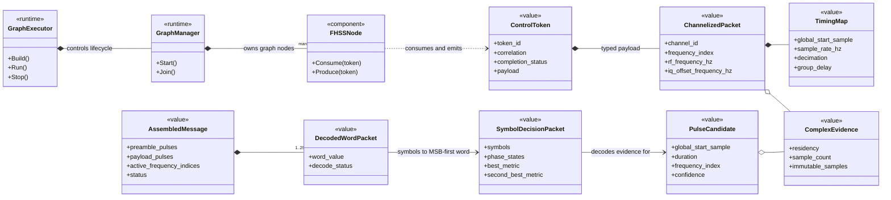
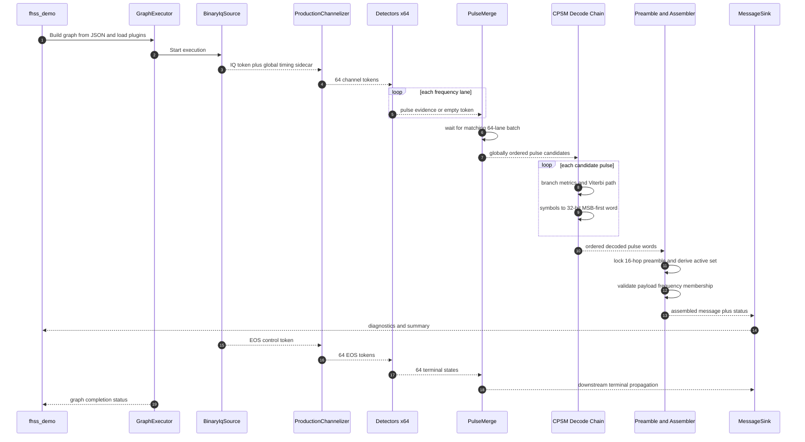
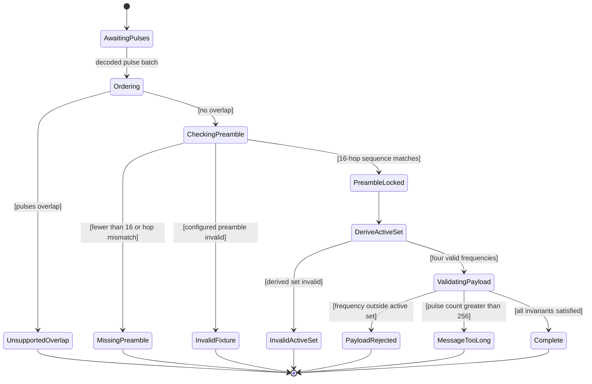
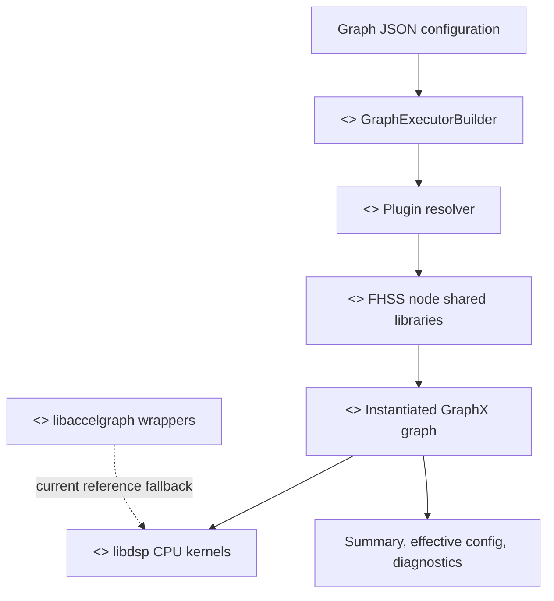
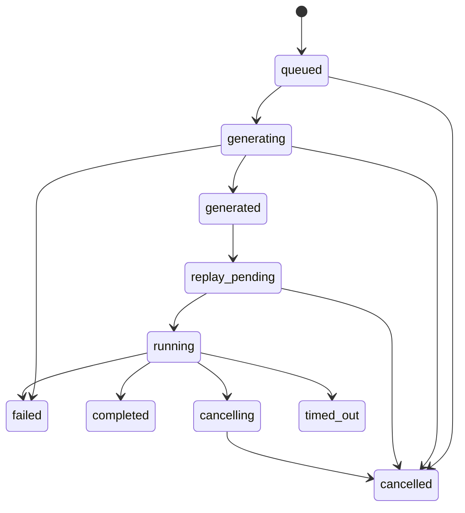

# FHSS Architecture

This document describes the current GraphX FHSS implementation as of the live
`libdsp`, `libaccelgraph`, and `examples/DSP` code. The implementation has two
closely related runtime variants: a deterministic FHSS/CPSM fixture graph and a
truth-free binary-IQ engineering receiver. They share the typed downstream
decode chain, GraphX packet contracts, scheduler behavior, diagnostics, and
accelerator-facing interfaces. Neither variant is a production-qualified RF
receiver.

## Validation and qualification boundary

Phase 3 adds an independent waveform/channel harness at
`examples/DSP/tools/fhss_phase3_independent.py`. It is deliberately outside
`libdsp` and does not import production generator, decoder, channelizer,
detector, fixture, or truth helpers. It writes binary IQ and a separate
evaluator-only truth manifest. The truth-free Phase 2 receiver graph receives
only the IQ path and declared receiver configuration.

Acquisition revealed that absolute-phase CPSM branch scoring made the first bit
absorb unknown initial carrier phase and the causal FIR burst-start transient.
The receiver now eliminates one constant nuisance phase with a pulse-global
reference. It does not re-anchor every symbol: the accumulated h=1/2 phase
state and phase continuity across symbol boundaries remain in the branch
metric. Tests distinguish the same symbol from different states, reject an
inserted boundary phase reset, preserve an unknown constant carrier phase, and
cover causal filter/decimate/expand first-bit evidence.

The Phase 3 profile, schemas, raw measurements, aggregate, and limitations are
documented in `fhss_phase3_characterization.md`. Those results are engineering
simulation only. In particular, the present detector frequency-error field is
not a qualified CFO estimator, decoder confidence is not calibrated as a
probability, and overlapping co-channel FHSS transmitters are not separated.
The v2/v3 evidence is retained as invalidated history because it used an
incorrect noise calibration, conditional-error denominators, and insufficient
message statistics. The remediated harness defines wanted active-symbol power
before blockers, hardware, and noise. For complex baseband,
`E{|n[k]|^2}=N0*Fs`, `Eb=Es=Pactive/Rb`, and sample SNR is
`Pactive/E{|n[k]|^2}`. IQ/DC, AGC, AWGN, clipping, and quantization execute as
separate ordered stages. SIR is referenced to the wanted active power and the
blocker is excluded from the AWGN reference.
The implemented time-varying engineering Rayleigh process is a seeded finite
sum of complex sinusoids. Its test validates the component
frequencies, finite-record power, and autocorrelation. It does not constrain an
instantaneous composite phase derivative, which can become arbitrarily large
near a fading null even when every component is within the declared Doppler
support.

Phases 4 and 5 add governance, replay, qualification, traceability, and
regression-maintenance infrastructure outside the runtime graph. The current
scope has no conducted, channel-emulator, OTA, independently recorded, or
hardware-in-the-loop evidence. All validation data is explicitly classified as
synthetic or software evidence. Consequently:

- software/engineering release readiness may pass from governed software
  evidence;
- synthetic characterization may pass from the frozen Phase 3 evidence;
- recorded-IQ/HIL validation remains `UNAVAILABLE_DEFERRED`;
- production-RF qualification remains `NOT_QUALIFIED`.

Synthetic evidence cannot be promoted to a physical capture class and Phase 3
v7 evidence cannot be reused as Phase 4 hardware data. The qualification and
evidence-management tools are a control plane around the receiver; they are not
part of its signal-processing data path.

## Scope

The canonical implementation is the channelized fixture graph:

```text
libdsp/config/fhss_cpsm_channelized_fixture_500msps.json
```

The graph role is:

```json
{
  "fhss_graph_role": "canonical_channelized_fixture",
  "canonical_fhss_graph": true,
  "reference_only": false
}
```

The canonical runtime lane is:

```text
FHSSSyntheticIqSourceNode
  -> FHSSDownconverterNode
  -> FHSSFixtureFrequencyChannelizerNode
  -> PerChannelPulseDetectorNode[64]
  -> FHSSPulseMergeNode
  -> FHSSPulseCandidateNode
  -> CPSMBranchMetricNode
  -> CPSMViterbiDecoderNode
  -> FHSSPulseWordDecoderNode
  -> FHSSPreambleDetectorNode
  -> FHSSMessageAssemblerNode
  -> FHSSMessageSinkNode
```

The truth-free engineering receiver is configured by:

```text
libdsp/config/fhss_phase2_binary_iq_receiver.json
```

Its input and acquisition lane is:

```text
FHSSBinaryIqFileSourceNode
  -> FHSSDownconverterNode
  -> FHSSProductionCandidateChannelizerNode
  -> FHSSAcquisitionPulseDetectorNode[64]
  -> FHSSPulseMergeNode
  -> FHSSPulseCandidateNode
  -> CPSMBranchMetricNode
  -> CPSMViterbiDecoderNode
  -> FHSSPulseWordDecoderNode
  -> FHSSPreambleDetectorNode
  -> FHSSMessageAssemblerNode
  -> FHSSMessageSinkNode
```

The two lanes are alternatives, not consecutive stages. The fixture lane starts
with configured messages and scheduled detector windows. The truth-free lane
starts with binary IQ and receives no message schedule, expected words,
transmitted-frequency hints, or generator truth. Both converge at pulse merge
and use the same downstream decode contracts.

The generated topology is maintained by:

```text
examples/DSP/tools/generate_fhss_fixture_topology.py
```

## Architectural views and UML semantics

The diagrams in this section use UML concepts expressed with Mermaid syntax:

- `*--` is composition: the contained state belongs to the enclosing object.
- `o--` is aggregation: a packet references shareable immutable evidence.
- `-->` is a navigable association or data transformation.
- `..>` is an implementation dependency without ownership.
- quoted numbers are multiplicities; `64` means one instance or edge per
  frequency-table index.
- `<<component>>`, `<<runtime>>`, `<<plugin>>`, and `<<value>>` are UML
  stereotypes that describe architectural roles rather than C++ inheritance.

### UML component view

```mermaid
flowchart LR
    subgraph Inputs["Input boundary"]
        SYN["<<component>> Synthetic IQ Source<br/>fixture graph"]
        FILE["<<component>> Binary IQ File Source<br/>truth-free graph"]
    end

    DOWN["<<component>> Downconverter"]

    subgraph Acquisition["Channelization and acquisition"]
        FIXCH["<<component>> Fixture Channelizer<br/>mix + decimate"]
        PRODCH["<<component>> Production Candidate Channelizer<br/>mix + FIR + decimate"]
        FIXDET["<<component>> Scheduled Detector x64"]
        ACQDET["<<component>> Acquisition Detector x64"]
    end

    MERGE["<<component>> Pulse Merge"]
    CAND["<<component>> Candidate Policy"]
    BRANCH["<<component>> CPSM Branch Metric"]
    VIT["<<component>> Viterbi Decoder"]
    WORD["<<component>> Pulse Word Decoder"]
    PRE["<<component>> Preamble Detector"]
    ASM["<<component>> Message Assembler"]
    SINK["<<component>> Message and Diagnostic Sink"]

    SYN --> DOWN --> FIXCH
    FILE --> DOWN --> PRODCH
    FIXCH -->|"64 typed output ports"| FIXDET
    PRODCH -->|"64 typed output ports"| ACQDET
    FIXDET -->|"64 terminal-aware inputs"| MERGE
    ACQDET -->|"64 terminal-aware inputs"| MERGE
    MERGE --> CAND --> BRANCH --> VIT --> WORD --> PRE --> ASM --> SINK
```



The compile-time 64-way fan-out makes the invariant "one logical frequency is
one GraphX edge" visible to graph construction, plugin resolution, scheduling,
packet typing, terminal control, and diagnostics. `FHSSPulseMergeNode` waits for
the matching token or terminal state from every lane before completing a batch.

### UML packet and class view



The token sidecar holds semantic metadata and terminal state. Complex samples
are currently represented as host-shared immutable evidence for CPU decoding.
An accelerator implementation may move sample storage out of band, but it must
preserve the timing, frequency, confidence, status, and diagnostic contracts.

### UML sequence view



A zero-detection capture remains a valid graph execution. Empty, failed, and
cancelled terminal tokens propagate through the decode chain without inventing
pulse evidence or using an out-of-band control path.

### UML message-assembly state view

This is a semantic state model. The current implementation may compute the
states as one bounded batch operation rather than persist each state in a
long-lived stateful object.



Preamble lock is hop-order based. The receiver derives the active-frequency set
from the distinct frequency indices in the configured preamble. The assembler
therefore needs `preamble_pulses`, but it does not need a redundant
`active_frequency_indices` field or any scheduled messages.

### UML deployment view



The plugin layer dynamically constructs nodes from graph JSON. DSP token types
remain shared across CPU and accelerator-facing wrappers. Native Metal and CUDA
FHSS kernels are not implemented; fallback execution must not be reported as
native accelerator execution.

## Protocol Model

The protocol constants live in `libdsp/include/dsp/fhss/FHSSProtocol.hpp`.

Current fixture constants:

| Property | Value |
| --- | --- |
| Frequency table size | 64 entries |
| Selectable frequencies | indices 1 through 62 |
| Reserved frequencies | indices 0 and 63 |
| Active frequency count | 4 |
| RF table base | 1 GHz |
| RF spacing | 8 MHz |
| Fixture IQ sample rate | 500 Msps |
| Bit rate | 5 Mbps |
| Samples per symbol | 100 |
| Bits per pulse | 32 |
| Pulse width | 3200 samples |
| Pulse gap | 3300 samples |
| Pulse period | 6500 samples |
| Preamble length | 16 pulses |
| Max message length | 256 pulses including preamble |

The RF table is metadata. Fixture samples are complex baseband/IF IQ at 500
Msps. Each frequency entry carries both:

```cpp
double rf_frequency_hz;
double iq_offset_frequency_hz;
```

`iq_offset_frequency_hz` is what the synthetic generator and channelizer use.
It may be derived from `iq_center_frequency_hz` as:

```text
rf_frequency_hz - iq_center_frequency_hz
```

Validation keeps active IQ offsets finite, distinct modulo sample rate, and
inside Nyquist after occupied-bandwidth and CFO guards.

## Packet Contracts

The public FHSS edge contracts live in
`libdsp/include/dsp/fhss/FHSSPackets.hpp` and are wrapped in accelerator-ready
GraphX control tokens by `libdsp/include/dsp/fhss/FHSSPorts.hpp`.

The edge sequence is:

| Edge | Packet |
| --- | --- |
| Synthetic IQ | `FHSSSyntheticIqOutputPacket` |
| Downconverted IQ | `FHSSDownconvertedIqPacket` |
| Channelized IQ | `FHSSChannelizedIqPacket` |
| Per-channel pulse evidence | `FHSSPerChannelPulseEvidencePacket` |
| Detected pulse evidence | `FHSSDetectedPulseEvidencePacket` |
| Pulse candidates | `FHSSPulseCandidateEvidencePacket` |
| CPSM branch metrics | `FHSSCpsmBranchMetricPacket` |
| CPSM symbol decisions | `FHSSCpsmSymbolDecisionPacket` |
| Decoded words | `FHSSDecodedPulseWordsPacket` |
| Assembled messages | `FHSSAssembledMessagePacket` |
| Diagnostics | `FHSSDiagnosticsPacket` |

All token aliases use:

```cpp
template <typename PacketT>
using FHSSGraphXToken = graph::gpu::accel::ControlToken<PacketT>;
```

The important architectural boundary is that FHSS semantic metadata stays in
the packet sidecar: timing, frequency, confidence, decode status, and
diagnostics. Current CPU decoding requires host complex IQ through
`FHSSGraphXComplexEvidence` with `HostSharedImmutable` residency. Future
accelerator storage may move samples out of band, but it must preserve the same
semantic sidecar contract.

## Node Responsibilities

### Synthetic IQ Source

`FHSSSyntheticIqSourceNode` wraps the deterministic generator in
`FHSSSyntheticIqGenerator.hpp`.

Responsibilities:

- Validate active frequencies, timing, IQ offsets, message roles, preamble
  consistency, payload frequency membership, and non-overlap.
- Generate zero-filled complex IQ with CPSM pulses inserted at scheduled global
  sample offsets.
- Optionally apply a realistic receive overlay for overlap, stationary receiver
  geometry, moving transmitter paths, propagation delay, path-loss amplitude,
  Doppler, timing jitter, and missing pulses.
- Emit truth-correlated `FHSSSyntheticIqToken` payloads.
- Support whole-schedule production and explicit message injection through
  `IFHSSMessageInjectionSource`.

Unsupported feature flags are rejected for noise and multipath. Doppler is
supported only through the realistic motion model. Overlap is opt-in through
`allow_overlap`.

#### Source configuration shape

The source node receives a `FHSSSyntheticIqGeneratorConfig`, usually parsed
from the source node's `node_config` in the graph JSON. The important source
fields are:

```json
{
  "active_frequency_indices": [24, 28, 32, 36],
  "iq_center_frequency_hz": 1240000000.0,
  "messages": [
    {
      "message_id": 1,
      "transmit_start_sample": 0,
      "pulses": [
        {"frequency_index": 24, "value": 2863311530, "role": "preamble"},
        {"frequency_index": 28, "value": 2004318071, "role": "preamble"},
        {"frequency_index": 24, "value": 16909060, "role": "body"}
      ]
    }
  ],
  "idle_mode": "zero",
  "idle_duration_samples": 0,
  "occupied_bandwidth_hz": 5000000.0,
  "max_abs_cfo_hz": 1000.0,
  "enable_noise": false,
  "enable_doppler": false,
  "enable_multipath": false,
  "allow_overlap": false,
  "realistic": {
    "enabled": false
  }
}
```

The actual canonical config has 16 preamble pulses before body pulses. The
short example above only shows the shape.

`FHSSSyntheticIqGeneratorConfigFromJson` parses this into:

- `decode_config.frequency`: RF table settings plus IQ offsets. When
  `iq_center_frequency_hz` is present, every table offset is derived as
  `RfFrequencyHz(index) - iq_center_frequency_hz`.
- `decode_config.active_frequency_indices`: the four selected active
  frequencies.
- `decode_config.preamble_pulses`: copied from the first message's first 16
  pulses.
- `messages`: the full vector of scheduled messages.
- `idle_duration_samples`: optional zero-output length when there are no
  messages.
- `realistic`: optional realistic receive-model settings. When omitted or
  disabled, the generator behaves like the deterministic fixture.
- feature flags: noise and multipath remain unsupported; Doppler is available
  only through the realistic motion model.

#### Source node production model

`FHSSSyntheticIqSourceNode` is a GraphX source node with one output port. It is
not continuously sampling a device. Each production event dequeues a
`FHSSMessageInjectionRequest` and turns that request into one complete synthetic
IQ packet.

There are two request modes:

| Request kind | Operation |
| --- | --- |
| `WholeSchedule` | Generate the complete `messages[]` schedule from the node config. |
| `ScheduledMessage` | Replace `config.messages` with one injected JSON message and generate only that message. |

For normal graph execution, `Produce()` installs a compatibility
`WholeSchedule` request when the queue is empty. That means a static graph run
with the canonical config emits one token containing IQ for the whole configured
schedule, then marks the token with `EdgeEndOfStream`.

For dashboard or external control, callers use `GetMessageInjectionQueue()` or
`ProduceInjectedMessage()` through `IFHSSMessageInjectionSource`. Injected
messages can carry `FHSSMessageCorrelation` values:

```cpp
struct FHSSMessageCorrelation {
  std::string scenario_id;
  std::uint64_t message_id;
  std::uint64_t release_sequence;
};
```

The source copies that correlation into the output packet sidecar so downstream
diagnostics can relate an emitted waveform back to the UI/control request.

#### Generator validation pipeline

`GenerateSyntheticIqFixture` is the pure helper that turns a config into:

```cpp
struct FHSSSyntheticIqFixture {
  std::vector<std::complex<double>> samples;
  std::vector<FHSSTruthPulse> truth_pulses;
  FHSSTimingModel timing;
};
```

It validates in this order:

1. Reject unsupported feature flags: noise and multipath. Doppler requires the
   realistic model.
2. Require exactly four distinct selectable active frequencies.
3. Derive and validate the timing model: 500 Msps, 5 Mbps, 100 samples per
   symbol, 3200 pulse samples, 3300 gap samples, and 6500 samples per period.
4. Validate the 64-entry RF metadata table and IQ offset guards.
5. Validate every scheduled message:
   - at least 16 pulses;
   - no more than 256 total pulses;
   - first 16 pulses have role `preamble`;
   - later pulses have role `body`;
   - preamble hops are inside the active set;
   - repeated preamble frequencies use the same fixture word value;
   - body frequencies are also inside the active set.
6. Validate the message schedule:
   - message end sample must not overflow;
   - messages must not overlap;
   - overlap is rejected unless `allow_overlap` is true.
7. Build the 64-entry frequency map with RF frequency and IQ offset for each
   frequency index.

If any validation fails, generation returns `std::unexpected` and the source
node emits no token.

#### Message schedule to global sample positions

Each message is placed at its explicit `transmit_start_sample`. Each pulse is
then placed on the deterministic pulse-period grid:

```text
global_start_sample =
  message.transmit_start_sample + pulse_index * 6500
```

The pulse occupies the first 3200 samples of that period. The remaining 3300
samples are left as zero gap samples.

For example, the canonical message has 18 pulses: 16 preamble pulses and 2 body
pulses. A message starting at sample 117000 places its pulses at:

```text
117000, 123500, 130000, ...
```

because each slot advances by 6500 samples.

Before synthesis, the generator computes the total output sample count as the
maximum of `idle_duration_samples` and every scheduled message end:

```text
message_end_sample =
  transmit_start_sample + pulse_count * 6500
```

It pre-sizes the sample vector with complex zeros. That is why gaps, idle time,
and unused channels appear as silence in the fixture IQ.

When `allow_overlap` is true, schedule validation permits message time ranges
to overlap. Pulse synthesis writes into absolute sample positions and adds IQ
samples into the existing vector. If two transmitters arrive at the same sample,
the output is the sum of both complex signals. The generator does not attempt to
fix or label the collision beyond preserving truth metadata; downstream pulse
merge and message construction are responsible for interpreting the result.

#### Truth metadata

For every pulse, the generator appends one `FHSSTruthPulse`:

```cpp
struct FHSSTruthPulse {
  std::uint64_t global_start_sample;
  std::uint64_t nominal_global_start_sample;
  std::uint64_t duration_samples;
  std::uint32_t frequency_index;
  double rf_frequency_hz;
  double iq_offset_frequency_hz;
  double doppler_hz;
  double propagation_delay_seconds;
  double range_m;
  double amplitude;
  bool dropped;
  std::uint32_t value;
  bool is_preamble;
  std::uint64_t message_id;
};
```

This truth vector is not the runtime decoder output. It is fixture evidence for
tests and source bookkeeping. The GraphX output token currently carries the
complex IQ and timing model; downstream nodes re-detect, merge, decode, and
assemble from the IQ evidence.

`nominal_global_start_sample` is the schedule-grid start before realistic
receive effects. `global_start_sample` is the receiver-arrival start after
propagation delay and timing jitter. If a pulse is marked `dropped`, the truth
entry is retained but no samples are written for that pulse.

#### Realistic receive overlay

The realistic overlay is configured under `realistic`:

```json
{
  "allow_overlap": true,
  "enable_doppler": true,
  "realistic": {
    "enabled": true,
    "rng_seed": 7,
    "missing_pulse_probability": 0.1,
    "timing_jitter_stddev_samples": 2.0,
    "apply_propagation_delay": true,
    "apply_path_loss": true,
    "apply_doppler": true,
    "reference_range_m": 1000.0,
    "minimum_range_m": 1.0,
    "receiver": {
      "position_m": {"x": 0.0, "y": 0.0, "z": 0.0}
    },
    "transmitter_paths": [
      {
        "message_id": 1,
        "waypoints": [
          {"time_seconds": 0.0, "position_m": {"x": 1000.0, "y": 0.0, "z": 0.0}},
          {"time_seconds": 0.1, "position_m": {"x": 2000.0, "y": 0.0, "z": 0.0}}
        ]
      }
    ]
  }
}
```

The receiver is stationary. Each transmitter path is associated with a
`message_id` and is linearly interpolated between time-ordered waypoints. If a
message has no matching path, it still transmits on the schedule grid but gets
no range, path-loss, delay, or Doppler adjustment.

For every scheduled pulse in realistic mode:

1. A deterministic RNG decides whether the pulse is dropped using
   `missing_pulse_probability`.
2. The transmitter position is interpolated at the pulse's nominal transmit
   time.
3. Range to the stationary receiver is computed.
4. Propagation delay shifts the receive `global_start_sample` by
   `round(range / c * sample_rate)`.
5. Optional timing jitter adds a deterministic Gaussian sample offset.
6. Optional path loss scales pulse amplitude by
   `reference_range_m / max(range_m, minimum_range_m)`.
7. Optional Doppler estimates radial range rate from nearby path samples and
   shifts the IQ offset by `-(range_rate / c) * rf_frequency_hz`.

This model is intentionally modest: it creates more realistic receiver-arrival
IQ without trying to solve association, synchronization, or missing-pulse
repair inside the source.

#### CPSM sample synthesis

`AppendCpsmPulseSamples` writes exactly 32 symbols per pulse and 100 samples per
symbol, so each pulse contributes 3200 complex samples.

The 32-bit `value` field becomes CPSM symbols MSB-first:

```text
bit 0 -> symbol +1
bit 1 -> symbol -1
```

For symbol `k`, the generator walks all 100 samples. Each complex sample is:

```text
sample = exp(j * (theta + hop_phase))
```

where:

```text
theta =
  2*pi*0.5*(completed_phase_pulse_sum + symbol*q(sample_in_symbol))

q(sample_in_symbol) =
  0.5 * sample_in_symbol / samples_per_symbol

hop_phase =
  2*pi*(iq_offset_frequency_hz + doppler_hz)*global_sample/sample_rate_hz
```

The CPSM part encodes the pulse word. The hop phase places that pulse at its
configured IQ offset frequency, plus optional Doppler. In deterministic mode,
amplitude is fixed at 1.0 and Doppler is 0. In realistic mode, amplitude may be
path-loss scaled. Initial phase is fixed at 0.0.

After each symbol, `completed_phase_pulse_sum` advances by `0.5 * symbol`.
That preserves continuous accumulated phase across the 32 symbols inside a
pulse.

#### Output token construction

After fixture generation, `FHSSSyntheticIqSourceNode::ProduceFromQueue` moves
the sample vector into a shared immutable host payload and creates:

```cpp
FHSSSyntheticIqToken token;
token.token_id = next_token_id_++;
token.sidecar.correlation = request.correlation;
token.sidecar.iq = FHSSGraphXComplexEvidenceFromHostSamples(...);
token.sidecar.timing = fixture.timing;
```

The sample time map currently starts at input global sample 0 for the emitted
packet. Later nodes preserve and transform this timing metadata as they
downconvert, channelize, detect, and merge pulses.

### Downconverter

`FHSSDownconverterNode` validates a reference-frame configuration and either
passes IQ through or applies:

```text
output[n] = input[n] * exp(-j 2*pi*translation_frequency_hz*n/sample_rate_hz)
```

The canonical graph configures it as validated passthrough. It is still present
in the canonical topology so the graph has an explicit frequency-reference
boundary.

### Fixture Channelizer

`FHSSFixtureFrequencyChannelizerNode` is a compile-time 64-output
`TypedFixedFanNode`. Each output port corresponds exactly to one frequency
index. There is no aggregate "all channels" packet type.

Responsibilities:

- Validate one receiver channel per frequency table entry.
- Build per-channel metadata from the RF/IQ frequency map.
- Mix each channel by `-iq_offset_frequency_hz`.
- Apply fixture decimation.
- Optionally write channel IQ capture through SigMF helpers.
- Mark indices 0 and 63 as receiver guard or metadata channels.

This is a fixture channelizer, not a production filter bank. The code itself
states that it is frequency mixing and decimation only.

### Phase 2 engineering-characterization candidates

`FHSSProductionCandidateChannelizerNode` is separate from the fixture node. It
mixes each of 64 explicitly configured, distinct IQ offsets to DC, applies a
normalized odd-length Hamming-window low-pass FIR, and only then decimates. Its
FIR state is retained across globally contiguous bounded tokens. Group delay is
carried in the sample-time map; EOS emits available causal output without an
invented zero-padded tail, then resets state. RF-table values remain metadata:
at 500 Msps only IQ offsets inside guarded complex Nyquist are representable.

The production channelizer's `input_global_start_sample` names the FIR
center-time of channel sample zero, while `channel_global_start_sample` names
its causal availability time and therefore equals center-time plus group
delay. A sample-time map normalizes local channel offset `n` as
`anchor + (output_start + n) * decimation - group_delay`. The delay correction
is evaluated as checked signed arithmetic relative to the unsigned anchor. For
a delay not divisible by decimation, the remainder is retained in the anchor
and the quotient in `output_start`; an intermediate negative offset is valid
when the anchor covers it. This convention preserves exact integer input-time
mapping across nonaligned packet boundaries for every odd FIR length.

`FHSSAcquisitionPulseDetectorNode` is likewise separate from the scheduled
fixture detector. It buffers a bounded contiguous channel capture, estimates
complex-Gaussian noise power from an evidence percentile, smooths power, applies
hysteretic thresholding and gap bridging, refines burst timing, validates pulse
duration and symbol coherence, and suppresses duplicates. It finalizes at EOS
and never consumes configured message epochs, scheduled pulse locations,
generator truth, or a configured noise-floor value.

The exact provisional numerical gates, representable IQ map, seed partitions,
and unsupported regions are versioned in
`libdsp/config/fhss_phase2_validation_profile_v1.json`. These candidates support
engineering characterization only; they do not establish product, regulatory,
interoperability, hardware, OTA, accelerator, or production-RF qualification.
The Phase 2 full-graph operating point qualifies acquisition, frequency and
timing propagation, terminal control, and downstream completion. Exact payload
word recovery after causal channel-filter startup is not yet qualified; a
matched-filter/equalization operating point remains future validation work.

### Per-Channel Detector

`PerChannelPulseDetectorNode` consumes one `FHSSChannelizedIqToken` and emits
one `FHSSPerChannelPulseEvidenceToken`.

Responsibilities:

- Require single-channel metadata where `channel_id == frequency_index`.
- Walk deterministic pulse windows using protocol pulse period.
- Estimate mean power, peak amplitude, SNR, phase slope, and symbol coherence.
- Emit pulse metadata and complex evidence ranges for windows above threshold.

The detector is tuned for the deterministic fixture. It is not an arbitrary
energy detector for unscheduled RF captures.

### Pulse Merge

`FHSSPulseMergeNode` supports two input styles:

- Port 0 for the older detected-pulse aggregate contract.
- Ports 1 through 64 for canonical per-channel detector outputs.

For the canonical path, the merge node waits for all 64 per-channel inputs in
one token batch. It requires a shared token id, accumulates local detections,
normalizes them into the global sample domain, and emits ordered candidates on
output port 1.

Merge semantics live in `FHSSPulseMerge.hpp`:

- Invalid metadata and invalid evidence ranges are rejected.
- Duplicate detections on the same frequency and overlapping time keep the
  higher-confidence or higher-SNR candidate.
- Cross-frequency overlapping pulses are rejected as unsupported.
- Candidates are globally ordered by start sample.
- Provisional and optional final slot indices are derived from pulse period and
  message epoch.

### Candidate Stage

`FHSSPulseCandidateNode` currently passes candidates through unchanged. It keeps
an explicit graph stage for future candidate filtering or policy decisions.

### CPSM Branch Metric

`CPSMBranchMetricNode` consumes globally ordered pulse candidates. For each
candidate it requires usable host complex IQ evidence, then calls
`CPSMBranchMetricKernel::Compute`.

The kernel models binary CPSM with modulation index `h = 1/2`, four accumulated
phase states, rectangular full-response phase pulse shaping, and 32 symbols per
pulse.

### Viterbi Decoder

`CPSMViterbiDecoderNode` decodes each candidate pulse using
`CPSMViterbiDecoderKernel::Decode`.

The Viterbi state machine:

- Starts from `initial_phase_state`.
- Scores transitions for symbols `+1` and `-1`.
- Accumulates branch costs.
- Optionally enforces a terminal phase state.
- Emits symbol decisions, phase states, best path metric, second-best metric,
  and confidence.

### Pulse Word Decoder

`FHSSPulseWordDecoderNode` converts CPSM symbols to bits:

```text
+1 -> 0
-1 -> 1
```

It assembles each 32-symbol pulse MSB-first into a `uint32_t`, preserves pulse
metadata and Viterbi confidence, and reports invalid symbol count, invalid
symbol decisions, low confidence, and non-finite best-path, second-best-path,
or confidence metrics. Both raw path metrics are preserved through the pulse
word packet and terminal receiver observation; the dashboard does not derive
or label an opaque “Viterbi margin.”

### Preamble Detector

`FHSSPreambleDetectorNode` performs hop-only preamble detection. It checks the
first 16 globally ordered decoded pulses against the configured preamble
frequency sequence.

Important: repeated preamble frequencies must have consistent fixture word
values, but lock itself is based on hop order. Word mismatches in observed
decoded data do not prevent hop-only lock.

### Message Assembler

`FHSSMessageAssemblerNode` reorders decoded pulses globally, rejects unsupported
overlap, locks the configured preamble, splits preamble and payload pulses, and
requires payload frequencies to stay inside the locked active frequency set.

### Message Sink

`FHSSMessageSinkNode` stores the last assembled message and exposes diagnostics
through `IDiagnosable`. Diagnostics include pulse counts, rejected count,
preamble lock, active frequency indices, decoded pulses, sample-time mapping,
confidence, best and second-best Viterbi metrics, decoded value, and
unsupported-feature flags.

## Configuration Flow

FHSS JSON parsing helpers live in `FHSSGraphXConfig.hpp`.

The synthetic fixture source config supplies:

- `active_frequency_indices`
- `iq_center_frequency_hz` or explicit `iq_offsets`
- `messages[]`
- `idle_mode`
- `idle_duration_samples`
- `occupied_bandwidth_hz`
- `max_abs_cfo_hz`
- unsupported-feature flags

Each scheduled message has a stable `message_id`, `transmit_start_sample`, and
ordered pulse list. The first 16 pulses must be marked `preamble`; later pulses
must be marked `body` or `payload`.

The truth-free binary-IQ graph deliberately has a smaller input contract. Its
file source receives the IQ path, format, sample rate, bounded read selection,
and global input anchor. It does not receive `messages`, expected words,
transmitted-frequency hints, or burst epochs. The preamble detector and
assembler parse `preamble_pulses` directly. `FHSSMessageAssemblerConfig` stores
only that preamble, and the active-frequency set is derived from its distinct
frequency indices after preamble lock. This prevents the earlier accidental
receiver dependency on a generator-owned `active_frequency_indices` field.

The graph generator expands the topology instead of relying on compact fan-out
syntax. That produces one node per detector and one explicit edge from each
channelizer output port into the corresponding detector.

## Runtime Integration

### Dashboard observation boundary

The reproducible external checklist is
[FHSS dashboard Phase 4 manual operator test](fhss_dashboard_phase4_manual_operator_test.md).

Phase 4 observes receiver state through the typed
`IFHSSReceiverObservationSource` interface implemented by acquisition,
channelizer, and terminal message-sink nodes. Snapshot copies are immutable and
mutex-protected. Expected schedule-derived truth is built independently from
the authoritative configuration with `DeriveTimingModel`; it is never passed
to the receiver graph. Evaluation joins separate expected and observed
documents after execution using exact logical channel and a documented
plus/minus 64-sample timing tolerance. Equal-distance assignments are reported
ambiguous rather than selected arbitrarily.

Dashboard metrics have generation-reset, monotonic counter definitions with
stable semantic units: processed/rejected item counters use `item`; enqueued,
dequeued, processed, inbound, outbound, and rejected message counters use
`message`; backpressure occurrences use `event`; queue-depth gauges use
`message`; and active-thread gauges use `thread`. Metrics and diagnostics are
both attributed using one atomic runtime snapshot containing generation, run
epoch, configuration revision, and ETag. A new run or replacement generation
therefore cannot inherit the previous run's diagnostic identity.

The observable traceability contract is below. `sink` means node ID `sink`,
class `FHSSMessageSinkNode`, schema
`graphx.fhss.message_sink.observation.v1`. `channelizer` means node ID
`channelizer`, class `FHSSProductionCandidateChannelizerNode`, schema
`graphx.fhss.production_channelizer.observation.v1`. `detector_*` means the 64
node IDs `detector_0` through `detector_63`, class
`FHSSAcquisitionPulseDetectorNode`, schema
`graphx.fhss.acquisition_detector.observation.v1`. All rows are bound to the
observation envelope's generation, run epoch, configuration revision, and
ETag; a mismatch makes comparison indeterminate.

| Observed API field | Exact source member | Node/schema | Time domain | Unit / transformation | Stable unavailable reason |
|---|---|---|---|---|---|
| `generation` | `GraphRuntimeSession::GenerationSnapshot::generation` | runtime session / `graphx.dashboard.runtime_status.v1` | generation transition | generation ID; copied | `generation_not_available` |
| `run_epoch` | `GenerationSnapshot::run_epoch` | runtime session | run transition | run ID; copied | `generation_not_available` |
| `config_revision` | `GenerationSnapshot::config_revision` | runtime session | generation transition | revision; copied | `generation_not_available` |
| `config_etag` | `GenerationSnapshot::config_etag` | runtime session | generation transition | opaque ETag; copied | `generation_not_available` |
| `observation_id` | generation and run epoch | observation service | snapshot | `observation-gN-rM`; formatted | `generation_not_available` |
| `availability` | typed-source discovery | all receiver sources | snapshot | state/reason; no truth fallback | `source_not_diagnosable`, `observation_export_disabled`, or `generation_not_available` |
| `timing_basis.unit/global` | receiver packet timing contract | `sink` | global input-sample domain | `input_samples`, `true`; declared contract | `generation_not_available` |
| `sample_rate.global_input_sample_rate_hz` | `sample_captures[].sample_rate_hz * input_sample_interval` | `channelizer` | every 1 input sample; wall clock unavailable (`not_carried_by_receiver_product`) | Hz; exact rate conversion | `no_receiver_samples` or `invalid_capture` |
| `sample_rate.receiver_capture_sample_rate_hz` | `sample_captures[].sample_rate_hz` | `channelizer` | every `input_sample_interval` input samples; wall clock unavailable | Hz; copied | `no_receiver_samples` or `invalid_capture` |
| `sample_rate.input_samples_per_capture_sample` | `sample_captures[].input_sample_interval` | `channelizer` | capture cadence; wall clock unavailable | input samples/capture sample; copied | `no_receiver_samples` or `invalid_capture` |
| `observed_pulses[].global_start_sample` | `decoded_pulses[].global_start_sample` | `sink` | per-pulse half-open `[start,start+duration)`; wall clock unavailable | input sample; copied | `decoder_or_assembler_not_reached` |
| `observed_pulses[].duration_samples` | `decoded_pulses[].duration_samples` | `sink` | same per-pulse interval | input samples; copied | `decoder_or_assembler_not_reached` |
| `observed_pulses[].logical_frequency_index` | `decoded_pulses[].logical_frequency_index` | `sink` | same per-pulse interval | logical index; copied | `decoder_or_assembler_not_reached` |
| `observed_pulses[].physical_channel_index` | `decoded_pulses[].physical_channel_index` | `sink` | same per-pulse interval | physical receiver channel; copied | `decoder_or_assembler_not_reached` |
| `observed_pulses[].rf_frequency_hz` | `decoded_pulses[].rf_frequency_hz` | `sink` | same per-pulse interval | Hz; copied | `decoder_or_assembler_not_reached` |
| `observed_pulses[].iq_offset_frequency_hz` | `decoded_pulses[].iq_offset_frequency_hz` | `sink` | same per-pulse interval | Hz; copied | `decoder_or_assembler_not_reached` |
| `observed_pulses[].estimated_center_frequency_hz` | `decoded_pulses[].estimated_center_frequency_hz` | `sink` | same per-pulse interval | Hz; copied detector estimate | `decoder_or_assembler_not_reached` |
| `observed_pulses[].detector_frequency_error_hz_unqualified` | `decoded_pulses[].detector_frequency_error_hz_unqualified` | `sink` | same per-pulse interval | Hz; raw detector error, not qualified CFO | `decoder_or_assembler_not_reached` |
| `observed_pulses[].confidence_score_uncalibrated` | `decoded_pulses[].confidence_score_uncalibrated` | `sink` | same per-pulse interval | uncalibrated score; copied | `decoder_or_assembler_not_reached` |
| `observed_pulses[].viterbi_path_metric` | `decoded_pulses[].viterbi_path_metric` | `sink` | same per-pulse interval | raw best-path metric; copied | `decoder_or_assembler_not_reached` |
| `observed_pulses[].viterbi_second_best_path_metric` | `decoded_pulses[].viterbi_second_best_path_metric` | `sink` | same per-pulse interval | raw second-best-path metric; copied | `decoder_or_assembler_not_reached` |
| `observed_pulses[].decoded_value` | `decoded_pulses[].decoded_value` | `sink` | same per-pulse interval | `uint32`; copied MSB-first decode | `decoder_or_assembler_not_reached` |
| `observed_pulses[].source_node_id` | graph node identity | `sink` | snapshot | node ID; attached by observation service | `decoder_or_assembler_not_reached` |
| `detected_count` | `detected_pulse_count` | `sink`, else sum of distinct `detector_*` | snapshot; interval unavailable (`not_carried_by_receiver_product`) | pulse count; source kinds never added | `source_not_diagnosable` or `no_candidate_detected` |
| `rejected_count` | `rejected_count` | `sink`, else distinct detector sum | snapshot; interval unavailable | pulse count | `source_not_diagnosable` or `no_candidate_detected` |
| `rejection_reason_codes[]` | `rejection_reason_codes` | `sink` | snapshot; interval unavailable | stable code; copied | `decoder_or_assembler_not_reached` |
| `preamble.locked` | `preamble_lock` | `sink` from assembler sidecar | snapshot; interval unavailable | boolean; copied | `decoder_or_assembler_not_reached` |
| `receiver_derived_active_frequencies.indices[]` | `receiver_derived_active_frequencies` | `sink` from locked preamble | snapshot; interval unavailable | logical index; copied and de-duplicated by receiver | `no_preamble_lock` |
| `assembler.status` | `assembler_status` | `sink` | snapshot; interval unavailable | status text; copied | `decoder_or_assembler_not_reached` |
| `receiver_message_result.status` | `receiver_message_status` | `sink` | terminal receiver message snapshot; interval unavailable | status text; copied | `receiver_message_result_unavailable` |
| `receiver_message_result.accepted` | `receiver_message_accepted` | `sink` | terminal receiver message snapshot | boolean; accepted assembler output only | `decoder_or_assembler_not_reached` |
| `receiver_message_result.decoded_pulse_count` | `decoded_pulses.size()` | `sink` | terminal receiver message snapshot | pulse count; counted | `decoder_or_assembler_not_reached` |
| `terminal_result.code/message/terminal_at` | runtime terminal result | runtime session / runtime-status schema | exact lifecycle wall-clock timestamp; sample interval unavailable | lifecycle result; copied separately from receiver message result | `generation_not_available` |
| `sources[]` | discovered typed source metadata | `sink`, `channelizer`, `detector_*` and schemas above | snapshot | identity records; copied | `source_not_diagnosable` or `observation_export_disabled` |
| `provenance[]` | `FHSSObservationProvenance` records | observation service | explicit available interval or `not_carried_by_receiver_product`; same for wall clock | field-specific unit/transformation | source field's reason |
| `truncation.*` | source pulse count and service bounds | observation service | snapshot | counts/bytes; bounded to 512 pulses and 1 MiB | `response_size_limit` |
| `observation_sha256` | canonical observation JSON before hash field | observation service | snapshot | SHA-256; computed | `generation_not_available` |
| spectrum `channel_index` | request physical channel or first observed pulse's `physical_channel_index` | `channelizer` capture | selected capture | physical channel index; no logical fallback | `no_candidate_detected` |
| spectrum `logical_frequency_index` | `sample_captures[].logical_frequency_index` | `channelizer` | selected capture | logical frequency index; copied | `no_receiver_samples` |
| spectrum `rf_frequency_hz` | `sample_captures[].rf_frequency_hz` | `channelizer` | selected capture | Hz; copied | `no_receiver_samples` |
| spectrum `iq_offset_frequency_hz` | `sample_captures[].iq_offset_frequency_hz` | `channelizer` | selected capture | Hz; copied | `no_receiver_samples` |
| spectrum `sample_rate_hz` | `sample_captures[].sample_rate_hz` | `channelizer` | every `input_sample_interval` global samples | 50 MHz capture Hz; copied, distinct from 500 MHz global input rate | `invalid_capture` |
| spectrum `global_start_sample` | `sample_captures[].global_start_sample` | `channelizer` | capture half-open interval | global input sample; copied | `no_receiver_samples` |
| spectrum `input_sample_interval` | `sample_captures[].input_sample_interval` | `channelizer` | capture cadence | input samples/capture sample; copied | `invalid_capture` |
| spectrum `captured_sample_count/original_sample_count/capture_truncated` | corresponding capture members | `channelizer` | capture interval | samples/boolean; copied | `no_receiver_samples` |
| spectrum `bins[].bin/baseband_frequency_hz` | selected capture samples | observation service DFT | one bounded frame | bin/Hz; symmetric-Hamming FFT-shift transform | `short_receiver_capture` or `invalid_spectrum_request` |
| spectrum `bins[].magnitude_linear_re_1_complex_unit` | selected capture samples | observation service DFT | one bounded frame | magnitude re 1 complex unit; window/coherent-gain corrected | `invalid_capture` |
| spectrum `bins[].magnitude_db_re_1_complex_unit` | linear magnitude | observation service DFT | one bounded frame | `20*log10(linear)`; not calibrated power | `invalid_capture` |

Every record also identifies generation, run epoch, configuration revision and
ETag, source node/class/schema, packet field, sample interval, capture time,
unit, and transformation. If the matching receiver source or runtime generation
is absent, the field is unavailable; generator truth is not a fallback.
Receiver packets currently provide sample-domain timing but no wall-clock
capture timestamp, so receiver provenance reports `capture_time: null` rather
than substituting graph lifecycle time. Decoded-pulse fields identify their
exact per-pulse half-open interval as `[global_start_sample,
global_start_sample + duration_samples)`; channel captures identify their exact
cadence as `every N input samples`. Other sample intervals are `null` unless
the typed source supplies an exact cadence.

The demo executable is `examples/DSP/src/fhss_demo.cpp`.

It loads the canonical graph through `GraphExecutorBuilder`, dynamically loads
plugins, optionally patches the source and decoder configs from external
message JSON, runs the real graph, and can write:

- summary JSON
- effective config JSON
- optional channel IQ SigMF captures
- dashboard API state when built with `GRAPHX_BUILD_WEB_DASHBOARD`

The source supports message injection, and dashboard tests cover configuration,
rebuild controls, message injection, replay, visualization, and artifact export.
For binary-IQ replay, the harness patches only the file path and explicitly
declared receiver/output parameters. Evaluator truth and transmitter logs are
outside the graph and are opened only after receiver execution when a validation
tool performs event matching.

## Plugin Surface

Each FHSS graph node has a plugin wrapper under `libdsp/plugins`, including:

- `fhss_synthetic_iq_source_node_plugin.cpp`
- `fhss_downconverter_node_plugin.cpp`
- `fhss_fixture_frequency_channelizer_node_plugin.cpp`
- `per_channel_pulse_detector_node_plugin.cpp`
- `fhss_pulse_merge_node_plugin.cpp`
- `fhss_pulse_candidate_node_plugin.cpp`
- `cpsm_branch_metric_node_plugin.cpp`
- `cpsm_viterbi_decoder_node_plugin.cpp`
- `fhss_pulse_word_decoder_node_plugin.cpp`
- `fhss_preamble_detector_node_plugin.cpp`
- `fhss_message_assembler_node_plugin.cpp`
- `fhss_message_sink_node_plugin.cpp`

`test_fhss_graphx_nodes.cpp` verifies that nodes use accelerator control-token
sidecars and are registered/dynamically loadable.

## Acceleration Layer

`libaccelgraph` provides FHSS accelerator-facing nodes and type aliases. The
type bridge reuses the DSP FHSS token aliases, so accelgraph does not define a
separate semantic packet model.

Current accelerator-facing nodes include:

- `AccelFhssDownconverterNode`
- `AccelFhssChannelizerNode`
- `AccelFhssPerChannelPulseDetectorNode`
- `AccelFhssBranchMetricNode`

Configuration is shared through `FHSSAccelConfig`:

- backend: `cpu`, `metal`, or `cuda`
- fallback policy: `strict` or `allow`
- provider id
- session key
- CUDA device ordinal

The current native Metal and CUDA FHSS kernel paths are intentionally not
implemented. The nodes wrap CPU reference implementations, report exact
diagnostics for unavailable native paths, and support fallback behavior. CUDA
paths include session probes and staging transfers for validation, but fallback
execution is not reported as native GPU execution.

## Test Architecture

The test suite covers the implementation in layers:

- Protocol validation: timing, frequency table, active sets, preamble shape,
  payload membership, IQ offset guards.
- Synthetic IQ generation: sample counts, truth metadata, unsupported feature
  rejection, nonzero transmit times, idle output, overlap rejection.
- Pulse merge: global timing normalization, decimation mapping, duplicate
  selection, overlap rejection, evidence preservation.
- CPSM decode: trellis transitions, branch metrics, Viterbi oracle parity,
  terminal phase policy, invalid evidence length.
- Word decode: symbol-to-bit mapping, MSB-first assembly, metadata preservation,
  low confidence and invalid metrics.
- Message assembly: hop-only lock, invalid active sets, payload rejection,
  message length, missing preamble, overlap rejection.
- Packet/node contracts: edge packet definitions, token sidecars, channelized
  contracts, plugin registration.
- Graph executor: canonical topology execution and sink diagnostics.
- Accelgraph: CPU parity, strict/allow fallback behavior, descriptor fields,
  hybrid pipeline execution, and evidence artifacts.
- Demo/dashboard: CLI behavior, external message JSON, deterministic dashboard
  APIs, rebuild controls, event replay, visualization, and artifact export.

Phase 4 dashboard validation gives the generator the production receiver's
explicit 64-channel IQ map, whose adjacent offsets are separated by 7.5 MHz,
and shifts every message start by one 6,500-sample pulse slot. This is a causal
channel-filter warm-up for the first decoded word, not receiver truth: receiver
execution receives only raw IQ and its minimal receiver configuration, with no
message definitions, generator schedule, truth, or active-frequency set.

Dashboard receiver processing is bounded at 30 seconds independently of the
five-second Stop/join bound. A lower-level successful Execute return is not a
successful receiver terminal result unless the graph also published its
completion signal; a timeout or other stop without that signal is reported as
`execution_failed`.

Dashboard schedule/timeline rows use the configured message start and this
architecture's 6,500-sample pulse period; they do not infer words or substitute
pulse ordinal values for sample time. Receiver spectrum selection is bounded to
logical channels 0–63 and defaults to the first receiver-observed channel, or
is unavailable when no channel was observed. Reserved channel 0 is never used
as a synthetic fallback. The channelizer
captures a deterministic bounded highest-energy receiver window for spectrum
display and advances the capture's global sample anchor by the selected window
offset. This selection is receiver-derived and does not consult generator
truth.

Receiver observation distinguishes graph execution lifecycle from terminal
message semantics. `terminal_result` is the generation/run result reported by
`GraphRuntimeSession`; `receiver_message_result` is the terminal message-sink
sidecar result with status, accepted flag, and decoded-pulse count. An empty
terminal token truthfully reaches the assembler and reports
`MissingPreamble`/not accepted with zero decoded pulses; it is not hidden and is
not a fabricated message completion.

### Dashboard message-job control

The dashboard's message controls are an FHSS application service, not a graph
node and not a generic `libgraph` facility. `FHSSJobController` is the sole
producer of work for these controls and serializes each job through the same
`GraphRuntimeSession` that owns graph rebuild, start, stop, and observation.
There is no arbitrary node stepping. **Step** means one complete FHSS message;
**Continue** means a bounded sequence of complete messages.



Each job invokes the same `FHSSSyntheticIqGeneratorConfigFromJson` and
`GenerateSyntheticIqFixture` implementation as the command-line IQ generator.
The controller writes raw little-endian `cf32` or `cf64` IQ, truth, SigMF
metadata, a receiver-minimal graph, and a hash manifest as separate bounded
files. Only the IQ path and receiver-minimal graph cross into receiver
execution. That graph is recursively checked for message, schedule, truth, and
active-frequency keys. The receiver derives the active set from the decoded
preamble; generator truth remains an evaluator artifact.

Job and controller identifiers are opaque. An idempotency key repeats the
original response only for the same canonical request; reuse with different
content is a conflict. Cancellation is cooperative and terminal, queued
cancellation creates no IQ artifacts, and timeouts stop the owned runtime
before reporting `timed_out`. Reset is rejected while work is active, advances
the controller epoch after terminal work, and is idempotent within that epoch.
The in-memory history is bounded by job count and serialized bytes. On process
restart, unfinished in-memory work is not resumed and therefore cannot be
mistaken for a completed replay; previously committed artifacts remain
available for explicit offline replay.

The dashboard Phase 5 evidence remains entirely synthetic. It contains no
HWIL, conducted-RF, OTA, or production-RF qualification.

## Architectural Limits

The implementation intentionally does not yet provide:

- Production RF channelization or adjacent-channel rejection guarantees.
- A defined spectral mask or production channel filter specification.
- Runtime fixture support for arbitrary noise or multipath feature flags. The
  independent Phase 3 harness models these impairments outside the receiver.
- A qualified CFO estimator or probability-calibrated decoder confidence.
- Overlap-aware separation of simultaneous cross-frequency pulses.
- Native Metal/CUDA FHSS kernels.
- Full simultaneous interpretation of all 64 1 GHz-spaced RF table entries as
  alias-free 500 Msps sampled RF.
- Conducted, channel-emulator, OTA, independently recorded, or HWIL evidence.
- Production-RF, regulatory, certification, or interoperability qualification.
- Support for the partial-hop same-channel collision offsets at 800 and 1600
  samples that remain explicitly deferred in the validation inventory.

The generic graph runtime also has a disclosed lifecycle limitation: after a
timeout, an active `Consume()` operation without cooperative interruption can
cause the executor to wait in an unbounded join. The production channelizer's
fixed circular FIR history removes the observed pathological shift workload,
but it does not change that general runtime API limitation.

The correct reading is that the system models a deterministic, validated,
channelized FHSS fixture and a truth-free engineering receiver over a semantic
packet contract designed to survive future channelizer, detector, and
accelerator-storage changes. Current release qualification applies to software
and synthetic evidence only.

## Extension Points

The cleanest extension points are:

- Replace fixture channel mixing/decimation with a real channelizer while
  preserving one GraphX output port per configured frequency.
- Add native accelerator kernels behind the existing accelgraph wrappers while
  preserving DSP packet sidecars.
- Add impairment support by extending generator validation and diagnostics
  deliberately instead of silently accepting feature flags.
- Add overlap-aware association in `FHSSPulseMergeKernel` and message assembly
  with explicit status vocabulary.
- Move sample storage to accelerator sidecars while keeping timing/frequency
  metadata available to CPU-visible diagnostics and graph contracts.

## Review Notes

The implementation has a coherent contract boundary: protocol and semantic
metadata are central, and node implementations mostly transform tokens without
inventing local side channels. The strongest architectural choice is the
compile-time 64-port channelizer plus per-channel detector fan-out, because it
makes the one-frequency-one-edge contract visible to GraphX and plugins.

The main risk is terminology drift. Several components are named like receiver
building blocks, but their current behavior is deterministic fixture logic. New
work should continue to say "fixture channelizer", "CPU reference", or
"accelerator-facing wrapper" until native channel filters, impairment models,
and accelerator kernels exist.
