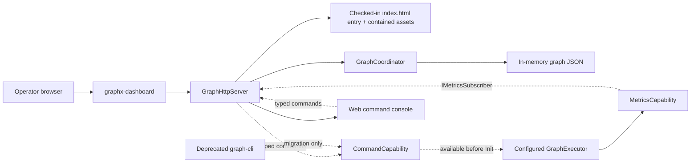

# GraphX generic dashboard architecture

## Architectural decision

GraphX has one dashboard concept: a generic graph inspection and parameter
editing surface. FHSS is a graph displayed by that surface, not a separate
dashboard architecture. The dashboard layer must not know FHSS message rules,
derive detector banks, construct receiver graphs, or repair unconnected ports.

The Phase 2B normative specifications are:

- [`Phase2B_Generic_Graph_Management.md`](../plan/Phase2B_Generic_Graph_Management.md)
- [`Phase2B_Corrected_Implementation_Specification.md`](../plan/Phase2B_Corrected_Implementation_Specification.md)

The proposed graphical extension is:

- [`GRAPHX_GENERIC_GRAPHICAL_DASHBOARD_PLAN.md`](../plan/GRAPHX_GENERIC_GRAPHICAL_DASHBOARD_PLAN.md)

It adds a presentation layer to this architecture. It does not authorize a
second coordinator, server, runtime owner, API namespace, executable, or
FHSS-specific management product.

Older FHSS dashboard documents describe historical prototype work. They do not
authorize restoration of `ReceiverGraphCoordinator`,
`ReceiverGraphHttpServer`, or another FHSS-specific management layer.

## Structure



The graph JSON is the topology source of truth. Node IDs, node types, the node
set, edges, and ports are authoritative structural data and are not changed by
the dashboard. Optional `presentation.groups` metadata describes a
presentation-only hierarchy; it has no graph-construction or execution
semantics. The only management-layer mutation is replacement of an existing
node's `node_config`.

Every `graphx-dashboard` instance has one `GraphExecutor`. Opening the page
does not initialize or run it: the executor begins configured and changes
state only through explicit lifecycle commands.

## Components

### GraphCoordinator

`GraphCoordinator` is the domain-neutral owner of a `nlohmann::json` graph
document. It provides copies for inspection and serializes access with a
mutex. `UpdateNodeConfig` changes only an existing node's `node_config`; it
cannot add, remove, rename, or retype nodes.

It is also the configuration authority. `Snapshot()` returns an immutable
graph document, a monotonically increasing revision, and deterministic content
identity. Successful content-changing mutations advance the revision; failed
and no-op mutations do not. Ownership prevents outside aliases from bypassing
locking or revision accounting. It does not load plugins, construct a
`GraphManager`, instantiate nodes, or own executor threads.

### GraphHttpServer

`GraphHttpServer` is a loopback-only HTTP/1.1 adapter around
`GraphCoordinator` and executor capabilities. It serves one checked-in
dashboard resource root: `libgraph/resources/web/index.html` is the sole entry
point, with its self-hosted JavaScript and CSS served from the contained
`libgraph/resources/web/assets/` inventory. A server instance selects one
resource root and never mixes source-tree and installed assets.

The staged runtime integration has two explicit contracts:

- Phase 0 passes `GraphHttpServer` the executor's stable
  `MetricsCapability` handle and establishes its lifetime/ownership boundary.
  The later graphical-dashboard metrics phase makes the server an
  `app::metrics::IMetricsSubscriber`, adds the bounded latest-value snapshot,
  and owns deterministic registration/unregistration.
- Lifecycle requests use the executor's typed `CommandCapability`; the server
  does not call `GraphExecutor::{Init,Start,Run,Stop,Join}` directly and does
  not translate HTTP requests into terminal command strings.

Both capabilities must be registered by `GraphExecutorBuilder` before the
executor is returned. The builder creates a configured executor shell from a
coordinator snapshot; it does not load plugins, instantiate nodes, or build a
`GraphManager`. Policies consume and populate those existing capabilities
during `Init`; they do not create the public control or subscription contracts
during `Init`. This makes `configure` and `init` available before node
construction and permits the later metrics phase to subscribe before metric
schemas are discovered.

The lifecycle is
`ConfigureGraph → Init → Start → Run → Stop → Join`. Configure records an
immutable snapshot and revision without performing node lifecycle work. Init
loads providers, builds the graph, discovers capabilities, and initializes
nodes. Coordinator edits after initialization set
`configuration_dirty=true`; they never mutate the instantiated graph.

The launcher creates one owning `shared_ptr<GraphCoordinator>`. Its initial
atomic snapshot configures the lazy executor through
`GraphExecutorBuilder::WithGraphSnapshot`; the same coordinator and the
executor's shared command/metrics capability handles are passed to
`GraphHttpServer`. The server receives no raw executor pointer and creates no
second graph document.

Configure, init, and start are synchronous. Run is asynchronous and owns a
joinable worker. Natural completion and requested stop converge on that
worker's single stop/join teardown. Stop uses `RequestStop()` immediately;
join observes the active teardown and never starts another one. The complete
state/command transition table is normative in
`plan/GRAPHX_GENERIC_GRAPHICAL_DASHBOARD_PLAN.md`.

`CommandCapability` is the typed lifecycle authority. The existing
`CommandProcessorCapability` remains an optional text-parsing adapter for
terminal input, and `DashboardCapability` remains an optional UI queue; neither
is a second lifecycle authority. HTTP never submits raw command text. To avoid
an ownership cycle, `CommandCapability` keeps a weak executor binding and
returns unavailable after that binding expires. An accepted asynchronous run
may retain the executor only for the duration of its joinable worker.

Command execution is serialized by the capability against the executor state
machine. A blocking graph run is owned by a joinable execution worker rather
than an HTTP request thread. `stop` uses `GraphExecutor::RequestStop()` as the
control-thread fast path; graph teardown remains on the execution thread.
Command results carry a typed operation identity, acceptance/completion state,
executor state, and diagnostic message. The CLI and HTTP adapters present
those same results in transport-appropriate form.

The Phase 0 implementation passes shared command and metrics capability
handles to `GraphHttpServer`; the server has no raw executor pointer and does
not invoke executor lifecycle methods directly. The generic metrics route and
subscriber bridge remain assigned to the graphical dashboard metrics phase.

The REST surface is:

| Method | Route | Meaning |
|---|---|---|
| `GET` | `/api/v1/graph` | Complete graph copy |
| `GET` | `/api/v1/nodes` | Existing nodes |
| `GET` | `/api/v1/nodes/{id}` | One existing node |
| `GET` | `/api/v1/nodes/type/{type}` | Nodes filtered by type |
| `PATCH` | `/api/v1/nodes/{id}` | Replace `node_config` in memory |
| `GET` | `/api/v1/execution/state` | Executor availability/state |
| `POST` | `/api/v1/execution/{configure,init,start,run,stop,join}` | Lifecycle operation |
| `POST` | `/api/v1/execution/{pause,resume,step}` | Explicitly unsupported |
| `GET` | `/api/v1/execution/commands` | Typed command discovery |
| `POST` | `/api/v1/execution/commands/{name}` | Typed command submission |
| `GET` | `/api/v1/execution/operations/{id}` | Asynchronous completion |

The planned additive metrics resource is:

| Method | Route | Meaning |
|---|---|---|
| `GET` | `/api/v1/metrics` | Bounded generic metric schema and latest-value snapshot |

Until that route and the subscriber bridge are implemented, the generic web
dashboard must report metrics as unavailable rather than infer values from
configuration or use the legacy embedded-dashboard snapshot publisher.

The server distinguishes invalid input (`400`), unknown resources (`404`),
unsupported methods (`405`), lifecycle conflicts (`409`), oversized requests
(`413`), unavailable/unsupported execution (`501`), and temporarily
unavailable execution (`503`). HTTP parameter changes are intentionally not
written to disk.

The transport is deliberately modest for the GraphX engineering/research
maturity level: bounded headers and bodies, read/write timeouts, joinable
workers, checked response writes, loopback binding, and MIME-sniffing
prevention. Production network exposure, authentication, TLS, and broader
security hardening are later roadmap work, not Phase 2B acceptance gates.

### Generic dashboard launcher

`graphx-dashboard` makes the server usable without an embedding application:

```bash
./build/graphx-dashboard \
  --graph libgraph/test/config/topologies/minimal_graph.json \
  --port 8080
```

Then open `http://127.0.0.1:8080/`.

The launcher always creates a configured executor, but opening the dashboard
does not initialize or run it. Plugin loading and node construction occur only
after explicit initialization. Topology inspection therefore remains
available even when a later runtime initialization reports a missing or
invalid plugin.

`--enable-execution` is removed. `--plugins` continues to supply the provider
search path used during initialization.

### Phase 2 presentation hierarchy

The generic frontend may interpret this optional execution-neutral document
section:

```json
{
  "presentation": {
    "groups": [
      {
        "id": "processing-bank",
        "label": "Processing bank",
        "members": ["node-a", "node-b"],
        "parent": "optional-parent-group-id",
        "layout": "layered",
        "collapsed_by_default": false
      }
    ]
  }
}
```

The accepted layout values are `layered`, `grid`, `fanout`, and `fanin`.
Groups form an acyclic forest. Group IDs and direct node memberships are
unique, parents must exist, and every member must name an authoritative node.
Unknown fields, malformed values, duplicate or overlapping membership,
unknown references, cycles, excessive depth, and numeric-bound violations
reject all grouping atomically. The page reports one stable diagnostic and
retains exact semantic raw-topology inspection; it never repairs or partially
applies metadata.

The locked limits are 256 groups, depth 12, 2,048 direct members per group,
10,000 total direct memberships, 10,000 authoritative edges per bundle,
20,000 node-plus-edge items per layout invocation, 100,000 cumulative
compound-layout work units, and 25,000 visible node/edge/bundle details.
Bounds are checked before expensive presentation work.

Collapsed crossing edges are grouped only by their current visible source and
target. A multi-edge crossing becomes a presentation bundle with a
collision-free canonical ID and a sorted exact authoritative member list.
Internal edges remain hidden membership and never become self-bundles.
Presentation groups and bundles use presentation-only boundary handles and
are never serialized or PATCHed.

Authoritative node/edge selection is maintained separately from
group/bundle selection. Collapse and isolation retain valid authoritative
selection, mark its containing group, and restore the exact object on
expansion or in **Raw topology** mode. Breadcrumb, isolation, minimap, layout,
collapse, and expansion state is local to the page. A node-config PATCH
continues to contain only `node_config` and preserves the top-level
`presentation` document.

The operator qualification procedure and exact generic/FHSS expectations are
documented in
[`graphx_dashboard_phase2_operator_test.md`](graphx_dashboard_phase2_operator_test.md).

### Web command surface and CLI deprecation

The supported interactive operator surface will be part of the existing
dashboard page. It will provide command discovery, structured argument forms,
completion status, bounded history, and accessible result output. It is a web
adapter to `CommandCapability`, not a terminal emulator and not a host-shell
gateway.

The standalone `graph-cli` executable and `graph::GraphCli` class are
deprecated. They remain temporarily available for migration:

```bash
./build/graph-cli \
  --graph libgraph/test/config/topologies/minimal_graph.json \
  node-count
```

New code and operator procedures must not depend on `graph-cli`. Its current
functions migrate as follows:

| Deprecated CLI responsibility | Replacement |
|---|---|
| `load` and plugin selection | `graphx-dashboard --graph ... --plugins ...` |
| `show`, `list-nodes`, `get-node` | Existing graph and node HTTP resources |
| `update-node` | Existing node `PATCH` resource and web inspector |
| `save` | Explicit browser graph export/download; no implicit server filesystem write |
| lifecycle and state | Web controls/command console using `CommandCapability` |
| headless automation | Documented HTTP requests against `graphx-dashboard` |

Removal occurs only after the web command surface, export workflow, and
headless REST examples pass source-tree and installed-tree acceptance tests.
At that point the executable, `graph::GraphCli`, its install rule, and
CLI-specific tests are removed together. Until then every invocation emits a
deprecation warning and compatibility tests remain.

## FHSS use

An FHSS graph is opened exactly like any other graph:

```bash
./build/graphx-dashboard \
  --graph libdsp/config/fhss_phase2_binary_iq_receiver.json
```

The dashboard displays the topology encoded in that file. If an FHSS detector
bank has 64 ports, all 64 connections must be represented correctly in the
graph configuration or in a generic hierarchical graph representation
supported by GraphX. The dashboard must not fabricate the missing 63
connections or interpret FHSS acquisition semantics.

FHSS IQ generation, preamble derivation, receiver validation, and synthetic
test truth remain DSP responsibilities documented under `docs/dsp/`. No
hardware-in-the-loop evidence is implied by displaying an FHSS graph.

## Validation boundary

Phase 2B validation covers:

- C++26 compilation with warnings treated as errors for affected targets;
- real loopback requests for REST routing, response codes, edits, and UI
  serving;
- CLI load/save/query/edit behavior and truthful lifecycle failures;
- default generic launcher operation with a configured but uninitialized
  executor;
- regression tests and `git diff --check`.

It does not validate FHSS DSP correctness, RF performance, or hardware. Those
belong to the synthetic FHSS validation program.
