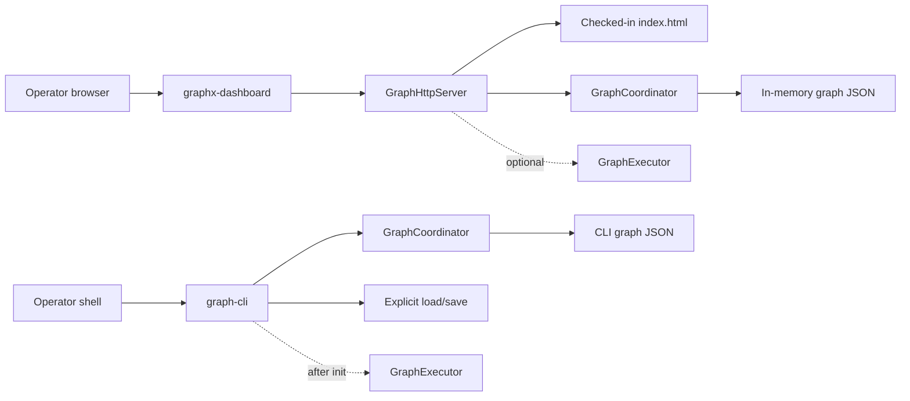

# GraphX generic dashboard architecture

## Architectural decision

GraphX has one dashboard concept: a generic graph inspection and parameter
editing surface. FHSS is a graph displayed by that surface, not a separate
dashboard architecture. The dashboard layer must not know FHSS message rules,
derive detector banks, construct receiver graphs, or repair unconnected ports.

The Phase 2B normative specifications are:

- [`Phase2B_Generic_Graph_Management.md`](../plan/Phase2B_Generic_Graph_Management.md)
- [`Phase2B_Corrected_Implementation_Specification.md`](../plan/Phase2B_Corrected_Implementation_Specification.md)

Older FHSS dashboard documents describe historical prototype work. They do not
authorize restoration of `ReceiverGraphCoordinator`,
`ReceiverGraphHttpServer`, or another FHSS-specific management layer.

## Structure



The graph JSON is the topology source of truth. Node IDs, node types, the node
set, edges, ports, and hierarchy are structural data and are not changed by
the Phase 2B dashboard. The only management-layer mutation is replacement of
an existing node's `node_config`.

## Components

### GraphCoordinator

`GraphCoordinator` is a domain-neutral, non-owning facade over a
`nlohmann::json` graph document. It provides copies for inspection and
serializes access with a mutex. `UpdateNodeConfig` changes only an existing
node's `node_config`; it cannot add, remove, rename, or retype nodes.

### GraphHttpServer

`GraphHttpServer` is a loopback-only HTTP/1.1 adapter around
`GraphCoordinator` and an optional `GraphExecutor`. It serves the single
checked-in resource at `libgraph/resources/web/index.html`.

The REST surface is:

| Method | Route | Meaning |
|---|---|---|
| `GET` | `/api/v1/graph` | Complete graph copy |
| `GET` | `/api/v1/nodes` | Existing nodes |
| `GET` | `/api/v1/nodes/{id}` | One existing node |
| `GET` | `/api/v1/nodes/type/{type}` | Nodes filtered by type |
| `PATCH` | `/api/v1/nodes/{id}` | Replace `node_config` in memory |
| `GET` | `/api/v1/execution/state` | Executor availability/state |
| `POST` | `/api/v1/execution/{init,start,run,stop,join}` | Lifecycle operation |
| `POST` | `/api/v1/execution/{pause,resume,step}` | Explicitly unsupported |

The server distinguishes invalid input (`400`), unknown resources (`404`),
unsupported methods (`405`), lifecycle conflicts (`409`), oversized requests
(`413`), unavailable/unsupported execution (`501`), and temporarily
unavailable execution (`503`). HTTP parameter changes are intentionally not
written to disk.

The transport is deliberately modest for the GraphX engineering/research
maturity level: bounded headers and bodies, read/write timeouts, joinable
workers, checked response writes, loopback binding, and MIME-sniffing
prevention. Production network exposure, authentication, TLS, and broader
security hardening are later roadmap work, not Phase 2B acceptance gates.

### Generic dashboard launcher

`graphx-dashboard` makes the server usable without an embedding application:

```bash
./build/graphx-dashboard \
  --graph libgraph/test/config/topologies/minimal_graph.json \
  --port 8080
```

Then open `http://127.0.0.1:8080/`.

The default supplies no executor. Viewing, filtering, detail inspection, and
in-memory parameter editing work; execution controls report that execution is
unavailable. This is the preferred read-only-execution mode for inspecting a
graph.

Execution is an explicit opt-in:

```bash
./build/graphx-dashboard \
  --graph path/to/graph.json \
  --port 8080 \
  --enable-execution \
  --plugins ./build/plugins
```

Executor construction validates the graph and plugin environment. It does not
alter topology.

### Graph CLI

`graph-cli` is the scriptable and interactive counterpart. A one-shot query is:

```bash
./build/graph-cli \
  --graph libgraph/test/config/topologies/minimal_graph.json \
  node-count
```

Run `graph-cli` without arguments for a stateful `load` → `update-node` →
`save` session. Unsaved edits cannot be used to initialize an executor because
the executor is built from the saved graph path. Lifecycle commands fail
truthfully before initialization. Pause, resume, and step are reported as
unsupported.

## FHSS use

An FHSS graph is opened exactly like any other graph:

```bash
./build/graphx-dashboard \
  --graph libdsp/config/fhss_phase2_binary_iq_receiver.json
```

The dashboard displays the topology encoded in that file. If an FHSS detector
bank has 64 ports, all 64 connections must be represented correctly in the
graph configuration or in a generic hierarchical graph representation
supported by GraphX. The dashboard must not fabricate the missing 63
connections or interpret FHSS acquisition semantics.

FHSS IQ generation, preamble derivation, receiver validation, and synthetic
test truth remain DSP responsibilities documented under `docs/dsp/`. No
hardware-in-the-loop evidence is implied by displaying an FHSS graph.

## Validation boundary

Phase 2B validation covers:

- C++26 compilation with warnings treated as errors for affected targets;
- real loopback requests for REST routing, response codes, edits, and UI
  serving;
- CLI load/save/query/edit behavior and truthful lifecycle failures;
- default generic launcher operation without an executor;
- regression tests and `git diff --check`.

It does not validate FHSS DSP correctness, RF performance, or hardware. Those
belong to the synthetic FHSS validation program.
