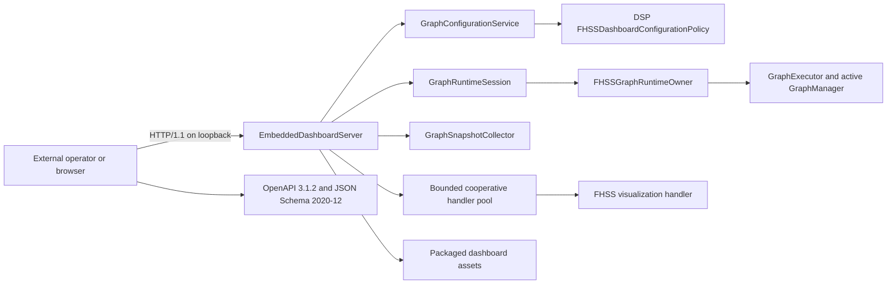

# GraphX FHSS dashboard architecture

The current observation checklist is in [FHSS dashboard Phase 4 manual operator test](dsp/fhss_dashboard_phase4_manual_operator_test.md).

## Scope and evidence boundary

The first GraphX dashboard is an FHSS-specific operator view, authoritative
configuration editor, live receiver controller, and truthful Phase 4
observation/evaluation surface for synthetic-IQ evaluation. It visualizes the
configured synthetic scenario and receiver/runtime observations, but it is not
a production RF monitor. Expected truth, receiver observations, and evaluator
comparison are separate typed documents and independent UI layers. There is
no hardware-in-the-loop (HWIL), conducted-RF, or over-the-air evidence in this
validation program. The configured schedule view is explicitly labelled as a
configured expectation. Missing receiver diagnostics remain unavailable and
never fall back to expected truth. Spectrum is calculated only from a bounded
typed receiver sample capture and is labelled non-calibrated.

Phase 3 adds transactional receiver rebuild and bounded start/stop execution to
the Phase 2 validation, atomic apply, and configuration/graph inspection
surface. `--dashboard-no-run` retains the inspection-only capability and hides
runtime routes; `--dashboard` injects the DSP runtime owner and exposes them,
but deliberately launches in `not_built` with generation zero. Only an
operator-issued Rebuild followed by Start can begin receiver execution; an
existing configured IQ path never auto-starts the graph.

## Components



`EmbeddedDashboardServer` and `GraphConfigurationService` are generic graph
infrastructure. The service owns the document, revision/strong ETag, atomic
RFC 6902/RFC 6901 application, and validation transport; it contains no FHSS
rules. The DSP-owned `FHSSDashboardConfigurationPolicy` owns architecture
validation, preamble/active-set derivation, checked sample-window arithmetic,
receiver-minimal projection, and provenance. The DSP example registers the
FHSS visualization extension and supplies configuration,
runtime-session, DSP runtime-owner, and snapshot services. Runtime ownership is
injected through the generic `IGraphRuntimeOwner` seam; graph infrastructure
does not depend on DSP types. The production executable discovers
installed assets relative to its executable and also supports an explicit
asset path.

## HTTP transport and security

The server uses Boost.Asio and Boost.Beast rather than a custom HTTP parser.
It binds only an explicit IPv4 or IPv6 loopback address, supports ephemeral
port allocation, and reports the actual bound host and port. Beast provides
HTTP framing; conflicting content length and transfer encoding are rejected.

The implementation bounds:

- request headers and bodies;
- response and static-asset sizes;
- JSON depth, members, strings, duplicate keys, and numeric magnitude;
- concurrent connections and queued application-handler jobs;
- activity-resetting read idle time, an absolute header/body read budget,
  writes, and the absolute total request deadline.

Error responses use `application/problem+json` and the RFC 9457 fields `type`,
`title`, `status`, and `detail`. Responses include no-store caching, a
deterministic CSP, MIME-sniffing prevention, no-referrer policy, and frame
denial. The page uses DOM text APIs, not `innerHTML`.

Static files are restricted by decoded path validation and component-aware
canonical containment. On POSIX, each path component is opened relative to a
directory descriptor with `openat` and `O_NOFOLLOW`; the final descriptor is
checked with `fstat`. This prevents sibling-prefix, symlink, and check/open
races. Phase 1 dashboard builds are deliberately unsupported on Windows until
equivalent reparse-point-safe handle traversal exists. CMake fails clearly if
the dashboard is enabled on Windows; dashboard-off builds remain supported.

## Cooperative application-handler contract

An extension is registered with `ApiHandlerRegistration`, which must declare:

- `cooperative_cancellation = true`;
- a positive `maximum_checkpoint_latency` no greater than the server's total
  request timeout; and
- a callback accepting `ApiContext`.

Startup rejects registrations that do not satisfy this contract. `ApiContext`
contains the absolute deadline and a `std::stop_token`. A handler must check
both at least once per declared checkpoint interval, including inside loops and
before or during bounded I/O. In-process C++ cannot forcibly cancel arbitrary
blocking code; registration is therefore an explicit cooperative contract,
not a claim of preemptive cancellation.

The server executes registered work in a fixed `std::jthread` pool with a
bounded queue. Deadline expiry requests per-job cancellation and returns 408;
capacity exhaustion returns 503. Shutdown stops admission, requests
cancellation for queued and active jobs, and joins the pool. The FHSS handler
checks cancellation in message, pulse, and channel loops. Phase 1
contains no extension filesystem writes.

## Phase 3 routes

The versioned application namespace is `/api/v1/fhss`:

- `GET /healthz`, `GET /readyz`, `GET /api/v1/version`
- `GET /api/v1/fhss/graph`
- `GET /api/v1/fhss/config`
- `GET /api/v1/fhss/config/authoritative`
- `GET /api/v1/fhss/config/effective`
- `GET /api/v1/fhss/config/provenance`
- `GET /api/v1/fhss/graph/receiver-minimal`
- `POST /api/v1/fhss/config/validate`
- `PATCH /api/v1/fhss/config`
- `GET /api/v1/fhss/config/derived-paths`
- `GET /api/v1/fhss/config/value?pointer=...`
- `GET /api/v1/fhss/metrics`
- `GET /api/v1/fhss/metrics/edges`
- `GET /api/v1/fhss/diagnostics`
- `GET /api/v1/fhss/nodes/{nodeId}`
- `GET /api/v1/fhss/nodes/{nodeId}/parameters`
- `GET /api/v1/fhss/visualization`
- `GET /api/v1/fhss/status`
- `POST /api/v1/fhss/config/rebuild`
- `POST /api/v1/fhss/commands/start`
- `POST /api/v1/fhss/commands/stop`

Rebuild captures one immutable receiver graph, revision, and strong ETag,
constructs and validates a replacement executor from exactly that snapshot,
then atomically publishes one generation snapshot containing the graph manager
and its configuration identity. Failed construction preserves the prior
generation. A single owner operation mutex serializes executor and execution
thread access, while generation checks reject stale completion callbacks.
Each Start receives a monotonically increasing run epoch. Status reports
`starting` until the owner confirms that its real execution thread has been
launched; an immediate completion cannot be overwritten by a late transition
to `running`. Completion callbacks must match both generation and run epoch.
For the matching run, operator stop intent deterministically records `stopped`
and `execution_cancelled`; completion without stop intent records `completed`
and `execution_completed`. Execution uses a joinable `std::jthread`; stop and shutdown request the real
executor to stop and wait up to five seconds. A stop timeout returns HTTP 504
and retains the live owner/thread state rather than detaching it or claiming
completion. Because graph `Consume()` implementations are cooperative, a
non-cooperative node can still keep the thread alive and can delay eventual
process destruction after that timeout. Status identifies the
active generation and its bound configuration revision/ETag, reports whether
the current configuration is stale and requires rebuild, and attributes the
terminal result and timestamps to a generation. Metrics and diagnostics are
collected from the same immutable generation snapshot and carry its generation,
revision, and ETag.

The OpenAPI document defines response-specific schemas for every successful
shape and reusable RFC 9457 responses for malformed input, missing resources,
unsupported methods, timeouts, size limits, internal failures, and unavailable
capacity/runtime states.

Canonical mutation uses `Content-Type: application/json-patch+json` and a
required strong `If-Match` value. Missing preconditions return 428, stale ETags
return 412, and successful application returns a new ETag. All six RFC 6902
operations are atomic and use strict RFC 6901 pointer behavior, including root,
arrays, `-`, null values, and `~0`/`~1` escaping. Generated targets are
read-only. The old `application/json`/`expected_revision` wrapper is a
documented deprecated compatibility lane with isolated 409 conflicts.

The architecture timing policy uses 3200 pulse samples plus 3300 gap samples,
giving a 6500-sample half-open message-slot period. Multiplication and addition
are checked before message windows are compared. Overlap is rejected unless
`allow_overlap` is true. Active frequencies are derived from the first 16
preamble pulses. The receiver-minimal projection uses a binary-IQ source and
contains no messages, truth path/fixture field, generator metadata,
transmitted-frequency hints, or redundant preamble/assembler active list.

## Build, packaging, and launch

Phase 8 support, security, accessibility, installed qualification, and the
decision not to perform premature generic extraction are specified in
`docs/dsp/fhss_dashboard_phase8_manual_operator_test.md`,
`docs/dsp/fhss_dashboard_phase8_security_support.md`, and
`docs/dsp/fhss_dashboard_phase8_architecture_recommendation.md`. The supported
profile remains an FHSS-specific, loopback-only local tool using synthetic IQ;
there is no HWIL/conducted/OTA evidence and production RF is not qualified.

Dashboard code and Boost are gated by:

```text
GRAPHX_BUILD_WEB_DASHBOARD=ON
```

With the option off, dashboard sources, headers, assets, and Boost dependency
are excluded. With it on, CMake builds the server and FHSS handler and installs
the executable, page, API schemas, validator lock, operator, scenario, expected
results, and report schema. A registered dashboard-off CTest performs a fresh
Ninja configure with `BUILD_TESTING=OFF` and builds only the FHSS demo, avoiding
recursive test invocation.

Example source-tree launch:

```sh
./build-ninja/ninja-debug/examples/DSP/graphx-dsp-fhss-demo \
  --dashboard --dashboard-port 0
```

The program prints the authoritative loopback URL. `--dashboard-host` accepts
only `127.0.0.1` or `::1`-equivalent loopback addresses.

## Authoritative contract validation and operator workflow

Phase 4 adds strict Draft 2020-12 schemas and OpenAPI routes for expected truth,
receiver observation, evaluator comparison, selected-channel spectrum,
field-level provenance, and one-entry current-run history. Receiver nodes expose
immutable typed snapshots through `IFHSSReceiverObservationSource`; the
dashboard does not scrape generic diagnostic JSON for IQ samples. Terminal sink
counts supersede upstream acquisition counts, so different source kinds are not
summed into a fictitious total. Every observation is attributed to generation,
run epoch, configuration revision/ETag, node class, packet field, sampling
interval, unit, and transformation.

Pulse `global_start_sample` values retain the receiver's complete unsigned
64-bit input-sample domain. The evaluator computes only a bounded signed timing
delta after matching, so values above `INT64_MAX` are neither rejected nor
converted through a signed absolute index. Expected-truth responses expose at
most 512 pulse records; when a schedule is larger,
`expected_receiver_message.decoded_pulse_count` describes that bounded returned
set and equals `bounds.returned_pulse_count`, while the full scheduled count is
reported separately as `bounds.original_pulse_count`.

The receiver sample capture is bounded to 256 complex samples per channel.
Spectrum supports power-of-two sizes 16 through 256, applies a symmetric
Hamming window, FFT shift, and coherent-gain correction, and reports linear and
dB magnitude relative to one complex unit. It is explicitly not calibrated RF
power. Observation history retains only the active generation/current run, at
most one entry, one hour, and 1 MiB.

Validation uses the pinned dependencies in
`examples/DSP/dashboard/api/requirements-contracts.lock`:

- `openapi-spec-validator==0.9.0` for OpenAPI 3.1.2 semantics;
- `jsonschema==4.26.0` and `Draft202012Validator` for schema metaschema and
  instance validation.

Provision an isolated environment, optionally from an offline wheelhouse:

```sh
python3 examples/DSP/dashboard/api/provision_contract_validators.py \
  --venv .venv-dashboard-contracts
# Offline:
python3 examples/DSP/dashboard/api/provision_contract_validators.py \
  --venv .venv-dashboard-contracts --wheelhouse /path/to/wheelhouse
```

Configure CMake with the same interpreter:

```sh
cmake -S . -B build-ninja/ninja-debug -G Ninja \
  -DGRAPHX_BUILD_WEB_DASHBOARD=ON \
  -DGRAPHX_DASHBOARD_CONTRACT_PYTHON="$PWD/.venv-dashboard-contracts/bin/python"
```

The contract test fails clearly when authoritative dependencies are absent; it
does not treat the small pinned-subset audit helper as authoritative. It checks
OpenAPI semantics, all references, every JSON Schema, and representative
instances. The external operator uses the same interpreter and validates live
responses for all 23 operations:

```sh
.venv-dashboard-contracts/bin/python \
  examples/DSP/dashboard/operator/fhss_dashboard_operator.py exercise \
  --phase 3 --build-dir build-ninja/ninja-debug \
  --output-dir <operator-output-dir>
.venv-dashboard-contracts/bin/python \
  examples/DSP/dashboard/operator/fhss_dashboard_operator.py verify \
  --phase 3 \
  --output-dir <operator-output-dir>
```

The Phase 3 operator retains all Phase 2 checks, independently derives the
expected active set, proves
validation does not mutate bytes/revision/ETag, exercises two-session 428/412
concurrency and atomic failure, verifies truth-free receiver export, and hashes
the inspected documents. It also checks framing, malformed and oversized input, traversal,
defensive headers, unsupported methods, slow-client isolation, loopback-only
binding, artifact hashes, and the absence of old generic routes. It generates
separate IQ, truth, and SigMF artifacts from exactly one complete canonical
message shifted by one 6,500-sample pulse slot for causal warm-up. It removes
schedule/truth before replay, runs that same bounded fixture through two real
receiver generations to natural terminal completion, requires
generation-attributed nonzero traffic, verifies exact already-completed Stop
responses, and verifies an invalid rebuild leaves the prior generation active.
The distinct long fixture retains in-flight cancellation coverage. Cleanup only
removes files marked as operator-owned.

## Automated evidence

The focused C++ suite covers startup/shutdown, IPv4/IPv6 binding, ephemeral
ports and reuse, idle and total deadlines, cancellation and handler contract
rejection, connection isolation, framing, exact `Allow` values, content types,
RFC 9457 errors, JSON and response limits, wrong-type survival, read-only route
behavior, static containment, events, metrics, configuration concurrency,
the Phase 2 runtime-control exclusion, injected-owner lock discipline, stale
completion rejection, transactional rebuild, real execution, natural terminal
completion, and bounded visualization.

Registered CTest lanes cover:

- C++ focused/regression discovery;
- authoritative OpenAPI and JSON Schema validation;
- source-tree Phase 1, Phase 2, and Phase 3 external operator execution;
- installed-tree Phase 1, Phase 2, and Phase 3 packaging/operator execution; and
- a fresh dashboard-off configure/build.

All operator fixtures and dashboard scenario data are synthetic. Passing these
lanes demonstrates software-contract behavior only, not RF performance or
hardware qualification.

## FHSS message jobs and controls

Dashboard Phase 5 adds an FHSS-specific application controller above the
existing single graph-runtime owner. It deliberately does not add generic node
stepping. The public controls are:

- **Step**: generate and replay exactly one complete architecture-conformant
  FHSS message;
- **Continue**: generate and replay a bounded count of complete messages;
- **Cancel**: cooperatively terminate queued or active work; and
- **Reset**: advance the controller epoch only when no job is active.

The controller exposes `/api/v1/fhss/jobs` resources and command endpoints
defined in `examples/DSP/dashboard/api/openapi.json`. Requests use opaque job
IDs and optional idempotency keys. Responses keep controller state, graph
lifecycle, receiver result, and expected-versus-observed comparison distinct.
The browser polls these bounded resources and never submits work as a side
effect of refresh.

Generation reuses the canonical FHSS IQ parser/generator and atomically writes
raw IQ, truth, SigMF metadata, receiver-minimal configuration, and a manifest
under the configured artifact root. Receiver execution is given only the IQ
path and receiver configuration. Recursive receiver-configuration checks reject
generator messages, schedules, truth, and active-frequency fields. Queue size,
message count, pulse count, sample count, IQ bytes, metadata bytes, history,
timeouts, and idempotency storage all have explicit bounds. Startup reconciles
committed job directories without following symlinks and retains only the
newest evidence within one hour, 32 directories, and 512 MiB; incomplete and
over-limit entries are removed. A cancellation or timeout blocked inside a
non-cooperative receiver rebuild is applied before receiver Start when rebuild
returns.

The external Phase 5 operator exercises duplicate idempotency, conflict,
queued and active cancellation, completion, timeout, reset, artifact hashes,
truth separation, and replay of the captured IQ after deleting truth and
stopping the dashboard. See
`docs/dsp/fhss_dashboard_phase5_manual_operator_test.md` for the runnable
workflow. This is synthetic software validation only; no HWIL is available.

## Bounded event streaming and recovery

Dashboard Phase 6 keeps `/api/v1/fhss/events` as a documented polling fallback
and adds `/api/v1/fhss/events/stream` as the primary RFC 6455 transport. The
same maintained Boost.Beast listener performs the HTTP upgrade, validates the
single exact loopback page origin and bound authority, rejects unsupported
subprotocols, declines extension offers without negotiating them, applies the
configured client/message limits, and
owns ping, close, masking, fragmentation, UTF-8, and protocol failure behavior.

The production publisher accepts events from configuration/runtime operations
and the application-owned FHSS job controller. Event envelopes identify the
publisher process epoch, monotonic sequence, RFC 3339 timestamp, graph
generation/run epoch, configuration revision/ETag, controller/job/correlation
identity, semantic class, and payload. These fields provide traceability; they
do not place synthetic schedule/truth into receiver execution.

Graph and job threads capture the current generation/run/configuration identity
when committing to an event-and-byte-bounded publisher ingress. Repetitive
metrics/diagnostics coalesce deterministically; terminal, configuration, and
job transitions already admitted to the ingress preserve FIFO order. Admission
never blocks: coalescible entries are evicted first; if only critical entries
remain at the configured byte/event bound, the newest critical event is
rejected and clients are marked for coherent resynchronization. Producers never
bypass the ingress for synchronous publication. Snapshot collection,
serialization, sequence assignment/retention commit, and client fan-out occur
outside graph and job critical sections. Global retention is bounded
independently by age (120 seconds), count (4,096), and encoded bytes (8 MiB).
Frame, reassembled-message, fragment, command/event-rate, replay, queue,
connection-lifetime, idle, close, client-count, and stale-client-state limits
are enforced. Overflow discards the affected client's queue and requires an
explicit resync without blocking the graph or another client. A resume is valid
only when publisher epoch and retained sequence range are contiguous.

The browser uses the native WebSocket API, stores a coherent epoch/sequence
tuple in session storage, ignores exact duplicates, validates heartbeat and
event envelopes, and treats epoch, sequence, or schema discontinuity as a
mandatory coherent-snapshot resync. Resync always uses the fixed same-origin
snapshot route and replaces the local/display model atomically. Reconnect uses
capped exponential delay and a finite attempt budget, reset only after a stable
connection; HTTP event polling is the bounded fallback. The
external operator uses the pinned
maintained Python `websockets` client for protocol coverage and WebDriver BiDi
with maintained Firefox for page behavior. It creates a genuine WebSocket-only
outage while HTTP stays healthy, observes bounded polling and coherent recovery
in the rendered page, and binds the screenshot and console stream to Firefox
browser/session/context identity and the served-state hash. Hand-authored
console JSON is not valid browser evidence. See
`docs/dsp/fhss_dashboard_phase6_manual_operator_test.md`. This remains
synthetic-only software validation; HWIL and production-RF qualification are
unavailable.

## FHSS investigation bundles and deterministic replay

Dashboard Phase 7 adds an application-owned asynchronous investigation service
at `/api/v1/fhss/investigations`. It exports a completed synthetic FHSS job in
one of two explicit modes: a default reference-only, non-self-contained bundle,
or an operator-confirmed copied-IQ, self-contained bundle. The confirmation
response and browser show the committed IQ byte estimate before copying.

Each version-1 bundle separates `truth.json`, `observation.json`,
`comparison.json`, `receiver-config.json`, `receiver-result.json`,
`provenance.json`, `actions.json`, and `recording.sigmf-meta`. Every mode adds
`build-api.json`, which binds the producer executable identity and SHA-256,
source revision/dirty state, OpenAPI version/digest, and the complete pinned
schema inventory/digests. Copy mode adds
`recording.sigmf-data`; reference mode instead adds an immutable approved-root
record. `manifest.json` records bounded artifact paths, media and semantic
classes, visibility, replay use, byte counts, SHA-256, and SHA-512. Its hash is
defined over the exact canonical manifest bytes and stored separately in
`manifest.sha256`, avoiding recursive self-hashing. The manifest independently
commits the source job id, source request id, controller epoch, and scenario
correlation id; import requires all four to equal the separately hashed
provenance document.

The repository pins and embeds the official SigMF 1.2.6 schema and license beneath
`examples/DSP/dashboard/sigmf/official-v1.2.6`. The generator emits `cf32_le`
or `cf64_le`, exact `core:sha512`, sample rate, capture start and center
frequency, and bounded annotations. Reference/self-contained status belongs to
the investigation manifest rather than being inferred by the receiver.

Import and replay resolve every component from opened approved-root handles,
reject links and special files, enforce single-link regular inputs and quotas,
verify the complete inventory and all hashes, validate every JSON document
against its embedded repository schema (including the official Draft 2020-12
SigMF schema), cross-correlate source-job/request/controller/scenario and
sample/configuration/generation/run/build
identities, validate datatype
stride, audit receiver configuration recursively, and only then construct the
normal binary-IQ receiver graph. Replay holds the validated IQ descriptor
through execution. Only IQ bytes and receiver-minimal configuration are
receiver-visible; truth, observation, comparison, metadata, provenance, and
actions remain validator/evaluator evidence. The replay result compares a
canonical semantic projection (`accepted`, decoded pulse count, and status),
excluding timestamps and other documented nondeterministic identity.

Publication uses a private same-root directory, synchronized files, and an
atomic no-replace directory rename. A cancellation accepted before rename
leaves no completed bundle; after rename it observes a completed point of no
return. Hash/copy work is chunked and bounded, one operation runs at a time,
history is capped, and failures clean only operation-owned temporary content.
Every semantically consumed artifact remains open after hashing; parsing uses
those exact descriptor bytes, and a final digest/path-identity check rejects
in-place mutation or replacement. Aggregate retained bytes are rescanned and
rechecked immediately before atomic publication and exposed as current and
remaining quota.
See `docs/dsp/fhss_dashboard_phase7_manual_operator_test.md` for source and
installed external workflows. All evidence is synthetic; HWIL, conducted RF,
OTA, and production-RF qualification remain unavailable.
