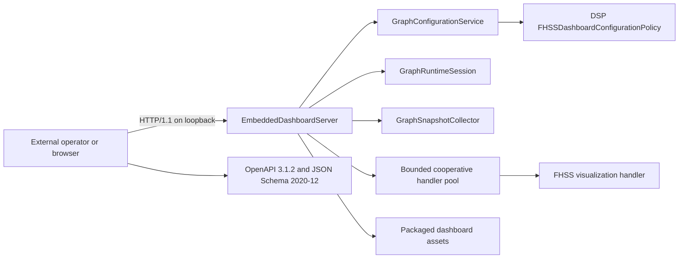

# GraphX FHSS dashboard architecture

## Scope and evidence boundary

The first GraphX dashboard is an FHSS-specific operator view and Phase 2
authoritative-configuration editor for synthetic-IQ evaluation. It visualizes the configured synthetic scenario and
receiver/runtime observations, but it is not a production RF monitor. There is
no hardware-in-the-loop (HWIL), conducted-RF, or over-the-air evidence in this
validation program. The UI labels scenario-derived confidence, decoder, and
spectrum previews as synthetic placeholders.

Phase 2 exposes configuration validation, atomic apply, and configuration/graph
inspection. Runtime rebuild, start/stop, event replay, and operation-lifecycle
controls belong to Phase 3 and are disabled in the production Phase 2 demo,
absent from its page, and absent from its OpenAPI contract.

## Components



`EmbeddedDashboardServer` and `GraphConfigurationService` are generic graph
infrastructure. The service owns the document, revision/strong ETag, atomic
RFC 6902/RFC 6901 application, and validation transport; it contains no FHSS
rules. The DSP-owned `FHSSDashboardConfigurationPolicy` owns architecture
validation, preamble/active-set derivation, checked sample-window arithmetic,
receiver-minimal projection, and provenance. The DSP example registers the
FHSS visualization extension and supplies configuration,
runtime-session, and snapshot services. The production executable discovers
installed assets relative to its executable and also supports an explicit
asset path.

## HTTP transport and security

The server uses Boost.Asio and Boost.Beast rather than a custom HTTP parser.
It binds only an explicit IPv4 or IPv6 loopback address, supports ephemeral
port allocation, and reports the actual bound host and port. Beast provides
HTTP framing; conflicting content length and transfer encoding are rejected.

The implementation bounds:

- request headers and bodies;
- response and static-asset sizes;
- JSON depth, members, strings, duplicate keys, and numeric magnitude;
- concurrent connections and queued application-handler jobs;
- activity-resetting read idle time, an absolute header/body read budget,
  writes, and the absolute total request deadline.

Error responses use `application/problem+json` and the RFC 9457 fields `type`,
`title`, `status`, and `detail`. Responses include no-store caching, a
deterministic CSP, MIME-sniffing prevention, no-referrer policy, and frame
denial. The page uses DOM text APIs, not `innerHTML`.

Static files are restricted by decoded path validation and component-aware
canonical containment. On POSIX, each path component is opened relative to a
directory descriptor with `openat` and `O_NOFOLLOW`; the final descriptor is
checked with `fstat`. This prevents sibling-prefix, symlink, and check/open
races. Phase 1 dashboard builds are deliberately unsupported on Windows until
equivalent reparse-point-safe handle traversal exists. CMake fails clearly if
the dashboard is enabled on Windows; dashboard-off builds remain supported.

## Cooperative application-handler contract

An extension is registered with `ApiHandlerRegistration`, which must declare:

- `cooperative_cancellation = true`;
- a positive `maximum_checkpoint_latency` no greater than the server's total
  request timeout; and
- a callback accepting `ApiContext`.

Startup rejects registrations that do not satisfy this contract. `ApiContext`
contains the absolute deadline and a `std::stop_token`. A handler must check
both at least once per declared checkpoint interval, including inside loops and
before or during bounded I/O. In-process C++ cannot forcibly cancel arbitrary
blocking code; registration is therefore an explicit cooperative contract,
not a claim of preemptive cancellation.

The server executes registered work in a fixed `std::jthread` pool with a
bounded queue. Deadline expiry requests per-job cancellation and returns 408;
capacity exhaustion returns 503. Shutdown stops admission, requests
cancellation for queued and active jobs, and joins the pool. The FHSS handler
checks cancellation in message, pulse, channel, and spectrum loops. Phase 1
contains no extension filesystem writes.

## Phase 2 routes

The versioned application namespace is `/api/v1/fhss`:

- `GET /healthz`, `GET /readyz`, `GET /api/v1/version`
- `GET /api/v1/fhss/graph`
- `GET /api/v1/fhss/config`
- `GET /api/v1/fhss/config/authoritative`
- `GET /api/v1/fhss/config/effective`
- `GET /api/v1/fhss/config/provenance`
- `GET /api/v1/fhss/graph/receiver-minimal`
- `POST /api/v1/fhss/config/validate`
- `PATCH /api/v1/fhss/config`
- `GET /api/v1/fhss/config/derived-paths`
- `GET /api/v1/fhss/config/value?pointer=...`
- `GET /api/v1/fhss/metrics`
- `GET /api/v1/fhss/metrics/edges`
- `GET /api/v1/fhss/diagnostics`
- `GET /api/v1/fhss/nodes/{nodeId}`
- `GET /api/v1/fhss/nodes/{nodeId}/parameters`
- `GET /api/v1/fhss/visualization`

The OpenAPI document defines response-specific schemas for every successful
shape and reusable RFC 9457 responses for malformed input, missing resources,
unsupported methods, timeouts, size limits, internal failures, and unavailable
capacity/runtime states.

Canonical mutation uses `Content-Type: application/json-patch+json` and a
required strong `If-Match` value. Missing preconditions return 428, stale ETags
return 412, and successful application returns a new ETag. All six RFC 6902
operations are atomic and use strict RFC 6901 pointer behavior, including root,
arrays, `-`, null values, and `~0`/`~1` escaping. Generated targets are
read-only. The old `application/json`/`expected_revision` wrapper is a
documented deprecated compatibility lane with isolated 409 conflicts.

The architecture timing policy uses 3200 pulse samples plus 3300 gap samples,
giving a 6500-sample half-open message-slot period. Multiplication and addition
are checked before message windows are compared. Overlap is rejected unless
`allow_overlap` is true. Active frequencies are derived from the first 16
preamble pulses. The receiver-minimal projection uses a binary-IQ source and
contains no messages, truth path/fixture field, generator metadata,
transmitted-frequency hints, or redundant preamble/assembler active list.

## Build, packaging, and launch

Dashboard code and Boost are gated by:

```text
GRAPHX_BUILD_WEB_DASHBOARD=ON
```

With the option off, dashboard sources, headers, assets, and Boost dependency
are excluded. With it on, CMake builds the server and FHSS handler and installs
the executable, page, API schemas, validator lock, operator, scenario, expected
results, and report schema. A registered dashboard-off CTest performs a fresh
Ninja configure with `BUILD_TESTING=OFF` and builds only the FHSS demo, avoiding
recursive test invocation.

Example source-tree launch:

```sh
./build-ninja/ninja-debug/examples/DSP/graphx-dsp-fhss-demo \
  --dashboard-no-run --dashboard-port 0
```

The program prints the authoritative loopback URL. `--dashboard-host` accepts
only `127.0.0.1` or `::1`-equivalent loopback addresses.

## Authoritative contract validation and operator workflow

Validation uses the pinned dependencies in
`examples/DSP/dashboard/api/requirements-contracts.lock`:

- `openapi-spec-validator==0.9.0` for OpenAPI 3.1.2 semantics;
- `jsonschema==4.26.0` and `Draft202012Validator` for schema metaschema and
  instance validation.

Provision an isolated environment, optionally from an offline wheelhouse:

```sh
python3 examples/DSP/dashboard/api/provision_contract_validators.py \
  --venv .venv-dashboard-contracts
# Offline:
python3 examples/DSP/dashboard/api/provision_contract_validators.py \
  --venv .venv-dashboard-contracts --wheelhouse /path/to/wheelhouse
```

Configure CMake with the same interpreter:

```sh
cmake -S . -B build-ninja/ninja-debug -G Ninja \
  -DGRAPHX_BUILD_WEB_DASHBOARD=ON \
  -DGRAPHX_DASHBOARD_CONTRACT_PYTHON="$PWD/.venv-dashboard-contracts/bin/python"
```

The contract test fails clearly when authoritative dependencies are absent; it
does not treat the small pinned-subset audit helper as authoritative. It checks
OpenAPI semantics, all references, every JSON Schema, and representative
instances. The external operator uses the same interpreter and validates live
responses for all 19 operations:

```sh
.venv-dashboard-contracts/bin/python \
  examples/DSP/dashboard/operator/fhss_dashboard_operator.py exercise \
  --phase 2 --build-dir build-ninja/ninja-debug \
  --output-dir <operator-output-dir>
.venv-dashboard-contracts/bin/python \
  examples/DSP/dashboard/operator/fhss_dashboard_operator.py verify \
  --phase 2 \
  --output-dir <operator-output-dir>
```

The Phase 2 operator independently derives the expected active set, proves
validation does not mutate bytes/revision/ETag, exercises two-session 428/412
concurrency and atomic failure, verifies truth-free receiver export, and hashes
the inspected documents. It also checks framing, malformed and oversized input, traversal,
defensive headers, unsupported methods, slow-client isolation, loopback-only
binding, artifact hashes, and the absence of old generic routes. Cleanup only
removes files marked as operator-owned.

## Automated evidence

The focused C++ suite covers startup/shutdown, IPv4/IPv6 binding, ephemeral
ports and reuse, idle and total deadlines, cancellation and handler contract
rejection, connection isolation, framing, exact `Allow` values, content types,
RFC 9457 errors, JSON and response limits, wrong-type survival, read-only route
behavior, static containment, events, metrics, configuration concurrency,
the Phase 2 runtime-control exclusion, and bounded visualization. Later-phase
runtime lifecycle tests remain regression coverage but are not exposed by the
Phase 2 production capability.

Registered CTest lanes cover:

- C++ focused/regression discovery;
- authoritative OpenAPI and JSON Schema validation;
- source-tree Phase 1 and Phase 2 external operator execution;
- installed-tree Phase 1 and Phase 2 packaging/operator execution; and
- a fresh dashboard-off configure/build.

All operator fixtures and dashboard scenario data are synthetic. Passing these
lanes demonstrates software-contract behavior only, not RF performance or
hardware qualification.
