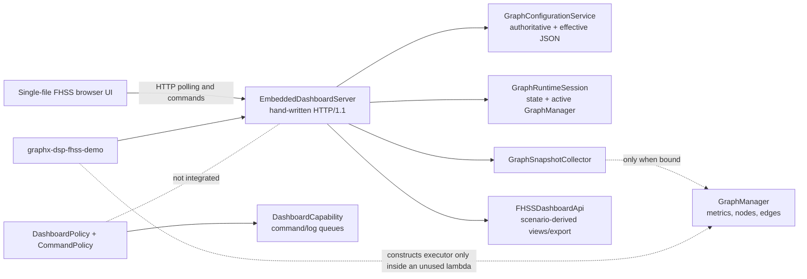
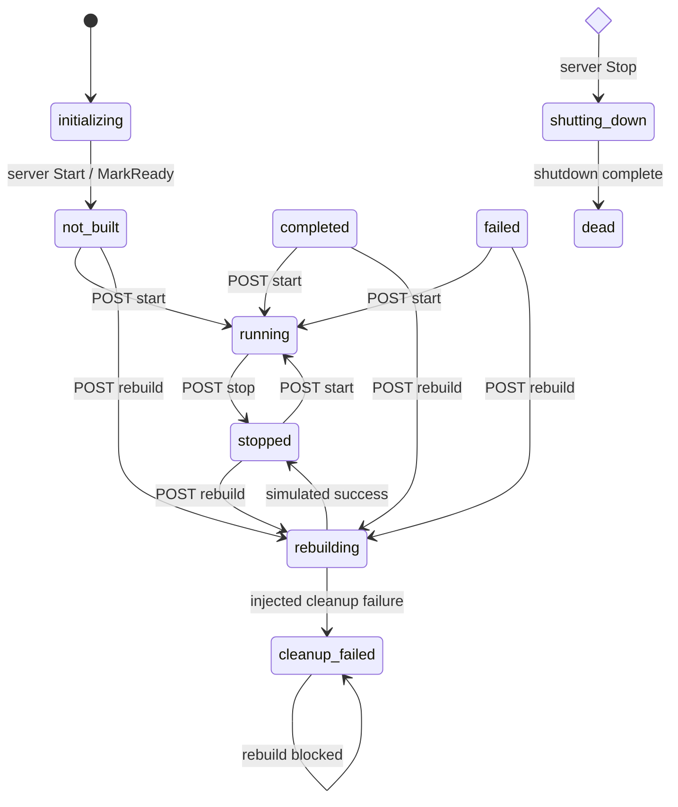

# GraphX Dashboard Architecture and Artifact Assessment

Date: 2026-07-17

Repository revision reviewed: `160be5b` (with unrelated local documentation changes preserved)

Scope: dashboard-related production code, build wiring, frontend assets, tests,
plans, and runtime integration in the GraphX repository.

## 1. Executive summary

GraphX contains two related but only partially integrated dashboard designs:

1. A reusable runtime capability/policy path in `libgraph` that exchanges text
   commands and logs through `DashboardCapability`. Its UI lifecycle is mostly
   commented out; it is not the backend used by the FHSS web page.
2. A newer embedded HTTP dashboard stack in `libgraph/include/graph/dashboard`
   and `libgraph/src/dashboard`, specialized for FHSS by
   `examples/DSP/dashboard/FHSSDashboardApi.cpp` and a self-contained HTML page.

The embedded stack has useful foundations: versioned JSON schemas, an
authoritative/effective configuration split, optimistic revision checks,
runtime state reporting, graph/edge metrics, node diagnostics, bounded event
replay, export path containment, and deterministic tests. The focused compiled
dashboard suite passes 31 tests from 9 suites.

It is not yet an operational implementation of the full dashboard plan. The
most important current facts are:

- The configured host is ignored and the server binds `INADDR_ANY`, despite the
  declared default and documentation presenting a loopback-only service.
- `--dashboard` and `--dashboard-no-run` enter the same no-run function. Start,
  stop, and rebuild API calls mutate `GraphRuntimeSession` state but do not
  build, start, stop, or replace an FHSS executor.
- Step 5 message-control tests exist but are excluded from CMake and reference a
  missing `FHSSScenarioController`; the corresponding UI commands therefore
  return `404`.
- Step 6 is an HTTP polling/replay endpoint, not the WebSocket transport called
  for by the plan.
- FHSS schedule, decoder, timeline, heatmap, and spectrum results are generated
  from configured scenario truth and deterministic placeholders. They are not
  measurements from receiver execution, and no raw IQ is included or exported.
- The implementation uses a hand-written, single-connection-at-a-time POSIX
  HTTP server without authentication, TLS, request-size/time limits, or
  production hardening.

The current dashboard is best classified as a deterministic local development
and configuration-inspection prototype. It should not be described as a live
receiver dashboard or exposed to an untrusted network.

## 2. Artifact inventory

### 2.1 Embedded web-dashboard core

| Artifact | Role | Current status |
|---|---|---|
| `libgraph/include/graph/dashboard/EmbeddedDashboardServer.hpp` | HTTP request/response types, server options, application route extension, event replay state | Active public header |
| `libgraph/src/dashboard/EmbeddedDashboardServer.cpp` | POSIX socket server, static files, generic REST routes, event retention/replay | Compiled into `graph` unconditionally |
| `libgraph/include/graph/dashboard/GraphConfigurationService.hpp` | Authoritative scenario, derived graph, validation, revisioning, export operations | Active public header |
| `libgraph/src/dashboard/GraphConfigurationService.cpp` | FHSS-oriented extraction, derivation, mutation, validation, and JSON export | Active, despite placement in generic `libgraph` |
| `libgraph/include/graph/dashboard/GraphRuntimeSession.hpp` | Runtime state machine and active `GraphManager` holder | Active public header |
| `libgraph/src/dashboard/GraphRuntimeSession.cpp` | In-memory lifecycle transitions and test failure injection | Active state model; no executor ownership |
| `libgraph/include/graph/dashboard/GraphSnapshotCollector.hpp` | Metrics and diagnostics snapshot API | Active public header |
| `libgraph/src/dashboard/GraphSnapshotCollector.cpp` | Reads `GraphManager`, edge metrics, node metadata, and `IDiagnosable` | Active when a real manager is bound |

`libgraph/CMakeLists.txt` recursively globs all `src/**/*.cpp`; consequently the
dashboard core is always part of the static `graph` library. The top-level
`GRAPHX_BUILD_WEB_DASHBOARD` option does not control this code.

### 2.2 FHSS adapter and browser asset

| Artifact | Role | Current status |
|---|---|---|
| `examples/DSP/dashboard/FHSSDashboardApi.hpp` | Declares the application-specific route handler factory | Active |
| `examples/DSP/dashboard/FHSSDashboardApi.cpp` | Builds FHSS visualization JSON and artifact bundles | Active and always built as `dsp_fhss_dashboard_api` |
| `examples/DSP/dashboard/index.html` | Entire frontend: HTML, CSS, and JavaScript in one file | Active; no external frontend toolchain |
| `examples/DSP/src/fhss_demo.cpp` | CLI options, server construction, services, signal/shutdown loop | Web entry point when compiled with the feature macro |
| `README.md` | Build/run instructions and CMake option description | Partly inconsistent with implementation |

The UI has two tabs: Overview and Graph Details. It renders command controls,
graph metrics, topology activity, diagnostics, FHSS schedule, 64-channel
heatmap, pulse timeline, decoder summaries, a selected-channel preview, nodes,
and edges. It uses DOM APIs for most output, but the pulse table interpolates
API values into `innerHTML`; that becomes an injection concern if those fields
ever cease to be strictly numeric or trusted.

### 2.3 Runtime capability/policy dashboard artifacts

| Artifact | Role | Relationship to web dashboard |
|---|---|---|
| `libgraph/include/capabilities/DashboardCapability.hpp` | Thread-safe active queues for UI commands and log lines | Not used by `EmbeddedDashboardServer` |
| `libgraph/include/capabilities/DashboardOutput.hpp` and `libgraph/src/capabilities/DashboardOutput.cpp` | `ICommandOutput` adapter that writes formatted messages to the dashboard log queue | Used by `CommandPolicy`, not by the web API |
| `libgraph/include/policies/DashboardPolicy.hpp` | Registers `DashboardCapability` in the executor capability bus | Always added by `GraphExecutorBuilder`; actual UI creation/thread code is commented out |
| `libgraph/include/policies/CommandPolicy.hpp` | Processes queued textual commands when CLI mode is enabled | Separate command path from web REST commands |
| `libgraph/src/graph/GraphExecutorBuilder.cpp` | Installs `DashboardPolicy`; conditionally appends `CommandPolicy` for CLI mode | Does not connect the embedded server to either policy |

This split is the main architectural inconsistency. The capability path owns a
command/log abstraction but no active UI; the embedded path owns an HTTP UI but
bypasses the command capability and directly edits a separate session model.

### 2.4 Tests and historical planning artifacts

The compiled test target includes:

- `test_dsp_fhss_dashboard_step1.cpp`
- `test_dsp_fhss_dashboard_step2_browser.cpp`
- `test_dsp_fhss_dashboard_step2.cpp`
- `test_dsp_fhss_dashboard_step3.cpp`
- `test_dsp_fhss_dashboard_step6.cpp`
- `test_dsp_fhss_dashboard_step7.cpp`
- `test_dsp_fhss_dashboard_step8.cpp`

`test_dsp_fhss_dashboard_step5.cpp` is present but not listed in
`examples/DSP/test/CMakeLists.txt`. It includes the nonexistent
`graph/dashboard/FHSSScenarioController.hpp`, so simply adding it to the target
would not compile. There is no Step 4 test file; generic metrics behavior is
covered inside Steps 1 and 3.

Planning material consists of the large current-root
`GRAPHX_FHSS_WEB_DASHBOARD_PLAN.md` plus implementation and verification prompts
under `plan/archive/2026-06-28-baseline/`. These are useful design history, not
evidence that the described steps are complete. The plan explicitly describes
Boost.Beast, WebSockets, a scenario controller, live receiver results, and
security limits that are absent from the current implementation.

## 3. Current component architecture



The server owns shared pointers to the three generic services and delegates
unrecognized API requests to the FHSS handler. The server thread accepts one
socket, reads and handles it to completion, closes it, and then accepts the next
socket. Every response uses `Connection: close`.

## 4. Build and launch behavior

The top-level option is:

```text
GRAPHX_BUILD_WEB_DASHBOARD=OFF
```

When enabled, it adds `GRAPHX_BUILD_WEB_DASHBOARD=1` and the source-tree asset
directory macro only to `dsp_fhss_demo`. It does not gate compilation of the
generic server or `dsp_fhss_dashboard_api`. The dashboard asset is not installed
with the executable, so the compiled default points back into the source tree;
an installed binary needs `--dashboard-assets` and a separately deployed
`index.html`.

The documented launch command is broadly correct for local source-tree use:

```bash
cmake -S . -B build-dashboard -G Ninja \
  -DGRAPHX_BUILD_WEB_DASHBOARD=ON \
  -DGRAPHX_BUILD_EXAMPLES_DSP=ON
cmake --build build-dashboard --target dsp_fhss_demo
./build-dashboard/examples/DSP/graphx-dsp-fhss-demo \
  --graph-config libdsp/config/fhss_cpsm_channelized_fixture_500msps.json \
  --plugin-dir build-dashboard/plugins \
  --dashboard --dashboard-port 8080 --dashboard-no-run
```

However, omitting `--dashboard-no-run` does not run the graph while serving the
dashboard, contrary to `README.md`. Either dashboard flag enters
`RunDashboardNoRunMode`. The function defines `start_runtime` and `stop_runtime`
lambdas, but only `stop_runtime` is invoked during shutdown; the server has no
callback with which to invoke `start_runtime`.

## 5. Generic HTTP API

All responses are JSON except static assets. Schemas generally use the
`graphx.dashboard.*.v1` namespace.

| Method and route | Purpose | Current semantics |
|---|---|---|
| `GET /healthz` | Process/server liveness | Always `200` while reachable |
| `GET /readyz` | Session readiness | `200` except initializing, rebuilding, shutting down, or dead |
| `GET /api/v1/version` | API version | Returns `v1` |
| `GET /api/v1/graph` | Effective graph | Declarative configuration response |
| `GET /api/v1/config` | Authoritative and effective config | Revisioned response |
| `PATCH /api/v1/config` | Apply scenario edit | Supports pointer/value or a subset of JSON Patch |
| `GET /api/v1/config/authoritative` | Authoritative scenario | Extracted from the source node |
| `GET /api/v1/config/effective` | Derived graph | Same effective content as config response |
| `GET /api/v1/config/derived-paths` | Read-only generated fields | Static path inventory |
| `GET /api/v1/config/value?pointer=...` | Resolve one JSON pointer | Scenario or effective node value |
| `GET /api/v1/nodes/{id}` | One graph node | Declarative node JSON |
| `GET /api/v1/nodes/{id}/parameters` | Parameter layers | Mostly placeholder metadata; meaningful configured data only for `source` |
| `POST /api/v1/config/validate` | Validate edits or scenario | Returns structured levels/errors |
| `POST /api/v1/config/rebuild` | Rebuild command | Increments session generation only; does not rebuild a graph |
| `GET /api/v1/status` | Runtime lifecycle status | In-memory session state |
| `POST /api/v1/commands/start` | Start command | State transition only |
| `POST /api/v1/commands/stop` | Stop command | State transition only |
| `GET /api/v1/metrics` | Graph/node/edge snapshot | Real only when an active manager has been bound |
| `GET /api/v1/metrics/edges` | Edge subset | Derived from the same collector |
| `GET /api/v1/diagnostics` | `IDiagnosable` node snapshots | Real only when an active manager has been bound |
| `POST /api/v1/config/undo` | Undo last committed edit | One service-local stack |
| `POST /api/v1/config/discard` | Clear edit history/staging | Does not change current scenario |
| `POST /api/v1/config/export` | Export authoritative/effective JSON | Synchronous file write represented as an operation |
| `GET/DELETE /api/v1/operations/{id}` | Inspect/delete operation | In-memory history |
| `POST /api/v1/operations/{id}/cancel` | Cancel operation | Usually inapplicable because export completes synchronously |
| `GET /api/v1/events` | Poll retained event batches | HTTP replay, not WebSocket/SSE |

The configuration service is nominally generic but contains FHSS-specific node
IDs, pulse roles, channel rules, and generated-field mappings. This violates the
layering suggested by its `libgraph` location. A generic configuration document
service and an FHSS derivation/validation policy should be separate types.

## 6. Configuration and state semantics

`GraphConfigurationService` treats the synthetic source node's `node_config` as
the authoritative scenario. It derives:

- active frequencies from the first message preamble;
- canonical preamble pulses;
- flattened transmitted pulse frequencies;
- receiver/channelizer copies of selected RF and overlap fields;
- source, preamble, assembler, and channelizer node configurations.

Writes are restricted to `/fhss/scenario` and its source-node alias. Generated
paths are rejected as read-only, edits include `expected_revision`, and stale
writers receive `409`. Validation checks message IDs, 16–256 pulses per message,
a 16-pulse common preamble, four distinct active frequencies, frequency range
`[1,62]`, active-frequency membership, pulse roles, and a simplified overlap
condition.

There are consistency issues with current FHSS receiver architecture:

- Generated paths still include assembler `active_frequency_indices`,
  `messages`, and `truth_from_fixture`-style scenario projection behavior. This
  conflicts with the receiver-side goal that the assembler consume minimal
  preamble configuration and derive active frequencies from `preamble_pulses`.
- The overlap check estimates message duration as `pulse_count * 1` sample,
  rather than using architecture-defined pulse timing and gaps.
- Node-parameter inspection returns empty runtime/descriptions/ports layers for
  most nodes, so the Step 2 plan's runtime parameter introspection is not
  implemented.

### Runtime state machine



These are control-model transitions, not proof of corresponding executor
actions. Failure injection flags simulate queue-disable, executor-construction,
cleanup, thread-interruption, and shutdown failures without executing those
operations.

## 7. Metrics and diagnostics

`GraphSnapshotCollector` is the strongest connection to the real GraphX
runtime. When `GraphRuntimeSession` holds an active `GraphManager`, it emits:

- graph totals for processed/rejected items and messages;
- enqueued/dequeued totals, backpressure, queue depth, and thread peaks;
- per-edge source/destination indices and names, port indices, message type,
  queue counters, lifecycle flags, and activity classification;
- per-node aggregate inbound/outbound/rejected counts, connected edges,
  backpressure, queue depth, and diagnostic availability;
- `IDiagnosable::GetDiagnostics()` payloads for compatible nodes.

Before a manager is bound, the schemas remain stable but contain zeros and
empty arrays. That is the state users see in the current dashboard server path,
because the defined graph-start function is not connected to the HTTP command.

## 8. Events and browser refresh

The server retains events for 120 seconds, caps global retained history at 4096
events, and gives each client a queue depth of 128. Event envelopes carry a
monotonic sequence, timestamp, type, optional revision, and payload. A replay
request can resume after `last_sequence` only when the retained range is
contiguous. Overflow or a retention gap sets `resync_required`; publishers do
not wait for slow clients.

This is a sound bounded-replay model, but transport and integration are partial:

- `/api/v1/events` is ordinary request/response polling.
- The browser does not call the events endpoint. It polls graph, metrics,
  diagnostics, and FHSS visualization concurrently every 100–2000 ms (normally
  250 ms).
- Metrics and status events are published as side effects of GET requests, so
  polling can create events rather than only observe state changes.
- Configuration-service operation events use a separate testing sink and are
  not wired to `EmbeddedDashboardServer::PublishEvent`.

## 9. FHSS-specific views and artifacts

### 9.1 What is displayed

`GET /api/v1/fhss/visualization` derives all display data from the authoritative
scenario:

- schedule message and preamble counts;
- a 64-channel expected-use heatmap;
- a bounded pulse timeline;
- a deterministic “Viterbi” summary based on channel values;
- a 32-bin selected-channel preview.

The endpoint correctly labels the data as a deterministic CPU fixture, but the
field names can still imply receiver evidence that does not exist. Specifically:

- detected sample starts are always `null`;
- detected and rejected channel counts are always zero;
- confidence is hard-coded to `0.9` for in-range channels;
- the “Viterbi” path is the first configured channel indices and its margin is
  an arithmetic placeholder;
- the spectrum is `abs(sin(bin * 0.35))`, independent of IQ;
- `raw_iq_included` is always false.

Accordingly, this view is a scenario/truth preview. It is not decoder telemetry,
detection validation, spectral analysis, or an expected-versus-observed
comparison.

### 9.2 Export behavior

`POST /api/v1/fhss/artifacts/bundle` writes a JSON summary beneath a configured
artifact root. With `include_sigmf_capture=true`, it also writes a minimal
`.sigmf-meta` document. It does not write or reference a `.sigmf-data` file and
explicitly reports `contains_raw_iq=false`. The UI button text “Export Artifact
Bundle + SigMF Meta” is accurate; this is not a signal capture.

Both general config export and FHSS bundle export require absolute output paths
under the artifact root. The FHSS demo sets that root to the parent of the asset
directory. The browser hard-codes `/tmp/graphx_dashboard_artifacts`, which is
non-portable and will normally be rejected unless it happens to fall beneath
that root.

## 10. Verification status

The following focused command was run against the existing debug build:

```bash
./build-ninja/ninja-debug/examples/DSP/test/test_dsp_example_unit \
  --gtest_filter='FhssDashboard*'
```

Result: **31/31 tests passed across 9 compiled suites**.

Coverage demonstrated by those tests includes ephemeral-port startup, asset
serving, health/readiness, stable response schemas, invalid startup conditions,
optimistic revision conflict, scenario validation, configuration export and
operation history, simulated lifecycle failures, event replay/backpressure,
bounded FHSS visualization, artifact containment, and absence of raw IQ in JSON.

Important coverage exclusions:

- no compiled Step 5 tests or scenario-controller implementation;
- no real browser engine, JavaScript execution, accessibility, or visual test;
- no WebSocket handshake/frame/reconnect test;
- no dashboard-driven executor start/stop/rebuild integration test;
- no live receiver result feeding FHSS views;
- no authentication, hostile request, fuzzing, request-limit, slow-client socket,
  or multi-thread concurrency test;
- no install/package test for dashboard assets;
- no non-POSIX portability test.

## 11. Findings and risks

### High severity

1. **Network exposure contradicts the declared contract.** `Options::host`
   defaults to `127.0.0.1`, but `Start()` ignores it and binds `INADDR_ANY`.
   There is no authentication or TLS. The server must bind the parsed address,
   fail closed for unsupported addresses, and remain loopback-only by default.

2. **Runtime controls are presentation-only.** The REST start/stop/rebuild
   routes only change in-memory state. The demo's real executor-start lambda is
   unreachable from the server. This can mislead users about whether processing
   occurred and makes metrics remain empty.

3. **FHSS “detected” and “decoder” views are synthetic placeholders.** They are
   derived from generator truth with fixed or fabricated observables. They must
   either be renamed clearly as expected/scenario views or be fed exclusively
   from receiver outputs with truth shown separately.

### Medium severity

4. **Step 5 is orphaned.** UI routes for step/continue/reset are not implemented;
   the excluded test refers to a missing controller. Either complete the
   controller and wire the source-owned injection/result contract, or remove and
   disable the controls until available.

5. **The advertised WebSocket architecture is not implemented.** HTTP replay is
   bounded and tested, but neither server nor browser uses WebSockets. Align the
   plan/docs with polling or implement the planned transport.

6. **The HTTP server is not production hardened.** It has no header/body limits,
   read/write deadlines, connection concurrency, authentication, origin/CSRF
   controls, or security headers. A client can monopolize the single accept
   loop with an incomplete request. Replace it with the planned maintained HTTP
   library or explicitly constrain it to test/local prototype use.

7. **Static-file containment uses a string prefix.** Comparing canonical paths
   with `find(root) == 0` does not establish path-component ancestry and can
   accept a sibling whose name begins with the root name. Use component-wise
   relative-path containment and reject `..`, symlink escapes, and non-files.

8. **Generic and FHSS responsibilities are mixed.** `GraphConfigurationService`
   in `libgraph` knows FHSS node IDs and pulse semantics, while the older generic
   dashboard capability is disconnected. Extract an application-neutral
   document/session API and inject FHSS derivation and validation.

9. **Receiver-minimal configuration is not reflected consistently.** Dashboard
   derivation still generates redundant assembler active-frequency/truth data.
   Align it with `docs/dsp/fhss_architecture.md`: parse `preamble_pulses`
   directly and derive the active set without scheduled messages or generator
   truth.

### Low severity

10. **Feature gating and packaging are incomplete.** Dashboard core and adapter
    compile even when the option is off, and the installed demo does not install
    its browser asset.

11. **The browser has weak error recovery.** `fetchJson` does not check HTTP
    status, a failed refresh stops the recursive refresh loop, commands do not
    trigger an immediate state refresh, and export display expects response
    fields that differ from the implemented result shape.

12. **Accessibility is partial.** Tabs carry ARIA roles but lack keyboard tab
    behavior, status regions are not live regions, the numeric input has no
    associated label, and color conveys activity/load without a complete
    alternative.

## 12. Recommended consolidation sequence

1. Correct the safety contract first: honor `Options::host`, enforce loopback by
   default, add strict request/time limits, fix path ancestry checks, and state
   explicitly that authentication/TLS are absent.
2. Give `GraphRuntimeSession` an injected runtime-owner interface whose
   transactional methods perform real build/start/stop/rebuild operations. Wire
   the existing demo executor logic through it and add end-to-end tests.
3. Reconcile receiver configuration derivation with
   `docs/dsp/fhss_architecture.md`, eliminating assembler dependence on messages,
   active-frequency duplication, and generator truth.
4. Decide the transport contract. If bounded polling is sufficient, update the
   plan and naming. If WebSockets are required, implement them with the planned
   maintained library and make the UI consume the replay/resync protocol.
5. Implement the missing source-owned `FHSSScenarioController` and terminal
   result correlation before enabling Step/Continue/Reset controls and Step 5
   tests.
6. Separate expected scenario truth from observed receiver telemetry in API
   schemas and UI panels. Calculate spectra and decoder diagnostics from actual
   receiver products; never manufacture confidence or detected fields.
7. Split the generic dashboard framework from the FHSS application policy, then
   connect or retire the older `DashboardCapability`/policy path so GraphX has
   one command and status architecture.
8. Package static assets with the installed executable, add browser-level and
   security tests, and gate dashboard-only targets consistently with the build
   option.

## 13. Intended classification

Until the high-severity findings are resolved, the most accurate user-facing
description is:

> The GraphX FHSS dashboard is a synthetic, local-development configuration and
> scenario visualization prototype. It exposes versioned inspection APIs and
> deterministic fixture views, but it does not currently control live FHSS
> execution or display receiver-derived detections, decoding, spectra, or raw
> IQ. No hardware-in-the-loop data is used.
