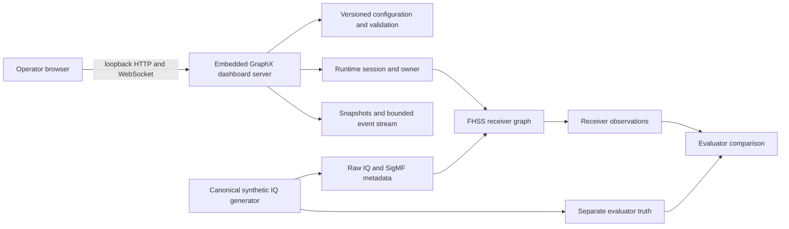

# GraphX dashboard user manual

## 1. Purpose and scope

This manual explains how to build, launch, operate, automate, install, and
troubleshoot the GraphX dashboard. It also documents the complete operator
workflow for the first packaged dashboard application: the FHSS dashboard.

GraphX provides reusable embedded-dashboard infrastructure for configuration,
runtime ownership, snapshots, events, bounded HTTP handling, and static assets.
The current user interface and versioned application API are FHSS-specific.
There is not yet a separately packaged, signal-agnostic GraphX dashboard.

The supported dashboard profile is:

- a local operator using a loopback address (`127.0.0.1` or `::1`);
- the `graphx-dsp-fhss-demo` executable built in C++26 mode;
- synthetic IQ and software evidence; and
- macOS with maintained Firefox for the currently qualified browser profile.

Other operating systems and browsers may work, but are unqualified until the
same installed-tree, browser, sanitizer, concurrency, soak, and regression
evidence passes there. Windows dashboard builds are intentionally disabled
until equivalent safe static-file traversal is implemented.

There is no hardware-in-the-loop (HWIL), conducted-RF, over-the-air, or live-RF
evidence. The dashboard and its FHSS receiver are **not production-RF
qualified**.

## 2. Operator safety and security

The dashboard is a local engineering tool. It has no authentication or TLS
because the server accepts loopback addresses only.

Follow these rules:

1. Do not put the dashboard behind a reverse proxy, port-forward, tunnel, or
   other mechanism that makes it remotely reachable.
2. Do not treat configured schedules or synthetic truth as receiver detections.
3. Do not interpret the spectrum panel as calibrated RF power. Its values are
   magnitude in dB relative to one complex unit, not dBm or dBFS.
4. Keep investigation artifacts in an operator-owned directory with adequate
   space. Copied-IQ bundles can be substantially larger than reference bundles.
5. Do not use `--dashboard-investigation-qualification` during normal
   operation. It activates a startup-only fault sequence intended for automated
   qualification.

A non-loopback deployment needs a new threat model and, at minimum,
authentication, authorization, TLS, origin and CSRF controls, audit logging,
secret management, deployment isolation, and independent security testing.

## 3. System model



The receiver is supplied with binary IQ and receiver-minimal configuration.
Generator messages, schedules, expected words, active-frequency hints, and
truth do not enter receiver execution. The preamble supplies the information
from which the receiver derives the active-frequency set.

## 4. Prerequisites

Building GraphX requires:

- CMake 4.0 or newer;
- Ninja;
- Linux or macOS;
- a compiler with C++26 support; and
- the normal GraphX dependencies, including Boost when the dashboard is
  enabled.

GPU backends are optional for this dashboard workflow. The bundled FHSS graph
is CPU-only, although the runtime links the GraphX GPU capability bootstrap.
See the repository `README.md` for platform-specific compiler and dependency
setup.

The external contract/operator workflow additionally requires Python and the
locked packages in
`examples/DSP/dashboard/api/requirements-contracts.lock`.

## 5. Build the dashboard

From the repository root, provision the authoritative API validators:

```sh
python3 examples/DSP/dashboard/api/provision_contract_validators.py \
  --venv .venv-dashboard-contracts
```

For a controlled offline installation, provide a reviewed wheelhouse:

```sh
python3 examples/DSP/dashboard/api/provision_contract_validators.py \
  --venv .venv-dashboard-contracts \
  --wheelhouse /path/to/wheelhouse
```

Configure a dashboard-enabled debug build and bind it to that interpreter:

```sh
cmake -S . -B build-ninja/ninja-debug -G Ninja \
  -DCMAKE_BUILD_TYPE=Debug \
  -DGRAPHX_BUILD_WEB_DASHBOARD=ON \
  -DGRAPHX_BUILD_EXAMPLES_DSP=ON \
  -DGRAPHX_DASHBOARD_CONTRACT_PYTHON="$PWD/.venv-dashboard-contracts/bin/python"

cmake --build build-ninja/ninja-debug --target dsp_fhss_demo
```

The dashboard option is off by default. If it was omitted, the executable
reports that dashboard support was not built.

Validate the pinned OpenAPI and JSON Schema contracts when changing or
qualifying an API build:

```sh
.venv-dashboard-contracts/bin/python \
  examples/DSP/dashboard/api/validate_contracts.py
```

## 6. Quick start

### 6.1 Inspection and configuration only

Use no-run mode when an operator should inspect and validate configuration
without exposing receiver execution or message-job controls:

```sh
./build-ninja/ninja-debug/examples/DSP/graphx-dsp-fhss-demo \
  --graph-config libdsp/config/fhss_cpsm_channelized_fixture_500msps.json \
  --plugin-dir build-ninja/ninja-debug/plugins \
  --dashboard-no-run \
  --dashboard-port 0
```

### 6.2 Full local operator mode

Use dashboard mode to expose configuration, receiver lifecycle, message-job,
and investigation controls:

```sh
./build-ninja/ninja-debug/examples/DSP/graphx-dsp-fhss-demo \
  --graph-config libdsp/config/fhss_cpsm_channelized_fixture_500msps.json \
  --plugin-dir build-ninja/ninja-debug/plugins \
  --dashboard \
  --dashboard-host 127.0.0.1 \
  --dashboard-port 0 \
  --dashboard-artifact-root /path/to/operator-owned/fhss-artifacts
```

The program prints an authoritative URL such as:

```text
Dashboard URL: http://127.0.0.1:49152
Dashboard receiver control mode active; runtime is stopped until Rebuild and Start. Press Ctrl+C to stop.
```

Open the printed URL in the browser. Port `0` asks the operating system to
select a free port and is recommended when a fixed port is unnecessary.

`--dashboard` and `--dashboard-no-run` are mutually exclusive. Full dashboard
mode still does not run a graph at launch: it starts in `not_built`, and an
operator must explicitly select **Rebuild** and then **Start**.

Press Ctrl+C in the terminal to stop the server cleanly.

## 7. Command-line reference

### Dashboard options

| Option | Meaning |
|---|---|
| `--dashboard` | Enable receiver lifecycle, message jobs, and investigation mutations. |
| `--dashboard-no-run` | Serve inspection/configuration capability without runtime or mutating application routes. |
| `--dashboard-host ADDRESS` | Bind a loopback address; default is `127.0.0.1`. |
| `--dashboard-port N` | Bind TCP port 0–65535; `0` selects an ephemeral port. |
| `--dashboard-assets PATH` | Override the directory containing `index.html` and dashboard assets. |
| `--dashboard-artifact-root PATH` | Select the root for generated jobs and investigation bundles. |

The WebSocket idle, heartbeat, and gate-file options are test and diagnostic
controls. The investigation-qualification option is also test-only; normal
operators should leave all of them unset.

### Shared FHSS demo options

| Option | Meaning |
|---|---|
| `--graph-config PATH` | Select the graph JSON loaded at startup. |
| `--message-json PATH` | Patch the canonical synthetic source/decoder configuration from a message document. |
| `--plugin-dir PATH` | Select the GraphX runtime plugin directory. |
| `--effective-config-json PATH` | Write the effective graph JSON to a chosen path. |
| `--print-effective-config` | Print the effective graph configuration. |
| `--executor-timeout-s N` | Bound non-dashboard graph execution. |
| `--summary-json PATH` | Write the non-dashboard execution summary. |
| `--decoded-pulse-limit N` | Bound decoded pulses included in that summary. |
| `--channel-iq-dir PATH` | Capture channelizer output as SigMF `cf32_le`. |
| `--channel-iq-indices active\|all\|CSV` | Choose captured physical channels. |

Run `graphx-dsp-fhss-demo --help` for the executable's current syntax.

## 8. Dashboard navigation

The page has two top-level tabs.

### Overview

The Overview tab contains:

- **Runtime Metrics**: graph, node, and edge counters attributed to the active
  runtime generation;
- **Topology Activity**: a compact view of current node/edge activity;
- **FHSS Schedule**: configured synthetic expectations, not detections;
- **Expected / Observed Evaluation**: separately selectable truth and receiver
  overlays plus evaluator comparison;
- **Diagnostics**: bounded typed runtime diagnostics;
- **64-Channel Heatmap**: activity by physical receiver channel;
- **Synthetic Schedule Expectations**: the expected timing table; and
- **Receiver Sample Spectrum**: a selected-channel, single-frame,
  symmetric-Hamming spectrum from a bounded receiver sample capture.

Each displayed observation carries identity and provenance information where
available, including graph generation, run epoch, configuration revision/ETag,
and source node.

### Graph Details

The Graph Details tab contains:

- nodes and edges;
- authoritative configuration and RFC 6902 Patch controls;
- effective configuration and provenance;
- receiver runtime controls;
- FHSS message-job controls; and
- investigation bundle controls.

Controls that require full mode are unavailable or hidden in no-run mode.

## 9. Configuration workflow

The dashboard treats configuration as a versioned document with a strong ETag.
Edits are RFC 6902 JSON Patch arrays using RFC 6901 pointers.

For a safe edit:

1. Open **Graph Details**.
2. Review the authoritative configuration identity and current ETag.
3. Enter a JSON Patch. For example:

   ```json
   [{"op":"replace","path":"/iq_center_frequency_hz","value":1240000000.0}]
   ```

4. Select **Validate**. Validation checks the candidate but does not mutate the
   current document, revision, or ETag.
5. Review validation errors and derived/provenance fields.
6. Select **Apply with If-Match**. The UI submits the ETag it read with the
   patch, preventing a stale browser session from overwriting a newer edit.
7. If the active runtime is now stale, select **Rebuild** before running again.

Missing preconditions return HTTP 428. A stale ETag returns HTTP 412. An
invalid patch fails atomically; partial changes are not retained. Derived
fields are read-only.

## 10. Receiver lifecycle

Full dashboard mode uses explicit lifecycle transitions:

```text
not_built -> Rebuild -> stopped -> Start -> running -> completed
                                            |
                                            +-> Stop -> stopped
```

- **Rebuild** validates one immutable configuration snapshot, constructs a
  replacement graph, and atomically publishes a new generation. A failed
  rebuild preserves the previous generation.
- **Start** launches that generation asynchronously and assigns a new run
  epoch.
- **Stop** requests cooperative cancellation and waits for the actual execution
  thread. A non-cooperative node can cause a bounded timeout rather than a
  false success.

Configuration changes do not silently alter a running generation. Status
shows the configuration revision and ETag bound to the generation and whether
a rebuild is required.

## 11. Events, refresh, and reconnection

The dashboard prefers the WebSocket event stream and retains a bounded polling
endpoint as a fallback. The header reports the current event transport state.

Each event has a process epoch and monotonic sequence plus applicable graph,
run, configuration, controller, job, and correlation identities. On a gap or
reconnect, the client obtains a fresh snapshot and reconciles state rather than
assuming that missed events did not occur.

If live updates stop:

1. Check that the demo process is still running.
2. Check the event-transport status at the top of the page.
3. Reload the printed URL once.
4. Query `/healthz` and `/readyz` from the same host.
5. Inspect the terminal for a shutdown, timeout, or rejected-origin message.

## 12. FHSS dashboard operation

### 12.1 What the FHSS dashboard evaluates

The dashboard exercises the current GraphX FHSS/CPSM processing chain. Its
canonical fixture generates architecture-conformant synthetic messages and IQ.
Its engineering receiver reads binary IQ, channelizes it, detects pulses,
computes CPSM branch metrics, performs Viterbi/word decoding, detects the
preamble, assembles the message, and reports receiver observations.

The two information paths stay separate:

- **synthetic truth** describes what the generator created;
- **receiver observation** describes what receiver nodes reported; and
- **evaluator comparison** matches the two outside receiver execution.

An unavailable receiver diagnostic remains unavailable; the UI does not fill
it with expected truth.

### 12.2 Run one synthetic message

The most direct end-to-end workflow is:

1. Launch with `--dashboard` and an operator-owned artifact root.
2. Open **Graph Details**.
3. Optionally validate and apply a configuration change.
4. Select **Step one complete message**.
5. Watch the job identity and state. Step means one complete FHSS protocol
   message, not one node, pulse, edge, sample buffer, or decoder state.
6. When the job completes, inspect generation, lifecycle, receiver result, and
   evaluator comparison as separate documents.
7. Return to **Overview** to inspect observations, channel activity, timing,
   diagnostics, and the selected-channel spectrum.

The job controller uses the canonical parser and IQ generator. It atomically
writes raw IQ, separate truth, SigMF metadata, receiver-minimal configuration,
and a manifest under the artifact root. It then replays only the IQ and
receiver-minimal configuration through the receiver.

### 12.3 Run a bounded sequence

Select **Continue complete messages** to run the controller's bounded message
sequence. Use **Cancel active job** for cooperative cancellation. Use **Reset
message cursor** only when no job is active; reset advances the controller
epoch so old jobs cannot be mistaken for the new sequence.

Jobs have opaque IDs and bounded queue, sample, byte, metadata, timeout,
history, and idempotency storage. Refreshing the browser only reads state and
does not submit another job.

### 12.4 Interpret the panels

- A scheduled pulse or channel is an expectation until a receiver observation
  independently reports it.
- The 64-channel heatmap identifies physical receiver channels, not generator
  truth channels injected into the receiver.
- Timing deltas are evaluator results after identity matching.
- Confidence values are engineering diagnostics, not calibrated
  probabilities.
- The displayed spectrum uses at most 256 complex samples and is suitable for
  qualitative engineering inspection only.
- Overlapping co-channel FHSS transmitters are not separated by the current
  receiver.

### 12.5 Investigation bundles

After selecting a completed job:

1. Enter a bounded bundle name using letters, digits, `.`, `_`, or `-`.
2. Select an IQ storage mode:
   - **Reference-only** is smaller but is not self-contained. It depends on the
     original IQ path remaining available and unchanged.
   - **Copied IQ** becomes self-contained after validation. The UI requires an
     explicit confirmation of the estimated byte count.
3. Select **Export selected completed job** and wait for a terminal operation
   state.
4. Select **Validate bundle**. Validation checks containment, schemas, hashes,
   inventory, metadata, and IQ references/data.
5. Select **Replay validated bundle** to run it through the normal receiver
   path and compare the semantic receiver result.
6. Use **Cancel operation** when available to request cooperative
   cancellation.

Raw IQ, SigMF metadata, truth, receiver configuration/result, observations,
comparison, provenance, and operator actions remain separate artifacts. Do not
edit a bundle and continue to rely on its old validation result.

### 12.6 Run the FHSS demo without the dashboard

The same executable can run the canonical fixture directly:

```sh
./build-ninja/ninja-debug/examples/DSP/graphx-dsp-fhss-demo \
  --graph-config libdsp/config/fhss_cpsm_channelized_fixture_500msps.json \
  --plugin-dir build-ninja/ninja-debug/plugins \
  --executor-timeout-s 12 \
  --summary-json /path/to/fhss-summary.json
```

This path builds and executes the graph immediately, prints a summary, and
returns zero only when execution succeeds and completion is signaled. It is
useful for batch receiver testing; it does not start the web server.

## 13. Installation and relocation

Install to a clean prefix:

```sh
cmake --install build-ninja/ninja-debug --prefix /path/to/graphx-install
```

The relevant installed layout is:

```text
<prefix>/bin/graphx-dsp-fhss-demo
<prefix>/share/graphx/config/
<prefix>/share/graphx/fhss-dashboard/index.html
<prefix>/share/graphx/fhss-dashboard/api/
<prefix>/share/graphx/fhss-dashboard/operator/
<prefix>/share/graphx/fhss-dashboard/sigmf/
<prefix>/share/graphx/fhss-dashboard/docs/
```

The executable first looks for assets and the default graph configuration
relative to itself, so a correctly installed tree does not need source-tree
paths. Launch it with:

```sh
/path/to/graphx-install/bin/graphx-dsp-fhss-demo \
  --dashboard --dashboard-port 0 \
  --dashboard-artifact-root /path/to/operator-owned/fhss-artifacts
```

Use `--dashboard-assets` only for development or an intentionally relocated
asset tree.

## 14. API and automation

The authoritative contract is
`examples/DSP/dashboard/api/openapi.json`; schemas are under
`examples/DSP/dashboard/api/schemas`. The API major is `/api/v1`.

Useful entry points include:

- `GET /healthz`, `GET /readyz`, and `GET /api/v1/version`;
- graph, configuration, effective-value, provenance, metric, diagnostic, node,
  and visualization reads under `/api/v1/fhss`;
- configuration validation and strong-ETag JSON Patch;
- receiver rebuild/start/stop and status;
- job step/continue/cancel/reset and job resources;
- expected truth, observations, comparison, spectrum, and snapshots;
- bounded polling and WebSocket event routes; and
- investigation export, validation, replay, cancellation, and quota routes.

Automation should validate request and response bodies against the pinned
contract, honor HTTP status codes and `application/problem+json`, preserve
ETags, treat IDs as opaque, and poll or stream terminal state instead of
assuming synchronous job completion.

Simple health checks from the local machine are:

```sh
curl -fsS http://127.0.0.1:PORT/healthz
curl -fsS http://127.0.0.1:PORT/readyz
curl -fsS http://127.0.0.1:PORT/api/v1/version
```

## 15. External operator and qualification workflows

The packaged Python operator is for repeatable evidence collection and
verification, not ordinary interactive use. A source-tree invocation has this
form:

```sh
.venv-dashboard-contracts/bin/python \
  examples/DSP/dashboard/operator/fhss_dashboard_operator.py exercise \
  --phase 8 \
  --build-dir build-ninja/ninja-debug \
  --output-dir /path/to/new/phase8-evidence

.venv-dashboard-contracts/bin/python \
  examples/DSP/dashboard/operator/fhss_dashboard_operator.py verify \
  --phase 8 \
  --output-dir /path/to/new/phase8-evidence
```

Always use a new, operator-owned output directory. The operator also provides
`serve`, `report`, and ownership-aware `cleanup` commands. Consult its README
and the phase-specific manual before running a qualification lane.

Phase 8 automated evidence does not replace human accessibility review. Its
manual WCAG record must be completed by a real operator from observed evidence;
the shipped template intentionally fails and must not be auto-attested.

## 16. Accessibility and keyboard use

The page provides a skip link, landmarks, labelled controls, live status
regions, reduced-motion behavior, and a responsive 320 CSS-pixel layout.

- Use Tab and Shift+Tab to move among interactive controls.
- On the dashboard tab list, use Left/Right Arrow, Home, and End to change the
  active tab.
- Use Space or Enter to activate buttons, checkboxes, and native controls.
- Use the **Expected overlay** and **Observed overlay** checkboxes to separate
  evidence layers without relying on color alone.

Automated accessibility checks and maintained-Firefox captures are part of the
qualification workflow, but human keyboard, reflow, focus, naming, and screen
reader review remains required for final WCAG evidence.

## 17. Troubleshooting

### “dashboard support is not built”

Reconfigure with `-DGRAPHX_BUILD_WEB_DASHBOARD=ON`, then rebuild
`dsp_fhss_demo`.

### The browser cannot connect

Use the exact URL printed by the executable. With port `0`, the port changes on
each launch. Confirm the process is still running and that no local policy is
blocking loopback connections.

### Dashboard assets are missing

Run from a correctly installed tree or pass
`--dashboard-assets examples/DSP/dashboard` from the repository root. Do not
point the option at an untrusted or remotely writable directory.

### Runtime controls are unavailable

The process was probably launched with `--dashboard-no-run`, or the dashboard
was built without its application capabilities. Restart with `--dashboard`.

### Start is rejected or status says configuration is stale

Select **Rebuild** to bind the current configuration revision and ETag to a new
runtime generation, then select **Start**.

### Apply reports 412 Precondition Failed

Another session changed the configuration after this page read its ETag.
Refresh the authoritative configuration, review the newer document, and
recreate the patch. Do not blindly resubmit a stale change.

### A job does not begin

Check the job state, controller epoch, queue limits, artifact-root permissions,
available disk space, and whether another job is active. Refresh is safe; it
does not create a duplicate job.

### Investigation validation fails

Do not replay the bundle. Review the reported path, schema, hash, inventory, or
SigMF error. A reference-only bundle also fails when its original IQ is absent
or changed. Re-export from the completed job when appropriate.

### Stop times out

The graph contains a node that has not cooperated with cancellation. The server
retains the live owner/thread state instead of claiming completion. Preserve
the diagnostic evidence, allow the node to return if possible, and terminate
the demo with Ctrl+C only after considering artifact writes in progress.

### The event stream reconnects repeatedly

Check browser origin, local connection stability, and terminal diagnostics.
Only the exact loopback page origin is accepted. The client should fall back to
bounded polling and resynchronize from a snapshot.

## 18. Related documentation

- `docs/graphx_dashboard.md`: dashboard architecture and implementation
  contracts.
- `docs/dsp/fhss_architecture.md`: normative FHSS message, IQ-generation, and
  receiver architecture.
- `examples/DSP/dashboard/api/openapi.json`: authoritative HTTP API.
- `examples/DSP/dashboard/operator/README.md`: external operator commands.
- `docs/dsp/fhss_dashboard_phase8_manual_operator_test.md`: installed-tree and
  human qualification procedure.
- `docs/dsp/fhss_dashboard_phase8_security_support.md`: supported profile,
  threat review, and versioning policy.
- `docs/dsp/fhss_dashboard_phase8_architecture_recommendation.md`: decision on
  future generic dashboard extraction.
