# GraphX SAR Example

This package demonstrates a deterministic, JSON-driven SAR stripmap pipeline for GraphX.

## Current Goals

1. Keep SAR-specific implementation under examples/SAR.
2. Use JSON topology as the primary execution path.
3. Keep deterministic synthetic behavior suitable for CI.
4. Compare GraphX execution against an equivalent direct non-graph baseline.
5. Keep new SAR stages dynamically loadable through the standard plugin/provider path:
  - SyntheticApertureIqSourceNode
  - RangeWindowNode
  - RangeCompressionNode
  - SarPulseFanoutNode
  - AzimuthTileSplitNode
  - SarBackprojectionTransformNode
  - ImageTileMergeNode

## Architecture

```mermaid
flowchart LR
   SRC[SyntheticApertureIqSourceNode]
   WINDOW[RangeWindowNode]
   SPLIT[AzimuthTileSplitNode]
   H2D[H2DAsyncNode]
   BP[SarBackprojectionTransformNode]
   D2H[D2HAsyncNode]
   MERGE[ImageTileMergeNode]
   SINK[SarDiagnosticsSinkNode]

   SRC --> WINDOW --> SPLIT --> H2D --> BP --> D2H --> MERGE --> SINK
```



Runtime topology source: examples/SAR/config/sar_stripmap_pr1.json

Additional demo scenario: examples/SAR/config/sar_projectile_approach_pr1.json

The projectile scenario also wires a visualization sink node (`SarVisualizationSinkNode`) that writes tile artifacts to `sar_viz_output/` using configurable `pgm` or `csv` output.

PR2 graph-visible fan-out topology: examples/SAR/config/sar_stripmap_pr2_fanout.json

PR3 Metal-oriented SAR topologies:

1. examples/SAR/config/sar_stripmap_pr3_metal_window.json
2. examples/SAR/config/sar_stripmap_pr3_metal_compression.json
3. examples/SAR/config/sar_stripmap_pr3_metal_fanout.json

The PR2 topology uses `SarPulseFanoutNode` to expose four branch lanes:

```text
fanout -> split_tile0 -> h2d_tile0 -> bp_tile0 -> d2h_tile0 \
fanout -> split_tile1 -> h2d_tile1 -> bp_tile1 -> d2h_tile1  \
fanout -> split_tile2 -> h2d_tile2 -> bp_tile2 -> d2h_tile2  / -> merge -> sink
fanout -> split_tile3 -> h2d_tile3 -> bp_tile3 -> d2h_tile3 /
```

## Build And Run

Build SAR example and tests:

```bash
cmake --build --preset build-debug --target sar_example test_sar_example_unit
```

Run example:

```bash
./build-ninja/ninja-debug/examples/SAR/sar_example
```

Run SAR tests:

```bash
./build-ninja/ninja-debug/examples/SAR/test/test_sar_example_unit
```

## Viewer Helper

The projectile scenario can generate PGM tiles in `sar_viz_output/` through `SarVisualizationSinkNode`.

Use the terminal ASCII viewer helper:

```bash
./examples/SAR/tools/view_sar_tiles.sh --input sar_viz_output
```

Useful options:

1. `--fps 8` to speed up playback.
2. `--step 1` for full resolution in terminal output.
3. `--loop 0` for continuous playback.
4. `--list` to list discovered frame files.
5. `--no-clear` to avoid screen clearing while troubleshooting frame output.

Native grayscale helper (macOS):

```bash
./examples/SAR/tools/view_sar_tiles_native.sh --open-dir
./examples/SAR/tools/view_sar_tiles_native.sh --open-first
./examples/SAR/tools/view_sar_tiles_native.sh --convert-png --open-png-dir
```

This helper opens PGM images in Preview/Finder directly and can convert all frames to PNG using `sips`.

## Deterministic Configuration Knobs

JSON node_config fields define deterministic profile behavior.

Primary knobs:

1. Source stage:
  - total_pulses
  - samples_per_pulse
2. Range DSP:
  - enabled
  - gain
3. Split/merge:
  - tile_count
  - tile_id_offset
  - fixed_tile_id
  - expected_tiles
  - require_all_tile_eos_before_complete
4. Transform metadata:
  - image_width
  - queue_id
  - kernel_id
5. Backend metadata:
  - backend
  - backend_id
6. PR2 tile identity metadata:
  - batch_id
  - aperture_id
  - pulse_range_start
  - pulse_range_count
  - tile_id
  - tile_count

All SAR nodes are initialized through standard IConfigurable using node_config.

Projectile-approach demo knobs (source node):

1. moving_target_enabled
2. target_initial_range_m
3. target_closing_velocity_mps
4. pulse_interval_s
5. target_reflectivity

This scenario models deterministic closing-range behavior and is intended as an architectural demo input profile rather than a full-fidelity radar physics model.

## Simulated Backend And Native Follow-Up

The current example targets a CI-safe simulated backend path and does not require native GPU runtime availability.

SAR tile messages also carry optional `graph::gpu::accel` metadata at the backend boundary. The simulated H2D, backprojection, D2H, and merge stages propagate accel leases, host/device views, transfer tickets, and kernel tickets so the example exercises the same metadata contracts used by libgpu while keeping the SAR graph itself generic.

Native backend tuning and specialization (CUDA/SYCL/Metal) remain follow-up work for backend-specific kernel implementations.

PR3 kickoff adds feature-gated native backend benchmarking mode and real transfer/kernel timing telemetry while keeping CI defaults on the simulated backend path.

PR3 follow-up adds Metal-oriented JSON SAR presets as a backend validation path, not as the default public SAR node surface.

## Benchmarking

A dedicated benchmark executable is provided:

```bash
cmake --build --preset build-debug --target sar_benchmark
./build-ninja/ninja-debug/examples/SAR/sar_benchmark --profile=ci
./build-ninja/ninja-debug/examples/SAR/sar_benchmark --profile=local
./build-ninja/ninja-debug/examples/SAR/sar_benchmark --profile=ci --range-stage=compression
./build-ninja/ninja-debug/examples/SAR/sar_benchmark --profile=ci --range-stage=compression --native-backend --trace-out=/tmp/sar_pr3_native_trace.json
./build-ninja/ninja-debug/examples/SAR/sar_benchmark --profile=ci --evaluate-device-reduce --trace-out=/tmp/sar_trace_phase_e.json
```

See benchmark details and attribution categories in examples/SAR/BENCHMARK_REPORT.md.

## Current Non-Goals

1. Full-fidelity SAR math (motion compensation/autofocus/radiometric calibration).
2. Framework-wide scheduler or architecture rewrites.
3. Mandatory native backend requirement in CI.
4. Multi-device dynamic load balancing.

## Deferred Work

1. Native backend-specialized kernels and transfer overlap tuning.
2. Backend-specialized implementation details for Metal/CUDA/SYCL execution stages beyond the shared SAR node path.
3. Extended execution tracing and richer performance attribution.
4. PR2 fan-out graph-vs-baseline comparison harness.
5. Multi-device heterogeneous routing and balancing.
