# GraphX SAR Example

This package demonstrates a deterministic, JSON-driven SAR stripmap pipeline for GraphX with optional GPU acceleration

## Current Goals

1. Keep SAR-specific implementation under examples/SAR.
2. Use JSON topology as the primary execution path.
3. Keep deterministic synthetic behavior suitable for CI.
4. Compare GraphX execution against an equivalent direct non-graph baseline.
5. Keep new SAR stages dynamically loadable through the standard plugin/provider path:
  - SyntheticApertureIqSourceNode
  - RangeWindowNode
  - RangeCompressionNode
  - SarPulseFanoutNode
  - AzimuthTileSplitNode
  - SarBackprojectionTransformNode
  - ImageTileMergeNode

## Architecture

```mermaid
flowchart LR
   SRC[SyntheticApertureIqSourceNode]
   WINDOW[RangeWindowNode]
   SPLIT[AzimuthTileSplitNode]
   H2D[H2DAsyncNode]
   BP[SarBackprojectionTransformNode]
   D2H[D2HAsyncNode]
   MERGE[ImageTileMergeNode]
   SINK[SarDiagnosticsSinkNode]

   SRC --> WINDOW --> SPLIT --> H2D --> BP --> D2H --> MERGE --> SINK
```



Runtime topology source: examples/SAR/config/sar_stripmap_pr1.json

Definitive main.cpp pipeline config:

1. examples/SAR/config/sar_stripmap_definitive.json

ResolverConfig dynamically replaces eligible portable intent nodes with METAL equivalents at runtime when `execution_backend` is set to `metal`.

Additional demo scenario: examples/SAR/config/sar_projectile_approach_pr1.json

The projectile scenario also wires a visualization sink node (`SarVisualizationSinkNode`) that writes tile artifacts to `sar_viz_output/` using configurable `pgm` or `csv` output.

PR2 graph-visible fan-out topology: examples/SAR/config/sar_stripmap_pr2_fanout.json

PR3 Metal-oriented SAR topologies:

1. examples/SAR/config/sar_stripmap_pr3_metal_window.json
2. examples/SAR/config/sar_stripmap_pr3_metal_compression.json
3. examples/SAR/config/sar_stripmap_pr3_metal_fanout.json

PR8 non-CI external-data manual topology scaffold:

1. examples/SAR/config/sar_gotcha_external_manual.json

The PR2 topology uses `SarPulseFanoutNode` to expose four branch lanes:

```text
fanout -> split_tile0 -> h2d_tile0 -> bp_tile0 -> d2h_tile0 \
fanout -> split_tile1 -> h2d_tile1 -> bp_tile1 -> d2h_tile1  \
fanout -> split_tile2 -> h2d_tile2 -> bp_tile2 -> d2h_tile2  / -> merge -> sink
fanout -> split_tile3 -> h2d_tile3 -> bp_tile3 -> d2h_tile3 /
```

## Build And Run

Build SAR example and tests:

```bash
cmake --build --preset build-debug --target sar_example test_sar_example_unit
```

Run example:

```bash
./build-ninja/ninja-debug/examples/SAR/sar_example
./build-ninja/ninja-debug/examples/SAR/sar_example \
  examples/SAR/config/sar_stripmap_definitive.json \
  ./build-ninja/ninja-debug/examples/SAR/plugins
```

To force METAL resolution, copy the definitive config and set `execution_backend` to `metal`.

Run SAR tests:

```bash
./build-ninja/ninja-debug/examples/SAR/test/test_sar_example_unit
```

## Viewer Helper

The projectile scenario can generate PGM tiles in `sar_viz_output/` through `SarVisualizationSinkNode`.

Use the terminal ASCII viewer helper:

```bash
./examples/SAR/tools/view_sar_tiles.sh --input sar_viz_output
```

Useful options:

1. `--fps 8` to speed up playback.
2. `--step 1` for full resolution in terminal output.
3. `--loop 0` for continuous playback.
4. `--list` to list discovered frame files.
5. `--no-clear` to avoid screen clearing while troubleshooting frame output.

Native grayscale helper (macOS):

```bash
./examples/SAR/tools/view_sar_tiles_native.sh --open-dir
./examples/SAR/tools/view_sar_tiles_native.sh --open-first
./examples/SAR/tools/view_sar_tiles_native.sh --convert-png --open-png-dir
```

This helper opens PGM images in Preview/Finder directly and can convert all frames to PNG using `sips`.

## Deterministic Configuration Knobs

JSON node_config fields define deterministic profile behavior.

Primary knobs:

1. Source stage:
  - total_pulses
  - samples_per_pulse
2. Range DSP:
  - enabled
  - gain
3. Split/merge:
  - tile_count
  - tile_id_offset
  - fixed_tile_id
  - expected_tiles
  - require_all_tile_eos_before_complete
4. Transform metadata:
  - image_width
  - queue_id
  - kernel_id
5. Backend metadata:
  - backend
  - backend_id
6. PR2 tile identity metadata:
  - batch_id
  - aperture_id
  - pulse_range_start
  - pulse_range_count
  - tile_id
  - tile_count

All SAR nodes are initialized through standard IConfigurable using node_config.

## Complete Node Parameter Reference

Top-level JSON graph contract fields:

| Field | Purpose |
| --- | --- |
| name | Graph name |
| execution_backend | Resolver backend intent, for example auto or metal |
| backend_fallback_policy | Resolver fallback policy, strict or allow_fallback |
| resolver_diagnostics | Include resolver metadata in execution trace |
| edge_contract | Must be accel-token for SAR transfer or kernel edges |
| num_threads | Graph executor thread count hint |

`SyntheticApertureIqSourceNode`:

| Parameter | Type | Default | Purpose |
| --- | --- | --- | --- |
| stream_id | integer | 0 | SAR stream identifier |
| total_pulses | integer | 32 | Number of pulses emitted before EOS |
| samples_per_pulse | integer | 256 | Number of IQ samples per pulse |
| backend_id | integer | 0 | Backend device index |
| backend | integer | 0 | Backend kind enum |
| moving_target_enabled | boolean | false | Enable deterministic moving-target synthesis |
| target_initial_range_m | number | 2000.0 | Initial target range in meters |
| target_closing_velocity_mps | number | 250.0 | Target closing velocity in meters per second |
| pulse_interval_s | number | 0.001 | Pulse interval in seconds |
| target_reflectivity | number | 1.0 | Deterministic target reflectivity scale |

`RangeWindowNode`:

| Parameter | Type | Default | Purpose |
| --- | --- | --- | --- |
| enabled | boolean | true | Apply deterministic Hann range window |
| gain | number | 1.0 | Linear gain after windowing |

`RangeCompressionNode`:

| Parameter | Type | Default | Purpose |
| --- | --- | --- | --- |
| enabled | boolean | true | Enable range compression |
| gain | number | 1.0 | Gain on compressed output |
| sample_rate_hz | number | 48000.0 | Sample-rate metadata |
| mode | string | fft_magnitude | Compression mode |
| output | string | magnitude | Matched-filter output representation |
| bandwidth_hz | number | 4000000.0 | LFM chirp bandwidth |
| chirp_duration_s | number | 0.000001 | LFM chirp duration |
| range_origin_m | number | 0.0 | Range origin metadata |
| range_spacing_m | number | 0.25 | Range-bin spacing metadata |

`SarPulseFanoutNode`:

No configurable node_config parameters. The node performs graph-visible 4-way fanout.

`AzimuthTileSplitNode`:

| Parameter | Type | Default | Purpose |
| --- | --- | --- | --- |
| tile_count | integer | 4 | Number of azimuth tiles |
| tile_id_offset | integer | 0 | Offset applied to modulo tile selection |
| fixed_tile_id | integer | -1 | Fixed branch tile id; -1 keeps modulo behavior |
| backend_id | integer | 0 | Backend device index |
| backend | integer | 0 | Backend kind enum |

`H2DAsyncNode` (`H2DAsyncAccelNode`):

| Parameter | Type | Default | Purpose |
| --- | --- | --- | --- |
| override_backend | boolean | false | Override backend on outgoing view |
| backend_id | integer | 0 | Backend device index for override mode |
| queue_id | integer | 0 | Queue id, 0 resolves to backend_id + 1 |
| backend | integer | 0 | Backend kind enum for override mode |

`SarBackprojectionTransformNode` (`SarBackprojectionTransformAccelNode`):

| Parameter | Type | Default | Purpose |
| --- | --- | --- | --- |
| image_width | integer | 16 | Dispatch width hint |
| backend_id | integer | 0 | Backend device index |
| queue_id | integer | 0 | Queue id, 0 resolves to backend_id + 1 |
| kernel_id | integer | 3301 | Kernel identifier |
| tap_count | integer | 8 | Backprojection accumulation tap count |
| delay_step | number | 0.5 | Fractional sample delay step |
| phase_tap_scale | number | 0.35 | Tap phase scale |
| phase_aperture_scale | number | 0.2 | Aperture phase scale |
| backend | integer | 1 | Backend kind enum |

`D2HAsyncNode` (`D2HAsyncAccelNode`):

| Parameter | Type | Default | Purpose |
| --- | --- | --- | --- |
| override_backend | boolean | false | Override backend on outgoing view |
| backend_id | integer | 0 | Backend device index for override mode |
| queue_id | integer | 0 | Queue id, 0 resolves to backend_id + 1 |
| backend | integer | 0 | Backend kind enum for override mode |

`ImageTileMergeNode`:

| Parameter | Type | Default | Purpose |
| --- | --- | --- | --- |
| expected_tiles | integer | 4 | Expected number of tiles before completion |
| require_watermark_before_complete | boolean | false | Require watermark before EOS completion |
| require_all_tile_eos_before_complete | boolean | false | Require EOS from all tile branches |
| backend_id | integer | 0 | Backend device index |
| backend | integer | 0 | Backend kind enum |

`SarDiagnosticsSinkNode`:

| Parameter | Type | Default | Purpose |
| --- | --- | --- | --- |
| completion_signal_enabled | boolean | true | Signal completion callback on complete EOS |

`SarMaterializedImageSinkNode`:

| Parameter | Type | Default | Purpose |
| --- | --- | --- | --- |
| enabled | boolean | false | Enable in-memory materialized capture |

`SarVisualizationSinkNode`:

| Parameter | Type | Default | Purpose |
| --- | --- | --- | --- |
| enabled | boolean | false | Enable artifact generation |
| output_dir | string | sar_viz_output | Output directory |
| format | string | pgm | Artifact format, pgm or csv |
| normalize | boolean | true | Normalize output values |
| file_prefix | string | sar_tile | Artifact filename prefix |

`GotchaReplaySourceNode`:

| Parameter | Type | Default | Purpose |
| --- | --- | --- | --- |
| fixture_path | string | empty | Path to normalized replay fixture |
| emit_watermark | boolean | false | Emit a watermark record before EOS |
| allow_external_fixture | boolean | false | Allow local/manual external replay fixture loading |

Projectile-approach demo knobs (source node):

1. moving_target_enabled
2. target_initial_range_m
3. target_closing_velocity_mps
4. pulse_interval_s
5. target_reflectivity

This scenario models deterministic closing-range behavior and is intended as an architectural demo input profile rather than a full-fidelity radar physics model.

## Simulated Backend And Native Follow-Up

The current example targets a CI-safe simulated backend path and does not require native GPU runtime availability.

SAR tile messages also carry optional `graph::gpu::accel` metadata at the backend boundary. The simulated H2D, backprojection, D2H, and merge stages propagate accel leases, host/device views, transfer tickets, and kernel tickets so the example exercises the same metadata contracts used by libgpu while keeping the SAR graph itself generic.

Native backend tuning and specialization (CUDA/SYCL/Metal) remain follow-up work for backend-specific kernel implementations.

PR3 kickoff adds feature-gated native backend benchmarking mode and real transfer/kernel timing telemetry while keeping CI defaults on the simulated backend path.

PR3 follow-up adds Metal-oriented JSON SAR presets as a backend validation path, not as the default public SAR node surface.

## PR9 Materialized Image Output

PR9 upgrades the PR7 materialized-image path from surrogate-only output to accel-token keyed image payload extraction in the simulated backend lane.

1. `SarBackprojectionTransformNode` now publishes deterministic image payload vectors keyed by the accel token carried through transfer stages.
2. `SarMaterializedImageSinkNode` consumes those payloads when available and captures image samples plus sidecar metadata (`sequence_id`, `tile_id`, element count).
3. Payload handoff now uses a shared SAR runtime component so backprojection and materialized sink nodes observe the same token payload registry in plugin and non-plugin execution layouts.

This keeps the public runtime contract unchanged:

1. `GraphExecutorBuilder` plus JSON remains the canonical execution path.
2. `edge_contract=accel-token` and resolver metadata contracts remain intact.
3. Direct non-graph execution remains baseline/parity-only support code.

## Benchmarking

A dedicated benchmark executable is provided:

```bash
cmake --build --preset build-debug --target sar_benchmark
./build-ninja/ninja-debug/examples/SAR/sar_benchmark --profile=ci
./build-ninja/ninja-debug/examples/SAR/sar_benchmark --profile=local
./build-ninja/ninja-debug/examples/SAR/sar_benchmark --profile=ci --range-stage=compression
./build-ninja/ninja-debug/examples/SAR/sar_benchmark --profile=ci --range-stage=compression --native-backend --trace-out=/tmp/sar_pr3_native_trace.json
./build-ninja/ninja-debug/examples/SAR/sar_benchmark --profile=ci --evaluate-device-reduce --trace-out=/tmp/sar_trace_phase_e.json
```

See benchmark details and attribution categories in examples/SAR/BENCHMARK_REPORT.md.

Main.cpp based METAL vs non-METAL timing benchmark:

```bash
bash ./examples/SAR/tools/benchmark_main_metal_vs_nonmetal.sh
bash ./examples/SAR/tools/benchmark_main_metal_vs_nonmetal.sh \
  ./build-ninja/ninja-debug/examples/SAR/sar_example \
  ./build-ninja/ninja-debug/examples/SAR/plugins
```

This benchmark executes `sar_example` directly with:

1. `examples/SAR/config/sar_stripmap_definitive.json` with `execution_backend=auto`
2. a temporary runtime variant of the same config with `execution_backend=metal`

and reports per-run milliseconds plus avg/min/max timing for each profile.

## External Data Lane (Non-CI)

PR8 keeps CI deterministic by default and requires explicit local/manual opt-in for larger external replay fixtures.

CI/default behavior:

1. Continue using small deterministic fixtures under `examples/SAR/test/fixtures`.
2. `GotchaReplaySourceNode` rejects non-test fixture paths by default.

Local/manual external-data behavior:

1. Set node config field `allow_external_fixture: true`.
2. Export environment gate `GRAPHX_SAR_ALLOW_EXTERNAL_DATA=1`.
3. Use the scaffold config `examples/SAR/config/sar_gotcha_external_manual.json` and replace `fixture_path` with your local normalized replay file.

Example local/manual run:

```bash
export GRAPHX_SAR_ALLOW_EXTERNAL_DATA=1
./build-ninja/ninja-debug-metal-native/examples/SAR/sar_example \
  examples/SAR/config/sar_gotcha_external_manual.json \
  ./build-ninja/ninja-debug-metal-native/examples/SAR/plugins
```

Notes:

1. External raw dataset ingestion remains out of CI scope.
2. Keep any heavyweight replay fixtures local and untracked.
3. Preserve `edge_contract=accel-token` and portable JSON intent contracts for external runs.

## Current Non-Goals

1. Full-fidelity SAR math (motion compensation/autofocus/radiometric calibration).
2. Framework-wide scheduler or architecture rewrites.
3. Mandatory native backend requirement in CI.
4. Multi-device dynamic load balancing.

## Deferred Work

1. Native backend-specialized kernels and transfer overlap tuning.
2. Backend-specialized implementation details for Metal/CUDA/SYCL execution stages beyond the shared SAR node path.
3. Extended execution tracing and richer performance attribution.
4. PR2 fan-out graph-vs-baseline comparison harness.
5. Multi-device heterogeneous routing and balancing.

