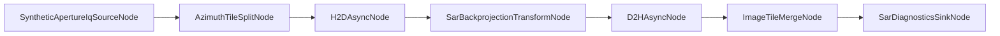

# GraphX SAR PR1 Example

This package demonstrates a deterministic, JSON-driven SAR stripmap pipeline for GraphX PR1.

## PR1 Goals

1. Keep SAR-specific implementation under examples/SAR.
2. Use JSON topology as the primary execution path.
3. Keep deterministic synthetic behavior suitable for CI.
4. Stay within the PR1 cap of four new SAR nodes:
  - SyntheticApertureIqSourceNode
  - AzimuthTileSplitNode
  - SarBackprojectionTransformNode
  - ImageTileMergeNode

## Architecture



Runtime topology source: examples/SAR/config/sar_stripmap_pr1.json

## Build And Run

Build SAR example and tests:

```bash
cmake --build --preset build-debug --target sar_example test_sar_example_unit
```

Run example:

```bash
./build-ninja/ninja-debug/examples/SAR/sar_example
```

Run SAR tests:

```bash
./build-ninja/ninja-debug/examples/SAR/test/test_sar_example_unit
```

## Deterministic Configuration Knobs

JSON node_config fields define deterministic profile behavior.

Primary knobs:

1. Source stage:
  - total_pulses
  - samples_per_pulse
2. Split/merge:
  - tile_count
  - expected_tiles
3. Transform metadata:
  - image_width
  - queue_id
  - kernel_id
4. Backend metadata:
  - backend
  - backend_id

All SAR nodes are initialized through standard IConfigurable using node_config.

## Simulated Backend And Native Follow-Up

PR1 targets a CI-safe simulated backend path and does not require native GPU runtime availability.

Native backend tuning and specialization (CUDA/SYCL/Metal) are deferred follow-up work.

## Benchmarking

A dedicated benchmark executable is provided:

```bash
cmake --build --preset build-debug --target sar_benchmark
./build-ninja/ninja-debug/examples/SAR/sar_benchmark --profile=ci
./build-ninja/ninja-debug/examples/SAR/sar_benchmark --profile=local
```

See benchmark details and attribution categories in examples/SAR/BENCHMARK_REPORT.md.

## PR1 Non-Goals

1. Full-fidelity SAR math (motion compensation/autofocus/radiometric calibration).
2. Framework-wide scheduler or architecture rewrites.
3. Mandatory native backend requirement in CI.
4. Multi-device dynamic load balancing.

## Deferred PR2/PR3 Work

1. Native backend-specialized kernels and transfer overlap tuning.
2. Higher-fidelity SAR signal processing stages.
3. Extended execution tracing and richer performance attribution.
4. Multi-device heterogeneous routing and balancing.
