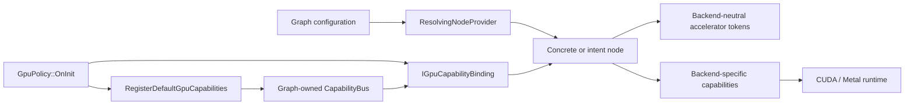
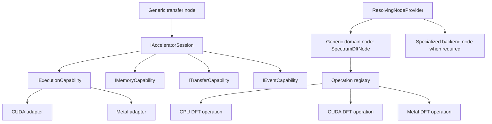

# GPU Node Architecture Analysis

## Executive summary

GraphX already has a genuine capability-based GPU mechanism:

- a graph-owned typed `CapabilityBus`;
- `IGpuCapabilityBinding` for dependency injection into nodes;
- `GpuPolicy` to register and bind capabilities during graph initialization;
- backend-neutral accelerator tokens;
- backend-specific CUDA and Metal capability interfaces;
- plugin ABI support for capability-bound nodes; and
- a resolver that can select concrete node implementations by backend.

The foundation is good. The main limitation is that the capability abstraction becomes backend-specific too early. A supposedly generic node must request `IMetalMemoryPoolCapability`, `ICudaTransferCapability`, or an equivalent backend-specific service. Consequently, most reusable behavior is duplicated across CUDA and Metal nodes.

The recommended direction is evolutionary: preserve backend-neutral graph tokens and the existing capability bus, introduce backend-neutral execution capabilities above the CUDA/Metal adapters, and retain specialized backend extensions for features that cannot be represented portably.

## Current architecture



### Capability bus

`CapabilityBus` is a type-indexed service container. Services are registered and retrieved by their C++ interface type in `libgraph/include/graph/CapabilityBus.hpp`.

This gives nodes dependency injection without directly constructing runtime services:

```cpp
bus.Register<IMetalTransferCapability>(implementation);
auto transfer = bus.Get<IMetalTransferCapability>();
```

Strengths:

- simple;
- testable with substituted implementations;
- independent of concrete implementation classes; and
- shared by statically linked and plugin-loaded nodes.

Limitations:

- only one service per exact interface type;
- no backend, device, or provider query;
- no priorities or selection constraints;
- no distinction between native, stub, simulated, or fallback implementations;
- no structured failure result;
- use of `shared_ptr<void>` and RTTI identity; and
- centralized, repetitive registration composition.

### Node capability binding

GPU-aware nodes implement `IGpuCapabilityBinding` and bind their dependencies during initialization. `GpuPolicy` walks every graph node and invokes the binding operation. Graph initialization fails if any GPU-aware node cannot bind its required capabilities.

This is a sound lifecycle boundary. It avoids runtime discovery during every `Transfer()` call.

The plugin facade also exposes `IGpuCapabilityBinding`, so dynamic plugins participate in the same mechanism. This is an important architectural asset and should be retained.

### Backend capability families

Each backend defines approximately the same service family:

- context, device, and queue management;
- memory allocation;
- transfers;
- kernel registration and launch;
- telemetry; and
- collectives.

CUDA defines these in `libgpu/include/gpu/cuda/capabilities/ICudaCapabilities.hpp`; Metal repeats nearly the same logical contracts under backend-specific names. Metal additionally has richer kernel descriptor and shared-queue support.

This indicates that the code already contains an implicit generic accelerator API; it simply has not been promoted into common interfaces.

### Capability bootstrap

`RegisterDefaultGpuCapabilities()` registers all enabled backend services. CUDA receives its default implementation, while Metal dynamically chooses native or default implementations.

Current concerns:

- native and stub services satisfy the same interface with no generic execution-status contract;
- backend creation is hardcoded into one bootstrap function;
- Metal has stronger native selection than CUDA;
- a backend may be registered despite not representing actual acceleration;
- a global shared bus exists alongside the graph-owned bus, creating two possible ownership models; and
- multi-device and multiple-provider selection are not modeled.

### Backend-neutral accelerator tokens

The strongest generic component is the token model in `libgpu/include/gpu/accel/types/AccelTypes.hpp`.

The system already has common representations for:

- `DeviceBufferView`;
- `HostPinnedBufferView`;
- `BufferLease`;
- `TransferTicket`;
- `KernelTicket`;
- `CollectiveTicket`; and
- `ControlToken<SidecarT>`.

These tokens carry a `BackendKind`, device ID, queue ID, readiness event, layout, type, and ownership metadata.

This is the right basic direction: graph edges carry logical accelerator resources rather than CUDA or Metal objects.

However, raw `void*` pointers and integer queue/event handles weaken type safety and lifetime guarantees. A token can also contain mutually inconsistent backend tags across its lease, view, and tickets.

### Backend-specific nodes

CUDA and Metal have separate H2D, D2H, ingress, egress, and lease-release nodes.

For example, CUDA H2D binds CUDA-specific memory and transfer interfaces while Metal H2D performs effectively the same operation but binds Metal-specific services and manages a command queue. Their graph contracts are already compatible. The duplication exists primarily because the service interfaces are backend-specific.

### Domain nodes

There are two patterns:

1. explicit backend nodes, such as `MetalSpectrumDftNode`; and
2. intent-like `Accel` nodes, especially in SAR.

The Metal DFT directly holds several Metal-specific services. This makes the domain algorithm inseparable from Metal even though its logical operation is a direct DFT.

The SAR `SarBackprojectionTransformAccelNode` looks generic externally but internally embeds `DeviceKernelNodeMetal`. It therefore provides generic naming without generic execution.

Some SAR H2D/D2H `Accel` nodes synthesize accelerator metadata. They are useful fixtures, but they are not runtime acceleration and should not become the model for native generic nodes.

## Generic architecture options

### Option 1: Keep backend-specific nodes

Continue adding separate CUDA and Metal nodes for each algorithm and operation.

Advantages:

- straightforward;
- full access to backend-specific features;
- minimal refactoring; and
- easy native truth-in-labeling.

Disadvantages:

- large duplication;
- domain algorithms become coupled to runtime APIs;
- configuration and plugin counts grow rapidly; and
- cross-backend parity is difficult to maintain.

Best use: specialized kernels or operations whose semantics genuinely differ.

### Option 2: Shared node templates with backend traits

Create reusable implementations such as:

```cpp
template<class BackendTraits>
class H2DAsyncNode;

template<class BackendTraits, class Algorithm>
class DeviceTransformNode;
```

Traits provide capability types, queue behavior, and backend constants.

Advantages:

- removes much mechanical duplication;
- retains compile-time type safety;
- leaves backend-specific behavior accessible; and
- requires a modest migration from the current design.

Disadvantages:

- produces separate concrete node and plugin types;
- backend selection remains compile-time;
- templates may leak into domain code; and
- the runtime resolver must still choose among specializations.

Best use: near-identical infrastructure nodes.

### Option 3: Backend-neutral capability interfaces

Introduce common interfaces such as:

```cpp
class IAcceleratorRuntime;
class IDeviceContext;
class IMemoryCapability;
class ITransferCapability;
class IKernelCapability;
class IEventCapability;
class ITelemetryCapability;
class ICollectiveCapability;
```

CUDA and Metal implementations adapt their native APIs to these contracts. A generic H2D node requests `ITransferCapability`, not `IMetalTransferCapability`.

Advantages:

- one generic transfer, memory, and control node set;
- backend-independent domain nodes;
- natural alignment with existing neutral tokens;
- practical runtime backend selection; and
- easy mock and CPU implementations.

Disadvantages:

- common interfaces must not incorrectly collapse distinct semantics;
- kernel compilation and descriptor models differ substantially;
- backend extensions remain necessary; and
- capability selection must become richer than `Get<T>()`.

Best use: the primary architecture for common operations.

### Option 4: Backend bundle or session capability

Instead of injecting several independent services, inject one coherent session:

```cpp
class IAcceleratorSession {
public:
    virtual BackendDescriptor Describe() const = 0;
    virtual IMemoryCapability& Memory() = 0;
    virtual ITransferCapability& Transfer() = 0;
    virtual IExecutionCapability& Execution() = 0;
    virtual IEventCapability& Events() = 0;
    virtual ITelemetryCapability& Telemetry() = 0;
};
```

A session owns a device, context, queue pool, and related services.

Advantages:

- prevents mixing capabilities from unrelated contexts;
- clarifies lifecycle and ownership;
- provides a natural place for native/stub/fallback status;
- supports multiple devices and sessions; and
- reduces node member clutter.

Disadvantages:

- can become a god interface;
- testing one service requires a session fixture; and
- fine-grained substitution is less direct.

Best use: combine with Option 3, exposing narrow sub-capabilities from a coherent session.

### Option 5: Operation capability registry

Domain nodes request an algorithm rather than a raw kernel API:

```cpp
auto dft = registry.Resolve<IDftOperation>({
    .backend = preferred_backend,
    .dtype = DataType::Float32,
    .size = N,
});
```

Implementations could include a CPU direct DFT, a CUDA kernel, a Metal kernel, or an optimized library implementation.

Advantages:

- domain nodes express intent;
- backend selection and fallback are centralized;
- algorithms can advertise constraints and precision;
- performance-based selection becomes possible; and
- algorithm parity is easy to test.

Disadvantages:

- requires more registry and metadata machinery;
- requires clear operation contracts; and
- is a poor fit for arbitrary user-defined kernels.

Best use: domain algorithms such as DFT, SAR backprojection, channelization, transforms, and reductions.

### Option 6: Resolver-only architecture

Keep backend-specific concrete nodes and rely on `ResolvingNodeProvider` to map an intent node to CUDA, Metal, CPU, or stub implementations.

Advantages:

- already partly present;
- no runtime abstraction penalty inside nodes;
- different backends may use entirely different implementations; and
- good plugin isolation.

Disadvantages:

- does not remove node duplication;
- edge contracts must remain exactly compatible;
- resolver configuration can become verbose; and
- backend choice happens at graph construction, not per device or workload.

Best use: coarse-grained selection among materially different implementations.

### Option 7: Portable kernel IR or DSL

Define backend-neutral kernel descriptions and compile them to CUDA or Metal.

Advantages:

- maximum kernel portability;
- generic transform nodes become possible; and
- potential runtime compilation and fusion.

Disadvantages:

- very large undertaking;
- harder debugging and performance tuning;
- lowest-common-denominator risk; and
- the existing Metal descriptor model is not sufficient as a universal IR.

Best use: not recommended as the next step. Consider it only after stable generic capabilities and operation contracts exist.

## Recommended hybrid

Use Options 3, 4, 5, and 6 together:



Recommended boundaries:

- graph edges: backend-neutral tokens;
- common infrastructure nodes: backend-neutral capability interfaces;
- domain nodes: algorithm or operation capabilities;
- runtime: backend session and adapter implementations;
- resolver: graph-level backend preference and fallback; and
- specialized nodes: operations where backend behavior is materially distinct.

## Required capability-model improvements

A generic capability request needs more information than a C++ type:

```cpp
struct CapabilityRequest {
    CapabilityKind kind;
    BackendPreference backend;
    ExecutionMode required_mode; // Native, simulated, fallback
    std::uint32_t device_id;
    FeatureSet required_features;
};
```

The result should be structured:

```cpp
struct CapabilityResolution {
    std::shared_ptr<ICapability> capability;
    BackendDescriptor backend;
    ExecutionMode mode;
    std::vector<Diagnostic> diagnostics;
};
```

Important additions:

- `Native`, `Stub`, `Simulated`, `CPUFallback`, and `Unavailable` execution modes;
- device enumeration and selection;
- required feature queries;
- multiple providers per capability;
- selection priorities;
- explicit fallback policy;
- structured errors instead of `bool`;
- graph-scoped session ownership; and
- backend extension lookup for native-only features.

## Token-model improvements

Keep the common token family, but gradually replace raw pointers and untyped integer queue and event IDs with opaque, reference-counted handles:

```cpp
class DeviceAllocationHandle;
class ExecutionQueueHandle;
class CompletionEventHandle;
```

Each handle should carry:

- backend identity;
- session identity;
- device identity;
- ownership and lifetime semantics; and
- native-handle access through a controlled backend extension.

Validation should reject tokens whose view, lease, event, and ticket belong to different sessions.

## Practical migration

1. Add `BackendDescriptor` and an explicit execution mode.
2. Introduce `IAcceleratorSession` without deleting existing interfaces.
3. Adapt Metal capabilities first because they already have the richest native implementation.
4. Add a CUDA adapter.
5. Implement one generic H2D node and one generic D2H node.
6. Build an `IDftOperation` with CPU, Metal, and CUDA implementations.
7. Convert the DSP spectrum graph to a backend-neutral `SpectrumDftAccelNode`.
8. Keep old backend-specific plugins as compatibility aliases.
9. Convert generic transform and reduce nodes next.
10. Leave peer copy, collectives, and specialized native kernels as extension capabilities.

## Conclusion

The system has the right capability-based bones. The capability bus, initialization policy, plugin ABI, resolver, and accelerator tokens are all reusable.

The missing architectural layer is a backend-neutral capability and session API. GraphX currently has backend-neutral data contracts connected to backend-specific service contracts. Moving the service boundary upward would enable genuinely generic GPU nodes without sacrificing native CUDA or Metal implementations.

The appropriate target is not one universal `GpuNode`. It is:

- generic graph nodes for common operations;
- coherent accelerator sessions;
- operation-level domain capabilities;
- backend adapters; and
- explicit specialized extensions where portability would be misleading.
