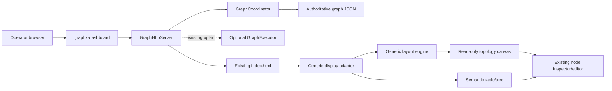

# GraphX Generic Graphical Dashboard Plan

**Status:** Proposed replacement plan  
**Scope:** Extend the existing generic Graph Management dashboard with a
read-only graphical topology display  
**Supersedes:** The graphical-frontend portions of
`docs/archive/2026-07-dashboard-consolidation/dsp/fhss-dashboard-v2.md` and
`docs/archive/2026-07-dashboard-consolidation/dsp/fhss_dashboard_implementation_plan.md`  
**Does not supersede:** FHSS DSP, synthetic-IQ, truth-isolation, or receiver
validation requirements

## 1. Decision

GraphX will have one graph-management implementation and one dashboard:

- `graph::GraphCoordinator` remains the in-memory graph inspection and
  parameter-editing boundary.
- `graph::GraphHttpServer` remains the HTTP adapter.
- `graphx-dashboard` remains the generic launcher.
- `libgraph/resources/web/index.html` remains the single dashboard entry point.
- `GET /api/v1/graph` remains the authoritative topology input.
- Existing `/api/v1/nodes/*` and `/api/v1/execution/*` routes remain the only
  management and lifecycle routes.

The graphical display is a presentation feature inside that dashboard. It is
not a second management stack, FHSS application, API namespace, configuration
authority, runtime owner, or executable.

The initial graphical implementation may use React Flow, ELK.js, and
TypeScript as recommended by the earlier FHSS analysis, but those technologies
must be integrated into the generic `libgraph` web resource and build. They
must not depend on or extend the legacy `examples/DSP/dashboard` product
structure.

## 2. Findings From The Original FHSS Plan

The original plan contained several strong display ideas:

- explicit source and target port handles;
- stable node and edge identities;
- layered directed-graph layout;
- pan, zoom, selection, minimap, and fit-to-view;
- compound/hierarchical groups for repeated graph stages;
- collapsed bundle edges that preserve their authoritative member edges;
- bounded rather than per-message animation;
- a semantic table/tree alongside the canvas;
- reduced-motion and keyboard support; and
- raw JSON as a diagnostic view rather than the primary display.

Those ideas should be retained generically.

The original plan also assumed or implemented a parallel FHSS management
architecture:

- `EmbeddedDashboardServer` rather than `GraphHttpServer`;
- application-owned `/api/v1/fhss/*` graph, configuration, runtime, job,
  observation, spectrum, investigation, and event resources;
- `GraphRuntimeSession` and an FHSS runtime owner separate from the generic
  optional `GraphExecutor`;
- an FHSS configuration service and policy beside `GraphCoordinator`;
- a frontend and installed asset tree under `examples/DSP/dashboard`; and
- FHSS-specific grouping, heatmap, job, truth, and receiver semantics in the
  dashboard product.

Those elements are rejected for this plan. They mixed a useful topology
renderer with a second management product. FHSS remains an important example
graph and acceptance fixture, but it receives no privileged dashboard
architecture.

## 3. Architectural Boundary



The browser obtains the complete graph from the existing
`GET /api/v1/graph`. A generic client-side adapter validates and converts that
document into display nodes, ports, edges, and optional groups. Layout and
collapse are presentation operations only.

Node configuration edits continue to use
`PATCH /api/v1/nodes/{id}`. Execution controls continue to use the existing
generic execution routes. The canvas never talks directly to `GraphManager`,
node objects, queues, DSP services, or an FHSS application.

## 4. Non-Negotiable Guardrails

### 4.1 One management implementation

The implementation must not add:

- another coordinator, HTTP server, runtime session, runtime owner, or graph
  configuration service;
- another dashboard executable or root page;
- `/api/v1/fhss`, `/api/v2`, or another route namespace for topology display;
- an `examples/DSP/dashboard` frontend or install tree;
- a frontend-selected management backend;
- a compatibility switch between generic and FHSS dashboards; or
- a second source of graph state.

Legacy files under `libgraph/src/dashboard`, `libgraph/include/graph/dashboard`,
or `examples/DSP/dashboard` are not dependencies for this work. If retained
for unrelated historical builds, tests must prove the generic dashboard does
not link, serve, or call them.

### 4.2 Authoritative topology

The graph document owns:

- node IDs and types;
- node configuration;
- edge endpoints;
- numeric or named ports; and
- any explicitly authored generic presentation hierarchy.

The renderer must not repair missing edges, connect unused ports, create
receiver nodes, infer execution semantics, or alter the document when arranging
the display.

### 4.3 Read-only structure

The graphical canvas permits selection, navigation, local layout, and
group expansion. It does not permit:

- adding or deleting nodes;
- connecting, reconnecting, or deleting edges;
- changing node IDs or types;
- persisting dragged positions into graph configuration implicitly; or
- suggesting that a visual bundle is an executable edge.

Existing `node_config` editing remains available through the existing editor.
Topology remains structurally read-only.

### 4.4 Generic behavior

No display rule may depend on an FHSS class name, frequency index, detector
count, message schedule, IQ metadata, or DSP-specific configuration field.
The same adapter and renderer must display minimal test graphs, split/merge
graphs, SAR graphs, and FHSS graphs.

## 5. Generic Display Contract

### 5.1 Input

The first implementation consumes the existing graph response unchanged:

```text
GET /api/v1/graph
  -> data.nodes[]
  -> data.edges[]
```

No new topology endpoint is required. Failure responses use the current
generic HTTP response contract.

The adapter must accept both supported port forms:

- `source_port` / `target_port`; and
- `source_port_name` / `target_port_name`.

It must reject or visibly report malformed endpoints instead of silently
dropping them.

### 5.2 Presentation model

The browser owns a domain-neutral model:

```typescript
type PortKey =
  | { kind: "index"; value: number }
  | { kind: "name"; value: string };

interface DisplayNode {
  id: string;
  graphNodeId: string;
  type: string;
  label: string;
  inputPorts: DisplayPort[];
  outputPorts: DisplayPort[];
  groupId?: string;
}

interface DisplayPort {
  id: string;
  key: PortKey;
  direction: "input" | "output";
}

interface DisplayEdge {
  id: string;
  sourceNodeId: string;
  sourcePort: PortKey;
  targetNodeId: string;
  targetPort: PortKey;
}

interface DisplayGroup {
  id: string;
  label: string;
  members: string[];
  layout: "layered" | "grid" | "fanout" | "fanin";
  collapsedByDefault: boolean;
}
```

This model is internal presentation state. It does not replace
`GraphConfig`, `GraphCoordinator`, or the REST document.

### 5.3 Identity

Node identity is the graph's stable string `id`.

Before implementation, Phase 0 must settle a generic edge-identity rule:

1. Prefer an explicitly authored generic edge ID if GraphX adopts one.
2. Otherwise use a canonical encoding of source node ID, exact source port,
   target node ID, and exact target port.
3. Do not use array position as persistent identity.
4. If GraphX permits duplicate edges with identical endpoints and ports, add a
   generic authoritative identity field rather than inventing a browser-only
   ordinal.

Port handle IDs must encode both direction and exact numeric-or-named port
identity. Numeric port `0` and named port `"0"` must not collide.

### 5.4 Generic hierarchy

Hierarchy is optional presentation metadata, not domain inference. The
preferred future graph-document shape is a top-level, execution-neutral
section such as:

```json
{
  "presentation": {
    "groups": [
      {
        "id": "acquisition-bank",
        "label": "Acquisition bank",
        "members": ["detector_00", "detector_01"],
        "layout": "grid",
        "collapsed_by_default": true
      }
    ]
  }
}
```

The exact schema is decided in Phase 2. It must be generic, optional, validated,
and ignored by execution. Invalid metadata must not alter graph construction.

The renderer may offer an unpersisted “group similar siblings” convenience
view based only on generic topology equivalence, but explicit metadata wins.
It must not contain FHSS type-name or prefix rules.

### 5.5 Collapsed groups and bundle edges

A bundle edge is presentation-only and contains the IDs of every authoritative
member edge it summarizes. It has no invented source or target port and never
appears in GraphX JSON.

Expanding a group restores every original node, edge, and exact port mapping.
Selection and inspection always resolve to authoritative node or edge
identities.

## 6. Frontend And Packaging Policy

The dashboard retains one entry point:

```text
libgraph/resources/web/index.html
```

If compiled frontend assets are introduced, they live under the same generic
resource root and are served by the same `GraphHttpServer`, for example:

```text
libgraph/resources/web/
  index.html
  assets/
    graphx-dashboard-<hash>.js
    graphx-dashboard-<hash>.css
```

Editable TypeScript sources and their lockfile may live under a generic
`libgraph/web/` source directory. They must not live under an FHSS example.

`GraphHttpServer` may be extended to serve bounded, contained static assets
from this one resource root. That is an extension of the existing adapter, not
a new server.

Recommended toolchain policy:

- React Flow and ELK.js are acceptable for rich nodes, ports, compound graphs,
  and layered layout.
- Dependencies are pinned and self-hosted; no CDN is used.
- Node.js is a maintainer/build-time tool, not a deployed runtime.
- The ordinary C++ user build must remain possible without downloading
  frontend dependencies.
- If compiled assets are checked in, CI verifies that rebuilding from the
  lockfile produces the checked-in inventory.
- Source-tree and installed-tree dashboards serve the same asset inventory.
- A dashboard-disabled or minimal library build must not acquire a Node.js
  runtime dependency.

Phase 0 may choose a no-framework SVG implementation only if it demonstrates
that exact-port routing, compound layout, accessibility, and the expected graph
sizes remain maintainable. It must not create an interim UI that is discarded
in the next phase.

## 7. Phased Delivery

Each phase uses one orchestrator, one implementer, and one independent verifier.
Stop after each phase for authorization.

### Phase 0 — Architecture lock and baseline

**Goal:** Prevent recurrence of the parallel FHSS architecture.

Implementation:

- Record this plan as the graphical-dashboard authority.
- Inventory the current `GraphCoordinator`, `GraphHttpServer`,
  `graphx-dashboard`, `index.html`, install rules, and dashboard tests.
- Inventory legacy dashboard sources and prove whether they are excluded from
  the default generic build.
- Decide React Flow/ELK versus a durable no-framework renderer using a small
  spike against both `minimal_graph.json` and the 75-node/137-edge FHSS graph.
- Define canonical generic edge and port identities.
- Define frontend source, generated asset, lockfile, and install locations.
- Capture current node-table/editor and execution-control behavior as
  regression requirements.
- Add architecture scans rejecting new FHSS routes, dashboard executables,
  coordinators, servers, runtime owners, and `examples/DSP/dashboard`
  dependencies in the generic target.

Acceptance:

- One architecture diagram maps every planned UI action to the existing
  management component and route.
- The chosen renderer displays exact numeric and named ports in the spike.
- The decision includes build/install behavior without a deployed Node runtime.
- No production API, runtime, or UI behavior changes in this phase.
- Focused generic dashboard tests and `git diff --check` pass.

Operator example:

```bash
graphx-dashboard \
  --graph libgraph/test/config/topologies/minimal_graph.json \
  --port 8080
```

The Phase 0 report records the existing table behavior and the renderer spike;
the spike is not installed as a second dashboard.

### Phase 1 — Generic read-only topology canvas

**Goal:** Add the first graphical representation to the existing dashboard.

Implementation:

- Replace the node-only initial load with one call to `GET /api/v1/graph`.
- Keep the existing management header, execution controls, search, node table,
  and node-config editor.
- Add a “Topology” view within the same `index.html`.
- Render every node and authoritative edge with exact port handles.
- Add deterministic layered layout, pan, zoom, fit-to-view, selection, and
  reset-layout.
- Add a node/edge inspector sourced from the same in-memory response.
- Keep topology interactions read-only.
- Add empty, malformed, disconnected, cyclic, numeric-port, named-port,
  split, merge, and fanout fixtures.
- Generalize the existing static-resource install/smoke tests if the asset set
  becomes multi-file.

Acceptance:

- The minimal graph renders two nodes, one edge, and all four endpoint fields.
- Generic split and merge fixtures show every port and edge.
- The full FHSS graph renders its authoritative cardinalities without
  FHSS-specific frontend code.
- Selecting a canvas node and selecting the table row opens the same inspector.
- Node-config edits still use the existing PATCH route and refresh both views.
- No structural mutation gesture is available.
- Source-tree and installed-tree dashboard smoke tests pass.

Operator example:

Open the minimal, complex-network, SAR, and FHSS graph files with the same
`graphx-dashboard --graph ...` command and record node/edge counts plus a
screenshot for each.

### Phase 2 — Generic hierarchy and large-graph navigation

**Goal:** Make repeated and high-fanout graphs understandable without encoding
FHSS semantics in management code.

Implementation:

- Define and validate optional generic `presentation.groups` metadata.
- Add compound group rendering, collapse/expand, breadcrumbs, isolate
  selection, and an overview/minimap.
- Add grid, fanout, fanin, and layered group layout modes.
- Implement presentation-only bundle edges with complete authoritative
  membership.
- Preserve selection when a group is collapsed or expanded.
- Provide a generic ungrouped/raw-topology mode.
- Add bounds for group count, members, layout work, and visible detail.
- Author FHSS detector-bank grouping in the FHSS graph's optional generic
  presentation metadata, not in dashboard code.

Acceptance:

- Invalid, overlapping, cyclic, or unknown-member groups fail visibly and do
  not change execution.
- Collapsing a group does not lose any authoritative edge identity.
- Expanding the FHSS detector group reveals all 64 nodes and all exact
  channelizer/detector/merge port mappings.
- The same group mechanism works for a non-FHSS split/merge fixture.
- Ungrouped mode exactly matches the graph document.
- No `FHSS`, detector count, or frequency rule exists in `libgraph` frontend
  or server code.

Operator example:

Use the same dashboard to collapse and expand one generic split/merge group and
the FHSS detector-bank group, then compare the inspector's authoritative member
counts with the source JSON.

### Phase 3 — Semantic alternative and operator usability

**Goal:** Make the topology understandable and operable without relying on the
canvas.

Implementation:

- Convert the existing node table into a semantic topology tree/table that
  includes endpoints, exact ports, group membership, and structural warnings.
- Synchronize selection among canvas, semantic view, search results, and
  inspector.
- Add keyboard navigation, visible focus, screen-reader labels, non-color
  status, reduced-motion preference, and stable focus during refresh.
- Save layout, zoom, and collapse preferences only as local presentation state,
  clearly separated from graph configuration.
- Support narrow viewport reflow without hiding graph information.

Acceptance:

- Every authoritative node and edge is available in the semantic view.
- All inspection and group operations are keyboard accessible.
- Canvas motion and color are never the only representation of state.
- Local layout changes never issue PATCH requests or modify graph JSON.
- Focus and selection remain stable after node-config refresh.
- Focused automated accessibility checks and a documented human keyboard/reflow
  pass complete successfully.

### Phase 4 — Generic execution and metrics overlays

**Goal:** Overlay truthful generic runtime information without creating another
runtime-management path.

Prerequisite:

The existing generic Graph Management layer must expose a stable mapping from
graph node/edge identity to existing runtime metrics. If it cannot, this phase
stops for a generic identity-contract decision.

Implementation:

- Continue using the existing execution-state endpoint and optional
  `GraphExecutor`.
- Add only the smallest additive generic metric snapshot route needed, under
  `/api/v1`, on `GraphHttpServer`.
- Source metrics from existing GraphX metric facilities; do not depend on the
  legacy embedded dashboard publisher or FHSS event schemas.
- Define units, monotonic/reset behavior, sample interval, availability, and
  graph-generation identity before displaying a value.
- Overlay node state, queue depth, backpressure, and aggregated edge activity
  only where the source contract supports them.
- Bound update frequency, retained history, animated edges, and layout work.
- Never rerun layout for metric-only updates.
- Provide pause, reduced-motion, and text equivalents.

Acceptance:

- Missing or uncorrelated metrics display as unavailable, never as zero.
- Metrics cannot affect GraphX scheduling, queueing, or execution.
- No per-message browser event stream is introduced.
- Collapsed groups aggregate only enumerated authoritative member metrics.
- Stale generations and counter resets cannot produce false rates.
- Inspection-only launch remains fully functional without an executor.

This phase does not add FHSS observations, expected truth, spectrum, jobs, or
investigation controls. Domain applications may provide those outside the
generic topology management surface if later authorized.

### Phase 5 — Packaging, performance, and release validation

**Goal:** Qualify the single generic graphical dashboard as a supported GraphX
surface.

Implementation:

- Verify clean host builds on macOS and Linux.
- Verify the ordinary non-Docker workflow first.
- If a generic Docker operator image is authorized, package
  `graphx-dashboard`; do not reuse the legacy FHSS operator container.
- Validate source-tree and clean installed-tree asset inventories.
- Measure initial render, layout, interaction, and bounded metric-update costs
  on representative small, medium, FHSS, and SAR graphs.
- Document supported graph-size budgets and graceful degradation.
- Add a comprehensive generic dashboard operator manual with an FHSS example
  subsection.
- Run proportional browser, accessibility, regression, and shutdown tests.

Acceptance:

- One executable, root page, API namespace, and asset inventory are installed.
- No generic dashboard command loads legacy embedded-dashboard files.
- Small and representative large graphs stay within documented budgets.
- The operator can build from a fresh clone, launch the installed dashboard,
  inspect minimal/SAR/FHSS graphs, and reproduce the report.
- Native GraphX build and dashboard operation remain available without Docker.
- `git diff --check` and the affected/full regression suites pass.

## 8. Agent Workflow

### Orchestrator

For each authorized phase:

1. Inspect current repository state and preserve unrelated changes.
2. Convert the phase into a file-level acceptance checklist.
3. Identify every existing Graph Management component and route being reused.
4. Assign implementation to one implementer.
5. Assign completed work to an independent verifier.
6. Route every verifier finding back to the implementer.
7. Repeat until no blocking/high findings remain and every criterion passes.
8. Stop at the phase boundary without committing, pushing, or opening a PR
   unless explicitly requested.

### Implementer

The implementer must:

- audit existing behavior before editing;
- extend the existing generic components in place;
- avoid legacy embedded-dashboard dependencies;
- implement only the authorized phase;
- preserve node editing and optional execution behavior;
- add deterministic frontend, C++, install, and operator tests appropriate to
  the phase; and
- report changed files, commands, results, and limitations.

### Verifier

The verifier must not edit implementation files. It independently verifies:

- reuse of `GraphCoordinator`, `GraphHttpServer`, `graphx-dashboard`, and the
  existing `/api/v1` routes;
- absence of parallel management components and FHSS-specific generic code;
- exact node, edge, and port rendering;
- structural read-only behavior;
- source-tree and installed-tree parity;
- small, generic complex, SAR, and FHSS examples;
- focused and full test results; and
- explicit PASS/FAIL for each phase criterion.

## 9. Test Strategy

Tests should be layered without duplicating management logic:

1. **Adapter unit tests:** JSON-to-display conversion, port forms, identity,
   malformed inputs, groups, and bundles.
2. **Renderer component tests:** node/edge counts, handles, selection,
   collapse/expand, and read-only interaction.
3. **Generic C++ HTTP tests:** existing `/api/v1/graph`, static assets, MIME
   types, and containment.
4. **Browser smoke tests:** real `graphx-dashboard`, graph fetch, render,
   inspector, edit synchronization, keyboard flow, and installed assets.
5. **Architecture tests:** forbidden parallel routes/classes/dependencies and
   exactly one dashboard entry point.
6. **Operator examples:** fresh-clone native build, minimal graph, generic
   complex graph, SAR graph, and FHSS graph.

The production renderer must not be its own only oracle. Expected node IDs,
edge endpoint tuples, port identities, and group membership come from small,
independently authored fixtures and direct source-JSON checks.

## 10. Completion Criteria

The plan is complete only when:

- the existing generic Graph Management dashboard presents an interactive
  node-and-edge topology;
- nodes, edges, exact ports, and optional hierarchy remain traceable to the
  graph document;
- topology is structurally read-only;
- FHSS and SAR are examples, not management-layer special cases;
- no parallel dashboard server, coordinator, runtime owner, configuration
  service, API namespace, executable, or asset tree is introduced;
- the existing table/editor and optional execution controls continue to work;
- source and installed dashboards use the same generic assets;
- native non-Docker operation remains supported; and
- affected and full regression tests plus `git diff --check` pass.
