# GraphX Operations And Architecture Guide

## Quick Start

Minimum sequence for a first successful local run (CI-safe, no real GOTCHA data required):

```bash
# 1) Configure + build
cmake --preset ninja-debug-metal-native
cmake --build --preset build-debug

# 2) Run core CTest lanes
ctest --preset test-libgraph-unit --output-on-failure
ctest --preset test-libgpu-metal-runtime --output-on-failure

# 3) Build and run SAR unit binary
cmake --build --preset build-sar-example-unit
./build-ninja/ninja-debug-metal-native/examples/SAR/test/test_sar_example_unit

# 4) Optional: if you have local GOTCHA dataset, generate CRSD input for SAR processors
export GRAPHX_SAR_GOTCHA_DATASET=/path/to/gotcha/root
bash scripts/convert_gotcha_subdata_to_crsd.sh /path/to/gotcha/root /tmp/gotcha_crsd_out
```

MATLAB is not required.

## 1. Architecture Specification

### High-Level Architecture Summary

GraphX is a C++26 graph runtime with modular libraries and plugin-resolved execution backends. The SAR path is token-based and uses explicit accel-token contracts for GPU transfer/kernel stages.

Core top-level libraries:

- `libgraph`: graph runtime, config parser, resolver/provider composition, execution.
- `libgpu`: backend-agnostic and backend-specific GPU abstractions/capabilities.
- `libdsp`: DSP components.
- `libsensor`: sensor-related components.
- `examples/SAR`: SAR pipeline nodes, configs, tooling, and tests.

### Major Modules/Libraries And Responsibilities

- `libgraph`
	- Parses JSON topology config (`execution_backend`, `edge_contract`, `resolver_mappings`).
	- Builds graph with resolver overlays and provider-backed node instantiation.
- `libgpu`
	- Owns accel transport types (`DeviceBufferView`, `HostPinnedBufferView`, `TransferTicket`, `KernelTicket`, etc.).
	- Provides Metal capabilities and kernel execution primitives.
- `examples/SAR`
	- Defines SAR token contract (`SarSidecar`, `SarAccelControlToken`).
	- Implements SAR stages (`RangeWindowNode`, `RangeCompressionNode`, `AzimuthTileSplitNode`, `H2DAsyncAccelNode`, `SarBackprojectionTransformAccelNode`, `D2HAsyncAccelNode`, `ImageTileMergeNode`, `SarDiagnosticsSinkNode`).
	- Provides GOTCHA conversion utility `graphx-gotcha-to-crsd` and local scripts.

### Data Flow For SAR And GOTCHA Conversion Paths

SAR runtime path (definitive topology):

```mermaid
flowchart LR
	SRC[SyntheticApertureIqSourceNode]
	WIN[RangeWindowNode]
	RC[RangeCompressionNode]
	SPLIT[AzimuthTileSplitNode]
	H2D[H2DAsyncAccelNode]
	BP[SarBackprojectionTransformAccelNode]
	D2H[D2HAsyncAccelNode]
	MERGE[ImageTileMergeNode]
	DIAG[SarDiagnosticsSinkNode]

	SRC --> WIN --> RC --> SPLIT --> H2D --> BP --> D2H --> MERGE --> DIAG
```



GOTCHA conversion path (current implemented behavior):

- Input `.mat` -> direct HDF5 pulse extraction -> CRSD chunk(s) -> optional SarPy validation/report artifacts.
- CRSD is the only supported external interchange path for SAR ingest and image comparison workflows.

### Runtime/Plugin/Resolver Model

- JSON config declares portable node intents and resolver settings.
- `edge_contract: "accel-token"` is used for SAR tokenized edges.
- Resolver mappings in SAR configs bind SAR intents to concrete backend-capable nodes.
- Backend preference supports `auto` and explicit backend selection with fallback policy.
- Plugin loading is dynamic; SAR plugins and shared GPU plugins can be provided via plugin directories.

### Conversion Format

- CRSD is the supported conversion output format.
- Non-standard GraphX intermediate conversion lanes are deprecated and removed from the active operational path.

## 2. Build Instructions

### Prerequisites

- CMake 3.23+
- C++26-capable compiler
- Ninja (recommended/default)
- macOS Metal-native lanes: Apple frameworks + metal-cpp headers
- Python 3 for SAR tooling/SarPy scripts

### Configure Commands (Recommended First)

Recommended debug configure:

```bash
cmake --preset ninja-debug-metal-native
```

Note on preset pairing:

- `build-debug` is paired with `ninja-debug-metal-native`.
- If you configure with `ninja-debug` instead, build with either:
	- `cmake --build build-ninja/ninja-debug`
	- or a matching build preset such as `build-libgraph-unit` (when appropriate).

Recommended debug Metal-native configure:

```bash
cmake --preset ninja-debug-metal-native
```

Strict Metal-native configure (fail-fast if native prerequisites missing):

```bash
cmake --preset ninja-debug-metal-native-strict
```

Alternative release configure:

```bash
cmake --preset ninja-release-metal-native
```

### Build Commands For Default And Common Variants

Default debug build:

```bash
cmake --build --preset build-debug
```

Release build:

```bash
cmake --build --preset build-release
```

Metal-native debug build:

```bash
cmake --build --preset build-debug-metal-native
```

Strict Metal-native debug build:

```bash
cmake --build --preset build-debug-metal-native-strict
```

### Build Targets Important For SAR/GOTCHA

```bash
cmake --build --preset build-debug --target sar_example test_sar_example_unit graphx_gotcha_to_crsd
```

Dedicated SAR unit target via preset:

```bash
cmake --build --preset build-sar-example-unit
```

### Expected Outputs And Where Binaries Are Located

Preset binary directories are under:

- `build-ninja/<configure-preset-name>/...`

Common outputs:

- SAR example executable:
	- `build-ninja/ninja-debug/examples/SAR/sar_example`
	- or `build-ninja/ninja-debug-metal-native/examples/SAR/sar_example`
- SAR unit test binary:
	- `build-ninja/ninja-debug/examples/SAR/test/test_sar_example_unit`
	- or `build-ninja/ninja-debug-metal-native/examples/SAR/test/test_sar_example_unit`
- GOTCHA converter:
	- `build-ninja/ninja-debug/examples/SAR/graphx-gotcha-to-crsd`
	- or `build-ninja/ninja-debug-metal-native/examples/SAR/graphx-gotcha-to-crsd`

### Quick Validation Checks After Build

```bash
# smoke: list converter options
build-ninja/ninja-debug-metal-native/examples/SAR/graphx-gotcha-to-crsd --help || true

# run SAR unit binary
./build-ninja/ninja-debug-metal-native/examples/SAR/test/test_sar_example_unit

# run main SAR executable with definitive config
./build-ninja/ninja-debug-metal-native/examples/SAR/sar_example \
	examples/SAR/config/sar_stripmap_definitive.json \
	./build-ninja/ninja-debug-metal-native/examples/SAR/plugins
```

## 3. CTest Instructions

### How To List Tests

Using preset build tree:

```bash
ctest --preset test-libgraph-unit -N
ctest --preset test-libgpu-metal-runtime -N
```

Direct by test directory:

```bash
ctest --test-dir build-ninja/ninja-debug-metal-native -N
```

### How To Run Full Test Suites

Core lanes:

```bash
ctest --preset test-libgraph-unit
ctest --preset test-libgpu-metal-runtime --output-on-failure
```

Strict lane:

```bash
ctest --preset test-libgpu-metal-runtime-strict --output-on-failure
```

SAR unit binary full run:

```bash
./build-ninja/ninja-debug-metal-native/examples/SAR/test/test_sar_example_unit
```

### How To Run Focused SAR/GOTCHA Subsets

```bash
# GOTCHA CLI behavior
./build-ninja/ninja-debug-metal-native/examples/SAR/test/test_sar_example_unit \
	--gtest_filter='GraphxGotchaToCrsdCliTest.*'

# Local real-data full-aperture validation (requires env var)
./build-ninja/ninja-debug-metal-native/examples/SAR/test/test_sar_example_unit \
	--gtest_filter='RealGotchaFullApertureValidationTest.*'
```

### How To Run Tests With Labels/Filters

SarPy-labeled CTest lane:

```bash
ctest --test-dir build-ninja/ninja-debug-metal-native -L sarpy --output-on-failure
```

Named preset for SarPy-labeled tests:

```bash
ctest --preset test-sar-sarpy-lane --output-on-failure
```

### How To Interpret Pass/Skip/Fail In This Project

- `PASS`: expected behavior in current environment.
- `SKIP`: often expected for local-only/data-gated tests when required env vars/tools are absent.
- `FAIL`: regression, missing dependency, invalid config, or unsupported runtime setup.

### Typical Causes Of Skips And How To Enable Skipped Local-Only Tests

Common skip gates:

- Real GOTCHA tests: `GRAPHX_SAR_GOTCHA_DATASET` not set.
- SarPy smoke/integration: SarPy packages not installed or CRSD input env var not set.
- External fixture adapter gate: `GRAPHX_SAR_ALLOW_EXTERNAL_DATA` should be unset unless explicitly testing local external fixtures.

```bash
export GRAPHX_SAR_GOTCHA_DATASET=/Users/rklinkhammer/workspace/Gotcha-Large-Scene-Data/subData
```

Enable local-only GOTCHA tests:

```bash
export GRAPHX_SAR_GOTCHA_DATASET=/path/to/gotcha/root
```

Enable optional SarPy CRSD smoke:

```bash
python3 -m pip install -r tools/sarpy/requirements.txt
export GRAPHX_SARPY_CRSD_FILE=data/crsd/file.crsd
```

Run the SAR suite with local-data gates explicitly cleared (recommended for CI-safe behavior):

```bash
env -u GRAPHX_SAR_ALLOW_EXTERNAL_DATA \
	-u GRAPHX_SAR_GOTCHA_DATASET \
	./build-ninja/ninja-debug-metal-native/examples/SAR/test/test_sar_example_unit
```

## 4. GOTCHA To CRSD Conversion Instructions

### Required Inputs And Dataset Assumptions

- Local GOTCHA dataset directory with `.mat` files (commonly `subData01.mat` ... `subData10.mat`).
- IQ phase-history samples are read directly from the HDF5 binary in each `.mat` file (MAT v7.3 format).
- Source data is treated as processed phase history.

### Required Environment Variables

Required for local data-backed conversion:

```bash
export GRAPHX_SAR_GOTCHA_DATASET=/path/to/gotcha/root
```

Recommended explicit preflight variables:

```bash
export SORT_MODE=manifest
export MANIFEST_PATH=/path/to/gotcha/root/manifest.json
```

Optional overrides:

```bash
export GRAPHX_SAR_GOTCHA_TO_CRSD_BIN=/path/to/graphx-gotcha-to-crsd
export GRAPHX_SAR_GOTCHA_OUTPUT_DIR=/tmp/gotcha_crsd_out
export GRAPHX_SAR_GOTCHA_COLLECTION_ID=local-gotcha-example
export GRAPHX_SAR_GOTCHA_MAX_OUTPUT_SIZE_MB=512
```

### Preflight Checks

Minimal CRSD-first lane requires only a directory of `.mat` files.

Optional deterministic ordering preflight requires only a manifest file when `SORT_MODE=manifest`.

### Command(s) To Run Conversion

Recommended local full-aperture script for CRSD output:

```bash
bash scripts/convert_gotcha_subdata_to_crsd.sh /path/to/gotcha/subData /tmp/gotcha_crsd_out
```

Default behavior of this script is intentionally minimal:

- `SORT_MODE=lexical`
- `MAX_MB=0` (attempt single CRSD output)
- `ENABLE_VALIDATE=0`
- `ENABLE_EMIT_INDEX=0`

Enable compatibility features only when needed:

```bash
SORT_MODE=manifest \
MANIFEST_PATH=/path/to/gotcha/subData/manifest.json \
ENABLE_VALIDATE=1 \
ENABLE_EMIT_INDEX=1 \
bash scripts/convert_gotcha_subdata_to_crsd.sh /path/to/gotcha/subData /tmp/gotcha_crsd_out
```

Direct CLI invocation:

```bash
build-ninja/ninja-debug-metal-native/examples/SAR/graphx-gotcha-to-crsd \
	--input-dir /path/to/gotcha/subData \
	--output-dir /tmp/gotcha_output \
	--collection-id local-gotcha-example \
	--max-output-size-mb 512 \
	--sort manifest \
	--manifest /path/to/gotcha/subData/manifest.json \
	--mode crsd \
	--validate \
	--emit-index
```

### Meaning Of Key CLI Options

- `--input-dir`: input dataset directory.
- `--output-dir`: output root directory.
- `--collection-id`: collection identifier in metadata/reporting.
- `--max-output-size-mb`: chunking threshold.
- `--sort manifest|lexical`: ordering mode.
- `--manifest`: manifest file path when manifest sort is used.
- `--mode`: output mode (supported: `crsd`).
- `--validate`: run product validation before CRSD export.
- `--emit-index`: emit root-level index/report artifacts.

### Output Files Produced And How To Validate Them

CRSD conversion outputs (mode=crsd) typically include one or more CRSD products:

- `*/product.crsd`

When `ENABLE_EMIT_INDEX=1`, additional report artifacts are emitted:

- `gotcha_crsd_index.json`
- `conversion_report.json`
- `conversion_warnings.log`

Validate outputs:

```bash
ls -la "$GRAPHX_SAR_GOTCHA_OUTPUT_DIR"
cat "$GRAPHX_SAR_GOTCHA_OUTPUT_DIR"/conversion_report.json
```

Check aperture accounting in report:

- `total_files_read`
- `total_pulses_read`
- `pulses_per_file`

### CRSD Output Policy

- CRSD is the expected input format for SAR processor ingest and for SarPy CRSD image generation workflows.
- If CRSD generation fails in your build lane, treat it as a build/runtime capability issue to resolve.

## 5. SarPy Image Creation From CRSD

### Required Python/SarPy Dependencies

```bash
python3 -m pip install -r tools/sarpy/requirements.txt
```

### How To Validate CRSD Inputs First

Environment probe:

```bash
python3 tools/sarpy/validate_crsd.py probe-environment --output-json /tmp/crsd_probe.json
```

Validation pass:

```bash
python3 tools/sarpy/validate_crsd.py \
	validate \
	--input-crsd /path/to/local/file.crsd \
	--output-json /tmp/crsd_validation_report.json
```

### Command(s) For Generating Reference Images From CRSD

```bash
python3 tools/sarpy/reference_image_from_crsd.py \
	generate-reference \
	--input-crsd /path/to/local/file.crsd \
	--output-magnitude-png /tmp/crsd_reference_magnitude.png \
	--output-metadata-json /tmp/crsd_reference_metadata.json
```

### Output Artifacts And How To Compare/Inspect Them

From CRSD reference generation:

- `/tmp/crsd_reference_magnitude.png`
- `/tmp/crsd_reference_metadata.json`

If you also have GraphX candidate arrays and a reference array, compare with:

```bash
python3 tools/sarpy/compare_images.py \
	compare \
	--reference-npy /tmp/reference_image.npy \
	--candidate-npy /tmp/candidate_image.npy \
	--output-report-json /tmp/comparison_report.json \
	--output-diff-magnitude-png /tmp/difference_magnitude.png \
	--output-phase-difference-png /tmp/phase_difference.png
```

### Local-Only Limitations And Gating Behavior

- SarPy tooling is local-only and optional.
- It is not a GraphX runtime dependency.
- Optional tests are skip-gated when SarPy packages or required environment variables are missing.
- Typical gate for CRSD smoke tests:
	- `GRAPHX_SARPY_CRSD_FILE` must point to a readable CRSD file.

## 6. Troubleshooting Appendix

### Build Errors

- Generator/toolchain mismatch:
	- Use presets first (`ninja-debug`, `ninja-debug-metal-native`).
- Missing metal-cpp headers for Metal-native lane:
	- Run `scripts/install_metal_cpp.sh`.
	- Or set `GRAPHX_METAL_CPP_INCLUDE_DIR` during configure.
- Strict Metal-native preset fails:
	- Use non-strict preset while validating host prerequisites.

### Missing Plugin/Provider Issues

- SAR executable cannot resolve nodes:
	- Ensure SAR plugin directory is passed.
	- If using shared GPU plugins, pass additional plugin directory.
- Resolver backend mismatch:
	- Confirm `execution_backend` and `backend_fallback_policy` in JSON config.

### CTest Discovery Or Runtime Errors

- No tests found in directory:
	- Ensure configure/build completed with test-enabled preset.
	- Use `ctest --test-dir <build-dir> -N` to confirm discovery.
- Unexpected skips:
	- Check gating env vars (`GRAPHX_SAR_GOTCHA_DATASET`, `GRAPHX_SARPY_CRSD_FILE`).
	- Check SarPy packages installed.

### Conversion Failures (Manifest/Order/Field Validation)

- Preflight failures:
	- Verify dataset root and manifest path (when using manifest sort).
- Ordering/manifest mismatch:
	- Use explicit `--sort` and `--manifest` parameters.

### SarPy Environment And Package Issues

- Probe first:
	- `reference_image_from_gotcha.py probe-environment`
	- `compare_images.py probe-environment`
	- `validate_crsd.py probe-environment`
	- `reference_image_from_crsd.py probe-environment`
- Package import errors:
	- Reinstall from `tools/sarpy/requirements.txt` in active Python environment.
- CRSD validation errors:
	- Ensure input is a readable CRSD file and inspect generated validation JSON for exact failure point.
