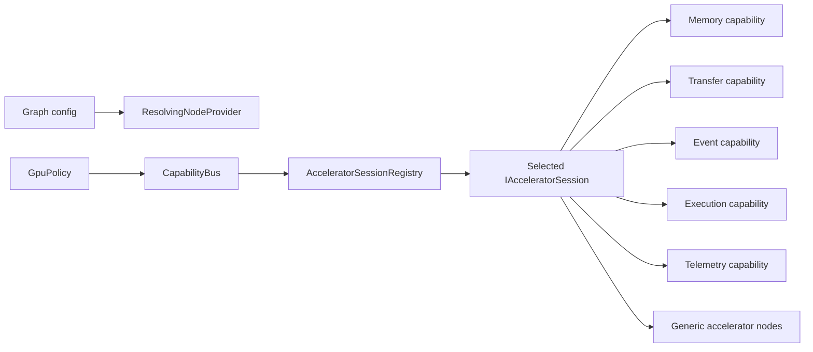

# GraphX GPU Phase 0-2 Design Record

## Scope

This record captures the Phase 0-3 replacement slice for the GPU architecture: identity, descriptors, coherent accelerator sessions, graph-owned resolution, and the first direct providers. It deliberately stops before generic GPU nodes, resource-handle replacement, and operation migration.

## Current inventory

| Surface | Current state |
|---|---|
| `CapabilityBus` | Graph-owned typed service container; still used for backend capability wiring. |
| `IGpuCapabilityBinding` | Graph-side GPU binding hook; still used by GPU-aware nodes and plugin facades. |
| `GpuPolicy` | Registers backend capabilities during graph initialization and binds them into nodes. |
| `GpuCapabilityBootstrap` | Installs the authoritative `AcceleratorSessionRegistry` in the graph-owned bus; transitional backend capability sets remain until their nodes are replaced. |
| `BackendKind` | CUDA, Metal, Unknown, and CPU. |
| Accelerator tokens | Backend-neutral token/view/lease structures already exist in `libgpu/include/gpu/accel/types`. |
| Backend capability APIs | CUDA and Metal still expose backend-specific context/memory/transfer/kernel/telemetry contracts. |
| Shared GPU bus | Removed. There is no process-global authoritative GPU capability bus. |

## Native versus stub status

| Backend | Current status | Notes |
|---|---|---|
| Metal | Direct new-interface provider is truthfully registered as `Stub`. The old native runtime remains outside the session architecture and must be refactored rather than wrapped. |
| CUDA | Direct new-interface provider is truthfully registered as `Stub`; there is no native CUDA implementation in this slice. |
| CPU | Direct `CpuFallback` provider implements allocation, copies, queue/event lifecycle, submission validation, telemetry, and cross-session rejection. |

## Duplicate logical contracts

| Contract family | Duplicated today |
|---|---|
| Context/device selection | CUDA and Metal both carry a backend-specific notion of device or runtime context. |
| Memory allocation | Device and host-visible allocation are implemented separately per backend. |
| Transfers | H2D, D2H, and D2D transfer contracts repeat across backends. |
| Event handling | Backend-specific queue/event acquisition and wait semantics repeat across backends. |
| Telemetry | Transfer and execution telemetry are backend-specific even where the semantics align. |

## Proposed ownership boundaries

| Layer | Owns |
|---|---|
| `libgraph` | Graph-owned capability bus, binding mechanics, resolver integration, and node lifecycle wiring. |
| `libgpu` | Accelerator descriptors, execution identity, session interfaces, narrow memory/transfer/event/execution/telemetry capabilities, and backend-specific providers. |
| `libdsp` | DSP-domain nodes and algorithms that should consume accelerator sessions rather than backend-specific capability families. |
| Examples | Graph composition and configuration that select sessions by backend, device, and execution mode. |

## Replacement sequence

1. Add explicit execution identity and backend descriptors in `libgpu`.
2. Introduce `IAcceleratorSession` plus narrow sub-capabilities and structured resolution.
3. Register sessions through graph-owned capability wiring rather than global state. **Complete.**
4. Refactor native Metal directly onto the new session interfaces. **Incomplete; no legacy adapter is permitted.**
5. Bind generic transfer and release nodes to one selected session. **Deferred to Phase 5.**
6. Remove superseded backend-specific GPU capability APIs when their nodes move to the new session path. **Scheduled for the generic-node slice.**

## Risks and rollback points

| Risk | Mitigation |
|---|---|
| New session types coexist briefly with backend capability APIs used by nodes not yet migrated | The session registry is authoritative; delete each old family as its nodes are replaced. Do not add wrappers or adapters. |
| Native/stub truthfulness regressions | Require descriptor-based tests to distinguish execution mode from backend kind. |
| Cross-session resource misuse | Bind one session per node and validate views against the bound descriptor before submission. |
| Overly broad migration | Limit the current slice to descriptors, resolution, and session wiring; defer operation registry and DFT migration. |

## Architecture sketch

## Gate status

- Phase 2 foundation is complete: descriptors are validated, unavailable providers cannot register or resolve, provider ordering is deterministic, malformed enums are rejected, and the registry is graph-owned.
- Gate A is **partially satisfied**. CPU is a real complete provider and CUDA/Metal stubs are labeled truthfully, but direct native Metal has not yet migrated to the new interfaces.
- Gate B is **not started** because generic resource-node migration belongs to Phase 5.

## APIs removed

- Process-global `GetSharedGpuCapabilityBus`.
- `OverrideSharedGpuCapabilityBusForTesting`.
- `ScopedGpuCapabilityBusOverride`.

## APIs scheduled for deletion

- `ICuda*Capability` and `IMetal*Capability` families.
- Backend-specific ingress, transfer, release, synchronization, and generic-kernel nodes.
- Backend-specific GPU infrastructure plugins and their topology mappings.

These APIs remain only because generic nodes are explicitly outside this slice. No adapter or compatibility layer has been added.
